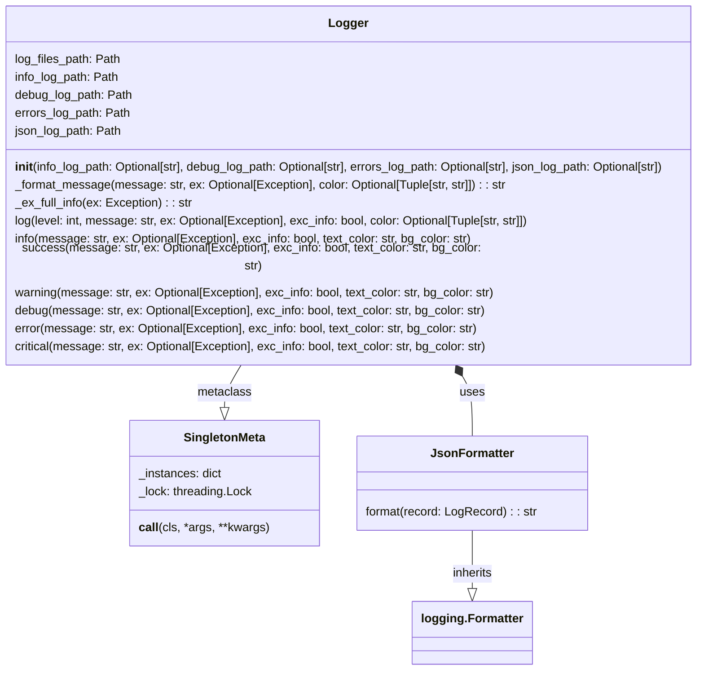

## Анализ кода `src/logger/logger.py`

### 1. <алгоритм>

**Блок-схема работы `logger.py`:**

1. **Инициализация:**
   - Загрузка конфигурации из `config.json` (`__root__ / 'src' / 'config.json'`).
   - Определение путей для лог-файлов:
     - Создается базовая директория логов, в которую входят все логи по времени.
     - Пути для `info.log`, `debug.log`, `errors.log`, и `[timestamp].json`.
   - Создание директорий и файлов, если они не существуют.
   - Создание `logging.Logger` для:
     - Консольного вывода (`logger_console`, на данный момент не используется).
     - Информационных сообщений (`logger_file_info`).
     - Отладочных сообщений (`logger_file_debug`).
     - Ошибок (`logger_file_errors`).
     - JSON-логов (`logger_file_json`).
   - Настройка форматеров для каждого логгера. `JsonFormatter` для JSON, простой форматер для остальных.
   - Инициализация объекта `Logger` как Singleton.

2. **`JsonFormatter.format(record)`:**
   - Принимает объект `logging.LogRecord`.
   - Форматирует запись лога в JSON формате:
     - `asctime`: Время события.
     - `levelname`: Уровень логирования (`INFO`, `DEBUG`, `ERROR`, `CRITICAL`, и т.д.).
     - `message`: Сообщение, подлежащее записи в лог.
     - `exc_info`: Информация об исключении, если она есть.
   - Возвращает JSON-строку.

3. **`Logger._format_message(message, ex=None, color=None)`:**
   - Принимает сообщение, исключение (опционально) и кортеж `color` (опционально).
   - Если `color` задан, добавляет цвет к сообщению.
   - Возвращает форматированную строку.
   - Пример:
    ```python
     _format_message(message="Test message", color=("green", "black"))  # Возвращает сообщение в зеленом тексте на черном фоне
     _format_message(message="Test message") # Возвращает Test message без форматирования
    ```

4. **`Logger._ex_full_info(ex)`:**
   - Принимает объект исключения `ex`.
   - Получает информацию о фрейме стека вызовов (функция, файл, строка) вызывающей функции.
   - Формирует и возвращает строку с информацией об исключении.
  
5. **`Logger.log(level, message, ex=None, exc_info=False, color=None)`:**
   - Принимает уровень логирования (`level`), сообщение, исключение (`ex`), флаг `exc_info`, и цвет (`color`).
   - Форматирует сообщение с помощью `_format_message`.
   - Если `exc_info` истина, добавляет информацию об исключении с помощью `_ex_full_info`.
   - Записывает отформатированное сообщение в `logger_console`, также есть закомментированный код для записи в файлы, который в данный момент не используется.

6. **Методы логирования (`info`, `success`, `warning`, `debug`, `error`, `critical`):**
   - Каждый из методов является оберткой над методом `log`, устанавливая соответствующий уровень логирования, цвет и флаг `exc_info`.
    - Пример:
        ```python
            logger.info("Information message", ex=Exception("Test exception"), exc_info=True, text_color='green', bg_color='white') # Запишет информационное сообщение с исключением.
            logger.debug("Debug message", ex=Exception("Test exception"), exc_info=True, text_color='cyan') # Запишет сообщение для дебага с исключением.
        ```
7.  **Singleton Pattern**:
    - Гарантирует, что существует только один экземпляр класса `Logger`.

### 2. <mermaid>



**Описание диаграммы:**

- `SingletonMeta`: Метакласс, который реализует паттерн Singleton, обеспечивая существование только одного экземпляра класса `Logger`. Он хранит словарь `_instances` с экземплярами и использует блокировку `_lock` для потокобезопасности. Метод `__call__` создает или возвращает существующий экземпляр.
- `JsonFormatter`: Класс для форматирования логов в JSON. Наследует от `logging.Formatter` и переопределяет метод `format()`.
- `Logger`: Класс, который реализует логирование. Он имеет атрибуты для хранения путей к лог-файлам, инициализирует `logging.Logger` для различных типов логов и имеет методы для логирования на разных уровнях (info, debug, error и т.д.).
  - `log_files_path`, `info_log_path`, `debug_log_path`, `errors_log_path`, `json_log_path`: Атрибуты для хранения путей к директориям и файлам логов.
  - `__init__()`: Конструктор класса, который устанавливает все необходимые параметры логирования.
  - `_format_message()`: Метод для форматирования сообщений с применением цветов.
  - `_ex_full_info()`: Метод для сбора полной информации об исключении.
  - `log()`: Базовый метод для записи в лог на указанном уровне.
  - `info()`, `success()`, `warning()`, `debug()`, `error()`, `critical()`: Методы-обертки для записи в лог на соответствующих уровнях.
- **Связи:**
  - `Logger` наследуется от `SingletonMeta` как метакласс, что обеспечивает паттерн Singleton.
  - `JsonFormatter` наследуется от `logging.Formatter`, расширяя его функционал.
  - `Logger` использует `JsonFormatter` для форматирования JSON-логов.

### 3. <объяснение>

**Импорты:**

- `logging`: Стандартный модуль Python для логирования. Используется для создания и настройки логгеров.
- `colorama`: Библиотека для добавления цветов в вывод консоли. Используется для форматирования сообщений.
- `datetime`: Модуль для работы со временем и датой. Используется для создания временных меток.
- `json`: Модуль для работы с JSON. Используется для форматирования логов в JSON.
- `inspect`: Модуль для интроспекции кода. Используется для получения информации о вызывающей функции.
- `threading`: Модуль для работы с потоками. Используется для создания блокировки в Singleton.
- `pathlib.Path`: Класс для работы с путями к файлам и директориям. Используется для построения путей к логам.
- `typing.Optional`, `typing.Tuple`: Модули для статической типизации.
- `types.SimpleNamespace`: Простой класс для создания объектов с атрибутами.
- `header`: Модуль, предположительно содержащий константу `__root__` для определения корневой директории проекта.

**Классы:**

- `SingletonMeta`:
  - **Роль**: Метакласс для реализации паттерна Singleton.
  - **Атрибуты**:
    - `_instances`: Словарь для хранения экземпляров класса.
    - `_lock`: Блокировка для обеспечения потокобезопасности.
  - **Методы**:
    - `__call__(cls, *args, **kwargs)`: Метод, вызываемый при создании экземпляра класса. Если экземпляр не существует, создает его, если существует - возвращает существующий экземпляр.
  - **Взаимодействие**: Используется в качестве метакласса для `Logger`.

- `JsonFormatter`:
  - **Роль**: Форматирует логи в JSON.
  - **Атрибуты**: Нет.
  - **Методы**:
    - `format(record)`: Принимает `logging.LogRecord` и возвращает отформатированную JSON-строку.
  - **Взаимодействие**: Используется для форматирования JSON-логов `Logger`.

- `Logger`:
  - **Роль**: Класс для логирования. Реализует паттерн Singleton.
  - **Атрибуты**:
    - `log_files_path`, `info_log_path`, `debug_log_path`, `errors_log_path`, `json_log_path`: Пути к лог-файлам.
    - `logger_console`, `logger_file_info`, `logger_file_debug`, `logger_file_errors`, `logger_file_json`: `logging.Logger` экземпляры.
  - **Методы**:
    - `__init__(self, ...)`: Инициализирует объект `Logger`, настраивая пути логов и логгеры. Загружает конфигурацию из `config.json`.
    - `_format_message(self, message, ex=None, color=None)`: Форматирует сообщение с учетом цвета.
    - `_ex_full_info(self, ex)`: Собирает информацию об исключении из стека вызовов.
    - `log(self, level, message, ex=None, exc_info=False, color=None)`: Общий метод логирования.
    - `info(self, ...)`: Метод для логирования информационных сообщений.
    - `success(self, ...)`: Метод для логирования успешных сообщений.
    - `warning(self, ...)`: Метод для логирования предупреждений.
    - `debug(self, ...)`: Метод для логирования отладочных сообщений.
    - `error(self, ...)`: Метод для логирования ошибок.
    - `critical(self, ...)`: Метод для логирования критических ошибок.
  - **Взаимодействие**:  Использует `JsonFormatter` для JSON-логов и `logging` для создания логгеров.

**Функции**:
- `JsonFormatter.format(self, record)`: Метод форматирования записи лога в JSON.
- `Logger.__init__(self, info_log_path: Optional[str] = None, debug_log_path: Optional[str] = None, errors_log_path: Optional[str] = None, json_log_path: Optional[str] = None)`: Конструктор класса `Logger`, инициализирует пути для логов, создает директории, файлы, настраивает логгеры и форматеры.
- `Logger._format_message(self, message: str, ex: Optional[Exception] = None, color: Optional[Tuple[str, str]] = None)`: Форматирует сообщение с учетом текста и фона.
- `Logger._ex_full_info(self, ex: Exception)`: Возвращает отформатированную строку с информацией об исключении.
- `Logger.log(self, level: int, message: str, ex: Optional[Exception] = None, exc_info: bool = False, color: Optional[Tuple[str, str]] = None)`: Общий метод для логирования.
- `Logger.info(self, message: str, ex: Optional[Exception] = None, exc_info: bool = False, text_color: str = "green", bg_color: str = "")`:  Метод для логирования информационных сообщений.
- `Logger.success(self, message: str, ex: Optional[Exception] = None, exc_info: bool = False, text_color: str = "yellow", bg_color: str = "")`: Метод для логирования успешных сообщений.
- `Logger.warning(self, message: str, ex: Optional[Exception] = None, exc_info: bool = False, text_color: str = "black", bg_color: str = "yellow")`: Метод для логирования предупреждений.
- `Logger.debug(self, message: str, ex: Optional[Exception] = None, exc_info: bool = True, text_color: str = "cyan", bg_color: str = "")`: Метод для логирования отладочных сообщений.
- `Logger.error(self, message: str, ex: Optional[Exception] = None, exc_info: bool = True, text_color: str = "red", bg_color: str = "")`: Метод для логирования сообщений об ошибках.
- `Logger.critical(self, message: str, ex: Optional[Exception] = None, exc_info: bool = True, text_color: str = "red", bg_color: str = "white")`: Метод для логирования критических сообщений.

**Переменные:**

- `MODE`: Строка, определяющая режим работы (например, `'dev'`).
- `TEXT_COLORS`, `BG_COLORS`: Словари, содержащие коды цветов из `colorama`.
- `logger`: Экземпляр класса `Logger`, используемый для логирования.
- `config`: SimpleNamespace - конфигурация загруженная из json файла.
- `timestamp`: Строка - временная метка.
- `base_path`: Path - базовый путь для сохранения логов.

**Потенциальные ошибки и области для улучшения:**

1.  **Двойной вывод в консоль**: Сейчас закомментирован вывод в консоль, поэтому двойного вывода не происходит. Это можно устранить при необходимости вывода в консоль и записи в файл.

2. **Закомментированный код**: Присутствует закомментированный код в методе `log`, который записывает логи в файлы напрямую. Этот код необходимо либо убрать, либо настроить.
3. **Обработка ошибок**: В текущей реализации не предусмотрена обработка ошибок при чтении `config.json` или создании директорий, стоит добавить обработку исключений.
4. **Настройка логгирования**: Уровни логирования можно было бы настроить более гибко, возможно, через конфигурационный файл.
5. **Использование `SimpleNamespace`**: Использование `SimpleNamespace` упрощает доступ к значениям в JSON, но может снизить читаемость кода в долгосрочной перспективе.
6. **Имя файла в `json_log_path`**: Имя файла `json_log_path` зависит от времени создания директории, что может быть не всегда удобно.
7. **Определение корневого пути**: Определение корневого пути через `header.__root__` может зависеть от структуры проекта, в дальнейшем стоит вынести эту часть в переменное окружение.

**Цепочка взаимосвязей с другими частями проекта:**

- Зависит от модуля `header`, в котором находится `__root__`.
- Использует `config.json` для получения пути к директории логов.
- Используется в других модулях проекта для логирования.