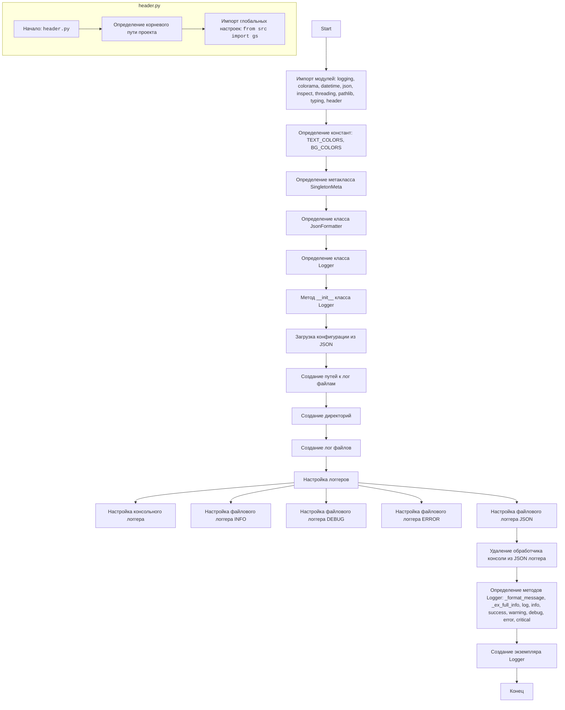

## ИНСТРУКЦИЯ:

Анализируй предоставленный код подробно и объясни его функциональность. Ответ должен включать три раздела:  

1. **<алгоритм>**: Опиши рабочий процесс в виде пошаговой блок-схемы, включая примеры для каждого логического блока, и проиллюстрируй поток данных между функциями, классами или методами.  
2. **<mermaid>**: Напиши код для диаграммы в формате `mermaid`, проанализируй и объясни все зависимости, 
    которые импортируются при создании диаграммы. 
    **ВАЖНО!** Убедитесь, что все имена переменных, используемые в диаграмме `mermaid`, 
    имеют осмысленные и описательные имена. Имена переменных вроде `A`, `B`, `C`, и т.д., не допускаются!  
    
    **Дополнительно**: Если в коде есть импорт `import header`, добавьте блок `mermaid` flowchart, объясняющий `header.py`:\
    ```mermaid
    flowchart TD
        Start --> Header[<code>header.py</code><br> Determine Project Root]
    
        Header --> import[Import Global Settings: <br><code>from src import gs</code>] 
    ```

3. **<объяснение>**: Предоставьте подробные объяснения:  
   - **Импорты**: Их назначение и взаимосвязь с другими пакетами `src.`.  
   - **Классы**: Их роль, атрибуты, методы и взаимодействие с другими компонентами проекта.  
   - **Функции**: Их аргументы, возвращаемые значения, назначение и примеры.  
   - **Переменные**: Их типы и использование.  
   - Выделите потенциальные ошибки или области для улучшения.  

Дополнительно, постройте цепочку взаимосвязей с другими частями проекта (если применимо).  

Это обеспечивает всесторонний и структурированный анализ кода.
## Формат ответа: `.md` (markdown)
**КОНЕЦ ИНСТРУКЦИИ**

## <алгоритм>

```mermaid
graph LR
    Start(Начало) --> InitializeLogger(Инициализация Logger);
    
    subgraph Singleton
    InitializeLogger --> CheckInstance{Существует ли экземпляр Logger?};
    CheckInstance -- Нет --> CreateInstance(Создание экземпляра Logger);
    CreateInstance -->  SetLogPaths(Определение путей к лог-файлам);
    SetLogPaths --> CreateLoggers(Создание логгеров);
    SetLogPaths -->  EnsureDirsAndFiles(Создание директорий и файлов);    
    CheckInstance -- Да --> ReturnInstance(Возврат существующего экземпляра);
    end
     
    CreateLoggers --> SetupConsoleLogger(Настройка консольного логгера);
    CreateLoggers --> SetupFileLoggers(Настройка файловых логгеров);

    SetupFileLoggers --> SetupInfoLogger(Настройка info логгера);
    SetupFileLoggers --> SetupDebugLogger(Настройка debug логгера);
    SetupFileLoggers --> SetupErrorLogger(Настройка error логгера);
    SetupFileLoggers --> SetupJsonLogger(Настройка json логгера);


    SetupConsoleLogger --> ReturnInstance
    SetupJsonLogger --> RemoveConsoleHandler(Удаление обработчика консоли из JSON логгера);
    RemoveConsoleHandler --> ReturnInstance
    ReturnInstance --> LogCall(Вызов метода log);
    
    LogCall --> FormatMessage(Форматирование сообщения);
    FormatMessage --> CheckColor{Есть ли цвет?};
    CheckColor -- Да --> ApplyColor(Применить цвет);
    ApplyColor --> AddExceptionInfo(Добавить информацию об исключении);
    CheckColor -- Нет --> AddExceptionInfo
    
    AddExceptionInfo --> CheckExcInfo{Нужно ли добавлять инф. об исключении};
    CheckExcInfo -- Да --> GetFullExceptionInfo(Получение полной информации об исключении);
    GetFullExceptionInfo --> LogMessage(Запись сообщения в лог);
    CheckExcInfo -- Нет --> LogMessage
    LogMessage --> End(Конец);
    
    
     subgraph Example Use
        Example1[Пример использования: <br>logger.info("Info message", ex=Exception("Test Ex"), exc_info=True, text_color="light_green", bg_color="blue")] --> LogCall
     end
    
    subgraph header.py
        HeaderStart[Начало: header.py] --> HeaderDetermineRoot[Определение корневого пути проекта]
        HeaderDetermineRoot --> HeaderImportGS[Импорт глобальных настроек: from src import gs]
    end

```
## <mermaid>


## <объяснение>

### Импорты:

-   `logging`: Стандартный модуль Python для логирования событий в приложении. Используется для записи сообщений в консоль и файлы.
-   `colorama`: Библиотека для добавления цветов в вывод консоли. Позволяет выделить важные сообщения цветом.
-   `datetime`: Стандартный модуль для работы с датой и временем. Используется для создания меток времени в логах.
-   `json`: Стандартный модуль для работы с данными в формате JSON. Используется для записи логов в JSON-файл.
-   `inspect`: Стандартный модуль для получения информации о стеке вызовов. Используется для получения информации об исключениях.
-   `threading`: Стандартный модуль для работы с многопоточностью. Используется для реализации Singleton.
-   `pathlib`: Стандартный модуль для работы с путями к файлам и директориям. Используется для создания путей к лог-файлам.
-   `typing`: Стандартный модуль для аннотации типов. Используется для объявления типов переменных.
-   `header`: Пользовательский модуль, используемый для определения корневой директории проекта.
-   `from header import __root__`: Импортирует переменную `__root__` из модуля `header`, которая содержит абсолютный путь к корню проекта.

### Классы:

1.  `SingletonMeta`:
    -   **Роль:** Метакласс для реализации паттерна Singleton. Гарантирует, что у класса будет только один экземпляр.
    -   **Атрибуты:**
        -   `_instances`: Словарь для хранения созданных экземпляров классов.
        -   `_lock`: Объект блокировки для безопасного создания экземпляров в многопоточной среде.
    -   **Методы:**
        -   `__call__(cls, *args, **kwargs)`: Магический метод, вызываемый при создании экземпляра класса. Проверяет, существует ли уже экземпляр, и возвращает его, иначе создает новый и сохраняет в `_instances`.
    
2.  `JsonFormatter(logging.Formatter)`:
    -   **Роль:** Класс для форматирования лог-сообщений в JSON. Наследуется от `logging.Formatter`.
    -   **Методы:**
        -   `format(self, record)`: Метод для форматирования записи лога в JSON. Преобразует `record` в словарь, затем в JSON-строку. Заменяет двойные кавычки на одинарные.

3.  `Logger(metaclass=SingletonMeta)`:
    -   **Роль:** Основной класс для логирования. Использует паттерн Singleton, поэтому у него будет только один экземпляр.
    -   **Атрибуты:**
        -   `log_files_path`: Путь к директории с лог файлами.
        -   `info_log_path`: Путь к файлу с info логами.
        -   `debug_log_path`: Путь к файлу с debug логами.
        -   `errors_log_path`: Путь к файлу с error логами.
        -   `json_log_path`: Путь к json файлу.
        -   `logger_console`: Объект логгера для консоли.
        -   `logger_file_info`: Объект логгера для info лог файла.
        -   `logger_file_debug`: Объект логгера для debug лог файла.
        -   `logger_file_errors`: Объект логгера для error лог файла.
        -   `logger_file_json`: Объект логгера для json файла.
    -   **Методы:**
        -   `__init__(self, info_log_path=None, debug_log_path=None, errors_log_path=None, json_log_path=None)`: Конструктор класса, инициирует логгеры, устанавливает пути к файлам. Создает директории и файлы, если их нет.
        -  `_format_message(self, message, ex=None, color=None)`: Форматирует сообщение, добавляя цвет и информацию об исключении.
        - `_ex_full_info(self, ex)`: Получает полную информацию об исключении (файл, функция, строка).
        - `log(self, level, message, ex=None, exc_info=False, color=None)`: Записывает сообщение с заданным уровнем и цветом. Вызывает `_format_message` и `_ex_full_info`, если нужно.
        - `info(self, message, ex=None, exc_info=False, text_color="green", bg_color="")`: Записывает сообщение info уровня.
        - `success(self, message, ex=None, exc_info=False, text_color="yellow", bg_color="")`: Записывает сообщение info уровня, как успешное.
        - `warning(self, message, ex=None, exc_info=False, text_color="black", bg_color="yellow")`: Записывает сообщение warning уровня.
        - `debug(self, message, ex=None, exc_info=True, text_color="cyan", bg_color="")`: Записывает сообщение debug уровня.
        - `error(self, message, ex=None, exc_info=True, text_color="red", bg_color="")`: Записывает сообщение error уровня.
        - `critical(self, message, ex=None, exc_info=True, text_color="red", bg_color="white")`: Записывает сообщение critical уровня.

### Функции:
-  `TEXT_COLORS`: Словарь для хранения кодов текстовых цветов из `colorama`.
-  `BG_COLORS`: Словарь для хранения кодов цветов фона из `colorama`.

### Переменные:
-  `MODE`: Определяет режим работы приложения (`dev`, `prod` и т.д.). Используется для определения папки логгирования.

### Потенциальные ошибки и области для улучшения:
-   **Управление логами:**  В коде закомментированы блоки записи в файлы. Сейчас запись ведется только в консоль. Нужно раскомментировать и настроить запись логов в файлы.
-   **Конфигурация путей:** Пути к логам формируются из `config.json`. Необходимо добавить возможность переопределять пути через переменные окружения. 
-   **Обработка исключений:**  В методе `_ex_full_info` необходимо продумать обработку `None` в `ex`.
-   **Общая ошибка**: Двойной вывод в консоль. Проблема в том, что консольный логгер не был выключен, а все файловые логгеры имеют по умолчанию `StreamHandler`. Чтобы этого избежать нужно либо выключить консольный логгер, либо удалить обработчики которые выводят в консоль.
-   **Именование переменных:** Необходимо унифицировать именование переменных, где то используется `logger_console`, где-то `self.logger_file_json`.
-   **Отказ от глобальных переменных**: Использование `MODE` как глобальной переменной может привести к проблемам в масштабировании.

### Взаимосвязи с другими частями проекта:
-   `header.py`: Используется для определения корневого пути проекта, относительно которого строятся пути к файлам логов и конфигурационному файлу.
-   `config.json`: Используется для настройки пути сохранения логов.