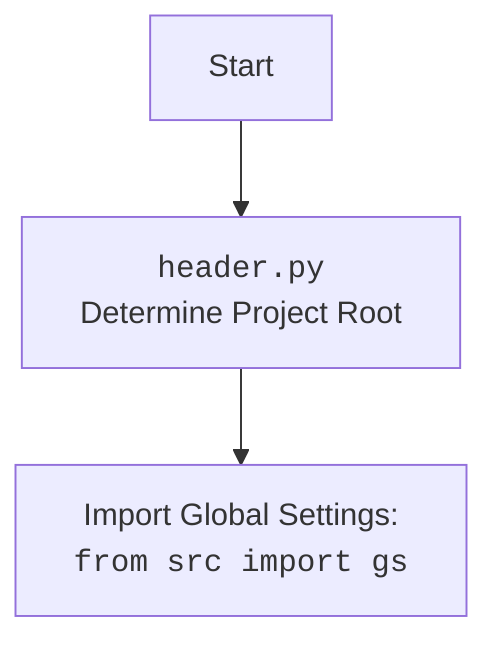

## <алгоритм>

1. **Инициализация `Logger`:**
   - При первом вызове `Logger()` (благодаря метаклассу `SingletonMeta`), создается экземпляр класса.
   - **Пример:** `logger = Logger()`
   - Загружаются настройки из `config.json` (через `header.__root__`)
   - Генерируется путь к логам на основе настроек и текущей даты и времени.
     -  **Пример**: `base_path = /path/to/project/logs`, `timestamp = 2707241430`,  `self.log_files_path = /path/to/project/logs/2707241430`
   - Определяются пути к файлам логов: `info.log`, `debug.log`, `errors.log` и `*.json`, создаются если их нет.
   - Создаются объекты `logging.Logger` для консоли, файлов (info, debug, errors) и JSON.
   - Для файловых логгеров устанавливаются обработчики `logging.FileHandler` с соответствующими форматерами. JSON-логгер использует кастомный `JsonFormatter`.
   - Удаляются все обработчики, которые выводят в консоль для JSON логгера.

2. **Форматирование сообщения `_format_message`:**
    - Принимает сообщение, возможное исключение и кортеж `color` (текст, фон).
    - Если `color` указан, выбираются коды цветов из `TEXT_COLORS` и `BG_COLORS` (или используются дефолтные значения).
    - Форматирует сообщение с использованием цветов (если указаны) и сбрасывает форматирование `colorama.Style.RESET_ALL` в конце.
    - **Пример:** `_format_message("Test Message", "Exception", color=("red", "white"))` вернёт строку с форматированием красным текстом на белом фоне.

3.  **Получение информации об исключении `_ex_full_info`:**
    - Принимает объект исключения.
    - Использует `inspect.stack()` для получения информации о месте вызова логгера (функция, файл, строка).
    - Форматирует эту информацию в строку для добавления в лог.
    - **Пример**: если ошибка произошла в `my_file.py` в функции `my_function` на строке 10, и исключение `ValueError("Invalid")`, то вернётся строка: `\nFile: my_file.py, \n |\n  -Function: my_function, \n   |\n    --Line: 10\nValueError("Invalid")`

4. **Основной метод логирования `log`:**
   - Принимает уровень логирования `level`, сообщение `message`, исключение `ex`, флаг `exc_info` и кортеж `color`.
   - Вызывает `_format_message` для форматирования сообщения.
   - Если `exc_info` равно `True`, вызывает `_ex_full_info` для добавления информации об исключении в сообщение.
   - Записывает отформатированное сообщение в консоль `logger_console`.
   -  Для файловых логеров  закомментировано и не используется.

5. **Методы для уровней логирования (info, success, warning, debug, error, critical):**
   - Каждый из этих методов вызывает основной метод `log` с соответствующим уровнем логирования и предопределенными цветами.
   - **Пример:** `logger.info("Operation started")` вызовет `logger.log` с уровнем `logging.INFO`, сообщением "Operation started" и цветом по умолчанию "green".

## <mermaid>

```mermaid
flowchart TD
    subgraph Logger Initialization
        A[Logger Constructor] --> B{Load Config from <br><code>config.json</code>};
        B --> C{Generate Log Path <br>with Timestamp};
        C --> D[Create Directories];
        D --> E[Create Log Files];
        E --> F{Create Console Logger};
        F --> G{Create File Loggers <br>(info, debug, errors, json)};
        G --> H[Set File Handlers and Formatters];
         H --> I[Remove Stream Handlers from Json Logger];
    end

    subgraph Log Message Flow
        J[Log Method <br>(level, message, ex, exc_info, color)] --> K{Format Message with Color};
        K --> L{Check exc_info};
        L -- Yes --> M[Get Full Exception Info];
        M --> N[Add Exception Info to Message];
        L -- No --> N[Use Formatted Message];
        N --> O[Log Message to Console];
    end

    A -- Singleton --> A
    I --> J

   style A fill:#f9f,stroke:#333,stroke-width:2px
     
```



### Объяснение `mermaid`

**Диаграмма `Logger Initialization`:**

*   **`A[Logger Constructor]`**: Начало процесса инициализации логгера.
*   **`B{Load Config from config.json}`**: Загрузка конфигурационных параметров из файла `config.json`.
*   **`C{Generate Log Path with Timestamp}`**: Формирование пути к каталогу с логами, включая временную метку.
*   **`D[Create Directories]`**: Создание каталогов для хранения лог-файлов.
*  **`E[Create Log Files]`**: Создание самих лог-файлов (`info.log`, `debug.log`, `errors.log` и json)
*   **`F{Create Console Logger}`**: Создание логгера для вывода в консоль.
*   **`G{Create File Loggers (info, debug, errors, json)}`**: Создание логгеров для записи в файлы с разными уровнями логирования.
*   **`H[Set File Handlers and Formatters]`**: Установка обработчиков для каждого файлового логгера и задание форматеров.
*    **`I[Remove Stream Handlers from Json Logger]`**: Удаление всех стрим обработчиков для JSON логгера (чтобы не было дублирования в консоль).
*  **`A -- Singleton --> A`**: Отражение поведения Singleton, т.е. конструктор вызывается только один раз.

**Диаграмма `Log Message Flow`:**

*   **`J[Log Method (level, message, ex, exc_info, color)]`**: Основной метод `log`, обрабатывающий различные типы сообщений с параметрами.
*   **`K{Format Message with Color}`**: Форматирование сообщения с применением цветовых кодов, если они заданы.
*   **`L{Check exc_info}`**: Проверка, нужно ли добавить в сообщение информацию об исключении.
*    **`M[Get Full Exception Info]`**: Получение подробной информации об исключении (функция, файл, строка, сообщение).
*   **`N[Add Exception Info to Message]`**: Добавление информации об исключении в отформатированное сообщение.
*   **`O[Log Message to Console]`**: Запись сообщения в консоль с использованием `logger_console`.
* **`I --> J`**: Указание на вызов метода `log` после инициализации.

**Диаграмма `header.py`**

*   **`Start`**: Начало процесса.
*   **`Header[header.py  Determine Project Root]`**: Определение корневого каталога проекта.
*   **`Header --> import[Import Global Settings: from src import gs]`**: Импорт глобальных настроек.

## <объяснение>

### Импорты:

*   **`logging`**: Модуль Python для реализации гибкой системы логирования. Используется для создания логгеров, установки уровней логирования и записи сообщений.
*   **`colorama`**: Модуль для кроссплатформенного вывода цветного текста в консоль. Используется для добавления цвета к сообщениям логгера.
*   **`datetime`**: Модуль для работы с датой и временем. Используется для создания уникальных имен каталогов логов на основе текущей даты и времени.
*   **`json`**: Модуль для работы с JSON-данными. Используется для форматирования логов в JSON.
*   **`inspect`**: Модуль для интроспекции кода. Используется для получения информации о месте вызова логгера.
*   **`threading`**: Модуль для работы с потоками. Используется для реализации потокобезопасного Singleton.
*   **`pathlib.Path`**: Модуль для работы с путями к файлам и каталогам. Используется для создания и управления путями логов.
*   **`typing.Optional, Tuple`**: Модуль для указания типов переменных. Используется для статического анализа кода.
*   **`types.SimpleNamespace`**: Модуль для создания простых объектов с атрибутами. Используется для хранения загруженных из `config.json` конфигурационных параметров.
*   **`header`**: Пользовательский модуль `header.py`, в котором хранится корень проекта и общие настройки.

### Классы:

*   **`SingletonMeta`**:
    *   **Роль:** Метакласс для реализации шаблона Singleton. Гарантирует, что будет создан только один экземпляр класса `Logger`.
    *   **Атрибуты:** `_instances` (словарь экземпляров классов), `_lock` (блокировка для потокобезопасности).
    *   **Методы:** `__call__` - переопределяет оператор вызова класса, обеспечивая создание только одного экземпляра.
*   **`JsonFormatter`**:
    *   **Роль:** Кастомный форматер для `logging`, который форматирует лог-сообщения в JSON.
    *   **Атрибуты:** нет.
    *   **Методы:** `format` - форматирует запись лога в JSON, включает время, уровень, сообщение и информацию об исключении.
*   **`Logger`**:
    *   **Роль:** Класс для ведения логов. Предоставляет интерфейс для записи логов в консоль и файлы, поддерживает разные уровни логирования, цветной вывод и форматирование в JSON. Реализован как Singleton.
    *   **Атрибуты:** `log_files_path`, `info_log_path`, `debug_log_path`, `errors_log_path`, `json_log_path` (пути к лог-файлам), `logger_console`, `logger_file_info`, `logger_file_debug`, `logger_file_errors`, `logger_file_json` (экземпляры логгеров).
    *   **Методы:**
        *   `__init__`: Инициализирует экземпляр логгера. Определяет пути к файлам логов, создает объекты логгеров и устанавливает их параметры.
        *   `_format_message`: Форматирует сообщение с применением цветовых кодов.
        *   `_ex_full_info`: Возвращает полную информацию об исключении, включая функцию, файл и строку вызова.
        *   `log`: Основной метод для записи логов. Вызывает другие методы для форматирования и записи сообщения.
        *   `info`, `success`, `warning`, `debug`, `error`, `critical`: Методы для удобного логирования сообщений с определенными уровнями и цветами.

### Функции:

*   Нет отдельных функций вне классов. Все операции выполняются внутри методов классов.

### Переменные:

*   **`TEXT_COLORS`**, **`BG_COLORS`**: Словари, содержащие цветовые коды для текста и фона, полученные из `colorama`.
*   **`logger`**: Экземпляр класса `Logger`, который используется для записи логов во всем приложении. Создается как синглтон.

### Взаимосвязи с другими частями проекта:

*   Зависит от `header`, который предоставляет путь к корневой директории проекта и позволяет читать файл конфигурации `config.json`.
*   Используется во всем проекте для записи логов.
*   Использует `src.config.json` для чтения настроек.
*   Используется `colorama` для форматирования логов.
*   Использует `logging` для записи логов в консоль и файлы.

### Потенциальные ошибки и области для улучшения:

*   **Закомментированный блок записи в файлы:** В текущем варианте записи в файлы отключены, что требует пересмотра при использовании.
*   **Дублирование сообщений**: При включении записи в файлы возможно дублирование сообщений в консоли и файлах.
*   **Негибкость настройки:**  Настройка цветов логирования жестко задана в методах, что ограничивает гибкость. Можно сделать кастомные настройки для цветов.
*   **Ограниченность форматов логов**: Поддерживается только текстовый и JSON формат, возможно добавление других форматов.
*   **Отсутствие ротации логов:** Не предусмотрена ротация логов, что может привести к неограниченному росту файлов.
*   **Обработка исключений**: Стоит добавить общую обработку исключений, чтобы избежать падения приложения при ошибке в процессе логирования.

Этот анализ предоставляет детальное понимание функциональности модуля `logger.py`, его взаимодействия с другими модулями и возможные направления для улучшения.