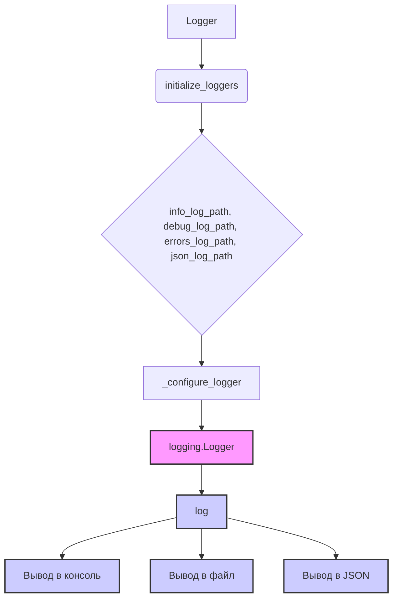

# <input code>

```rst
.. :module: src.logger
```
[English](https://github.com/hypo69/hypo/blob/master/src/logger/README.MD)
### Документация для модуля `src.logger`

Модуль `src.logger` предоставляет гибкую систему логирования, поддерживающую логирование в консоль, файлы и в формате JSON. Он использует шаблон проектирования Singleton, чтобы обеспечить использование единственного экземпляра логгера во всем приложении. Логгер поддерживает различные уровни логирования (например, `INFO`, `ERROR`, `DEBUG`) и включает цветное отображение для вывода в консоль. Также доступны настройки форматов вывода и управление логированием в различные файлы.

---

### Классы:
- **SingletonMeta**: Метакласс, реализующий шаблон Singleton для логгера.
- **JsonFormatter**: Кастомный форматтер для вывода логов в формате JSON.
- **Logger**: Основной класс логгера, поддерживающий логирование в консоль, файлы и в формате JSON.

---

### Функции:

#### `__init__`
Инициализирует экземпляр класса Logger с плейсхолдерами для различных типов логгеров (консоль, файлы и JSON).

#### `_configure_logger(name: str, log_path: str, level: Optional[int] = logging.DEBUG, formatter: Optional[logging.Formatter] = None, mode: Optional[str] = 'a') -> logging.Logger`
Настраивает и возвращает экземпляр логгера.

**Параметры:**
- `name`: Имя логгера.
- `log_path`: Путь к файлу логов.
- `level`: Уровень логирования, например, `logging.DEBUG`. Значение по умолчанию — `logging.DEBUG`.
- `formatter`: Кастомный форматтер (опционально).
- `mode`: Режим работы с файлом, например, `'a'` для добавления (значение по умолчанию).

**Возвращает**: Настроенный экземпляр `logging.Logger`.

#### `initialize_loggers(info_log_path: Optional[str] = '', debug_log_path: Optional[str] = '', errors_log_path: Optional[str] = '', json_log_path: Optional[str] = '')`
Инициализирует логгеры для логирования в консоль и файлы (информация, отладка, ошибки и JSON).

**Параметры:**
- `info_log_path`: Путь к файлу логов информации (опционально).
- `debug_log_path`: Путь к файлу логов отладки (опционально).
- `errors_log_path`: Путь к файлу логов ошибок (опционально).
- `json_log_path`: Путь к файлу логов в формате JSON (опционально).

#### `log(level, message, ex=None, exc_info=False, color=None)`
Логирует сообщение на указанном уровне (например, `INFO`, `DEBUG`, `ERROR`) с возможным исключением и цветовым форматированием.

**Параметры:**
- `level`: Уровень логирования (например, `logging.INFO`, `logging.DEBUG`).
- `message`: Логируемое сообщение.
- `ex`: Исключение для логирования (опционально).
- `exc_info`: Включать информацию об исключении (значение по умолчанию — `False`).
- `color`: Кортеж цветов текста и фона для консольного вывода (опционально).

#### Другие методы:
- `info`: Логирует информационное сообщение.
- `success`: Логирует сообщение об успешной операции.
- `warning`: Логирует предупреждение.
- `debug`: Логирует сообщение для отладки.
- `error`: Логирует сообщение об ошибке.
- `critical`: Логирует критическое сообщение.


---

### Параметры логгера
Класс `Logger` принимает несколько опциональных параметров для настройки поведения логирования.

... (остальная документация)
```



```markdown
# <algorithm>

Алгоритм работы модуля `src.logger` основан на использовании класса `Logger`, реализующего шаблон Singleton.

1. **Инициализация логгера:** При первом обращении к `Logger` создается единственный экземпляр класса.
2. **`initialize_loggers`:**  Эта функция принимает пути к файлам для логирования (информация, отладка, ошибки, JSON) и настраивает логгеры для каждого из них, используя `_configure_logger`.
3. **`_configure_logger`:** Создает и настраивает экземпляры `logging.Logger` с указанными параметрами (путь к файлу, уровень логирования, форматтер и режим открытия файла).
4. **`log`:**  Логирует сообщения различных уровней (INFO, DEBUG, ERROR и т.д.) в консоль, файлы и JSON, принимая сообщение, уровень и дополнительные параметры.
5. **Вывод:** Сообщения выводятся в соответствующие места (консоль, файлы логов, JSON-файл), используя `logging`.


# <explanation>

**Импорты:**

Модуль `src.logger` скорее всего импортирует `logging` и `colorama` из стандартной библиотеки Python и сторонней библиотеки, соответственно.  Эти импорты необходимы для работы с функциями логирования и, возможно, для цветного вывода в консоль.

**Классы:**

- **`SingletonMeta`:**  Реализует паттерн Singleton, гарантируя, что в приложении существует только один экземпляр `Logger`.

- **`JsonFormatter`:**  Настраивает формат вывода логов в формате JSON.  Этот класс, вероятно, наследуется от `logging.Formatter` и переопределяет метод `format`, чтобы создавать строки в формате JSON.

- **`Logger`:** Центральный класс, отвечающий за логирование. Он использует `logging` для работы с файлами и консолью.   `Logger` держит ссылки на логгеры для консоли и файлов, а `initialize_loggers` использует `_configure_logger` для их создания и настройки.  Методы `info`, `error`, `debug` и др. вызывают `log`, передавая нужный уровень логирования.  Атрибуты `Logger` хранят пути к лог-файлам.

**Функции:**

- **`__init__`:** Инициализирует логгер, создавая экземпляры для различных методов логирования (консоль, файлы, JSON).

- **`_configure_logger`:**  Основная функция настройки логгера, создает логгер `logging.Logger`  и настраивает его поведение (уровень логирования, форматтер, путь к файлу).  Ключевой аспект — она возвращает экземпляр `logging.Logger` для дальнейшего использования.

- **`initialize_loggers`:**  Инициализирует все логгеры, вызывая `_configure_logger` для каждого типа логгера (консоль, информация, отладка, ошибки, JSON).

- **`log`:**  Основные методы логирования. Принимает уровень, сообщение и опциональные параметры, такие как исключения и цвета. Это важный метод, позволяющий гибко управлять процессом логирования.

**Переменные:**

`info_log_path`, `debug_log_path`, `errors_log_path`, `json_log_path` — строки, хранящие пути к файлам.  Они определяют, куда записываются соответствующие лог-файлы.

**Возможные ошибки и улучшения:**

- **Обработка исключений:**  Можно улучшить обработку исключений, чтобы логгер не просто выводил ошибку, но и сохранял traceback, в случае возникновения проблем при работе с файлами.
- **Ресурсы:** `Logger` должен позаботиться о том, чтобы освобождать ресурсы, используемые для файлов (закрывать файлы), когда не используется.
- **Тестирование:** Не хватает тестов, чтобы проверить корректность работы логгера.
- **Глубокая интеграция:**  Проверить, есть ли возможность интеграции с системами мониторинга и анализа логов (например, ELK).


**Взаимосвязи с другими частями проекта:**

Этот модуль ( `src.logger`) предоставляет механизм логирования для всего проекта.  Его использование предполагает, что другие части приложения будут импортировать и использовать `Logger` для записи сообщений.