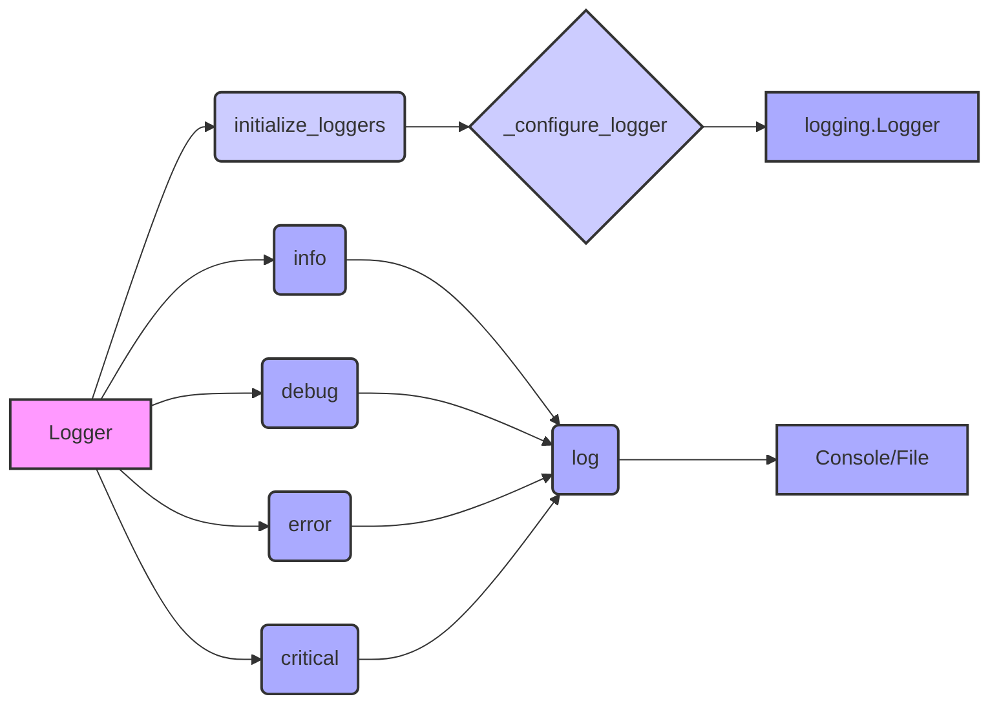

## Анализ кода модуля `src.logger`

### 1. <алгоритм>

**Общий рабочий процесс:**

1. **Инициализация логгера:**
   - Создается экземпляр класса `Logger`.
   - Вызывается метод `initialize_loggers` с параметрами, определяющими пути к файлам логов (info, debug, errors, json).
   - Внутри `initialize_loggers` для каждого переданного пути вызывается `_configure_logger`.

2. **Конфигурация логгера (`_configure_logger`):**
   - Принимает имя логгера, путь к файлу, уровень логирования, форматтер и режим работы с файлом.
   - Создает или получает экземпляр `logging.Logger` по имени.
   - Если указан путь к файлу, добавляет `FileHandler` для записи в файл.
   - Устанавливает уровень логирования и форматтер для хендлера (если передан).
   - Возвращает настроенный логгер.

3. **Логирование сообщений (`log`):**
   - Принимает уровень логирования, сообщение, опциональное исключение, флаг для информации об исключении и опциональные цвета для консоли.
   - В зависимости от уровня логирования вызывает соответствующий метод (например, `info`, `debug`, `error`, `critical`).
   - Внутри каждого из этих методов вызывается `log` с уровнем, сообщением и другими параметрами.
   - Если указаны цвета, сообщение выводится в консоль с применением этих цветов с помощью `colorama`.
   - Если передано исключение, оно также логируется.

**Примеры:**

-   **Инициализация:**
    1.  `logger = Logger()`: Создается экземпляр логгера.
    2.  `config = {'info_log_path': 'logs/info.log', 'debug_log_path': 'logs/debug.log', ...}`: Определяется словарь с путями к файлам логов.
    3.  `logger.initialize_loggers(**config)`: Инициализируются логгеры.
    4.  Внутри `initialize_loggers` последовательно для каждого пути: `_configure_logger(name, log_path, level, formatter)` - настраивается и возвращается логгер для каждого типа логов (info, debug, error, json).
-   **Логирование INFO:**
    1.  `logger.info('Сообщение')`: Вызывается метод `info`.
    2.  `log(logging.INFO, 'Сообщение')`: Внутренний вызов `log`.
    3.  Сообщение форматируется и выводится в консоль и/или в файл, в зависимости от настроек.
-   **Логирование ERROR с исключением:**
    1.  `logger.error('Ошибка', ex=Exception('Пример ошибки'), exc_info=True)`: Вызывается метод `error`.
    2.  `log(logging.ERROR, 'Ошибка', ex=Exception(...), exc_info=True)`: Внутренний вызов `log`.
    3.  Сообщение и информация об исключении форматируется и выводится в консоль и/или в файл.
-   **Логирование с цветами:**
    1.  `logger.info('Текст', colors=(colorama.Fore.GREEN, colorama.Back.BLACK))`: Вызывается метод `info`.
    2.  `log(logging.INFO, 'Текст', color=(...))`: Внутренний вызов `log`.
    3.  Сообщение выводится в консоль с указанным цветом, используя `colorama`.

**Поток данных:**

-   `Logger` -> `initialize_loggers` -> `_configure_logger` -> `logging.Logger`
-   `Logger` -> `info` / `debug` / `error` / `critical` -> `log`
-   `log` -> (консоль, файлы)

### 2. <mermaid>

**Анализ зависимостей `mermaid`:**

-   `Logger`: Главный класс логгера, который управляет настройкой и логированием.
-   `initialize_loggers`: Метод класса `Logger`, который инициализирует все нужные логгеры (консоль, файл, json).
-   `_configure_logger`: Метод класса `Logger`, который настраивает конкретный логгер (например, для info, debug, error).
-   `logging.Logger`: Стандартный класс `logging` из Python, который непосредственно выполняет запись логов.
-   `info`, `debug`, `error`, `critical`: Методы `Logger`, которые используются для логирования сообщений разного уровня.
-   `log`: Внутренний метод класса `Logger`, который обрабатывает логирование сообщения.
-   `Console/File`: Конечная точка, куда выводится сообщение (консоль или файл).

### 3. <объяснение>

**Импорты:**

-   `logging`: Стандартная библиотека Python для логирования. Предоставляет базовые классы и функции для записи логов. В этом модуле используется для создания и настройки логгеров, а также для определения уровней логирования.
-   `typing.Optional`: Используется для указания того, что переменная может быть `None`. В данном случае, используется для обозначения опциональных параметров функций, таких как пути к файлам логов и форматтеры.
-   `colorama`: Библиотека для добавления цветного вывода в консоль. Используется для форматирования сообщений в консоли, в частности, добавления цвета.
-   `json`: Стандартная библиотека для работы с JSON. Используется в `JsonFormatter` для форматирования сообщений в JSON.

**Классы:**

-   **`SingletonMeta`**:
    -   **Роль:** Метакласс, реализующий шаблон Singleton. Гарантирует, что только один экземпляр класса `Logger` будет существовать во всем приложении.
    -   **Атрибуты:** `_instances` (словарь для хранения экземпляров).
    -   **Методы:** `__call__`: Проверяет, существует ли уже экземпляр класса; если нет, то создает новый и сохраняет его в `_instances`.
    -   **Взаимодействие:** Метакласс для класса `Logger`.

-   **`JsonFormatter`**:
    -   **Роль:** Кастомный форматтер для `logging`, форматирующий логи в JSON.
    -   **Атрибуты:** Нет.
    -   **Методы:** `format`: Преобразует запись лога в JSON-строку.
    -   **Взаимодействие:** Используется при настройке логгера для JSON-файлов.

-   **`Logger`**:
    -   **Роль:** Основной класс логгера, обеспечивающий логирование сообщений в консоль, файлы и JSON-формате.
    -   **Атрибуты:**
        -   `info_logger`, `debug_logger`, `errors_logger`, `json_logger`: Атрибуты для хранения настроенных экземпляров `logging.Logger` для каждого типа логирования.
    -   **Методы:**
        -   `__init__`: Инициализирует экземпляры логгера плейсхолдерами.
        -   `_configure_logger`: Настраивает и возвращает экземпляр `logging.Logger` для файла или консоли.
        -   `initialize_loggers`: Инициализирует все логгеры с путями к файлам (если заданы).
        -   `log`: Основной метод для логирования сообщений на указанном уровне с возможностью форматирования (цвета, исключения).
        -   `info`, `success`, `warning`, `debug`, `error`, `critical`: Методы-обертки для вызова `log` с соответствующим уровнем логирования.
    -   **Взаимодействие:** Использует `SingletonMeta` для гарантии единственности, взаимодействует с `JsonFormatter` для JSON-логирования и с `logging.Logger` для фактической записи логов.

**Функции:**

-   **`__init__`:**
    -   **Аргументы:** Нет.
    -   **Возвращаемое значение:** Нет (метод инициализации).
    -   **Назначение:** Инициализирует плейсхолдеры для логгеров.
    -   **Пример:** `logger = Logger()`

-   **`_configure_logger`:**
    -   **Аргументы:** `name` (str), `log_path` (str), `level` (Optional[int]), `formatter` (Optional[logging.Formatter]), `mode` (Optional[str]).
    -   **Возвращаемое значение:** `logging.Logger`.
    -   **Назначение:** Настраивает и возвращает `logging.Logger`, добавляя обработчик файла при необходимости.
    -   **Пример:** `_configure_logger('info', 'logs/info.log', logging.INFO)`

-   **`initialize_loggers`:**
    -   **Аргументы:** `info_log_path` (Optional[str]), `debug_log_path` (Optional[str]), `errors_log_path` (Optional[str]), `json_log_path` (Optional[str]).
    -   **Возвращаемое значение:** Нет.
    -   **Назначение:** Инициализирует все логгеры (info, debug, error, json) с соответствующими файлами.
    -   **Пример:** `initialize_loggers(info_log_path='logs/info.log', debug_log_path='logs/debug.log')`

-   **`log`:**
    -   **Аргументы:** `level` (int), `message` (str), `ex` (Optional[Exception]), `exc_info` (bool), `color` (Optional[tuple]).
    -   **Возвращаемое значение:** Нет.
    -   **Назначение:** Записывает сообщение в лог с указанным уровнем, цветом и исключением.
    -   **Пример:** `log(logging.INFO, 'Сообщение', color=(colorama.Fore.GREEN, colorama.Back.BLACK))`

**Переменные:**

-   `info_logger`, `debug_logger`, `errors_logger`, `json_logger` - Экземпляры `logging.Logger`, настроенные для соответствующего уровня логирования и места назначения.
-   `config` (в примере использования) - Словарь, содержащий пути к файлам логов.

**Потенциальные ошибки и области для улучшения:**

-   **Отсутствие обработки ошибок:** Не предусмотрена обработка ошибок при создании файлов, открытии файлов или записи в них.
-   **Жесткая привязка к `colorama`:** Использование `colorama` для форматирования вывода в консоль делает модуль зависимым от этой библиотеки. Можно использовать абстрактный класс для форматирования, и реализовать несколько форматеров (например для `rich`).
-   **Ограниченная гибкость форматирования:** Форматирование сообщений ограничено стандартным `logging.Formatter`. Можно добавить возможность настраивать форматтер для каждого логгера отдельно.
-   **Отсутствие асинхронности:** Логгирование является синхронным. В высокопроизводительных приложениях желательно использовать асинхронное логирование, чтобы не блокировать основной поток.
-   **Не учитываются ошибки в `JsonFormatter`**: Потенциальные ошибки при преобразовании объекта в json (например, объект несериализуем), не обрабатываются.

**Взаимосвязь с другими частями проекта:**

-   Этот модуль предполагается использовать в других частях проекта для централизованного логирования.
-   Настройки логгера можно передавать через конфигурационные файлы/переменные окружения (например, пути к файлам).
-   Может использоваться в связке с другими модулями для логирования событий и ошибок, происходящих в разных частях приложения.

Этот подробный анализ позволяет понять структуру и функциональность модуля `src.logger`, а также выявить потенциальные области для улучшения.