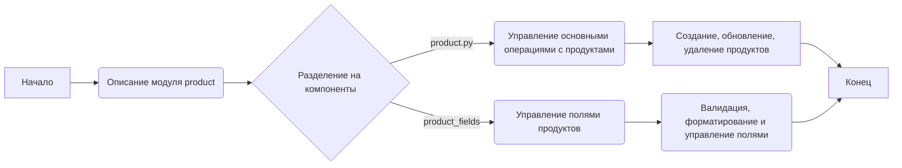
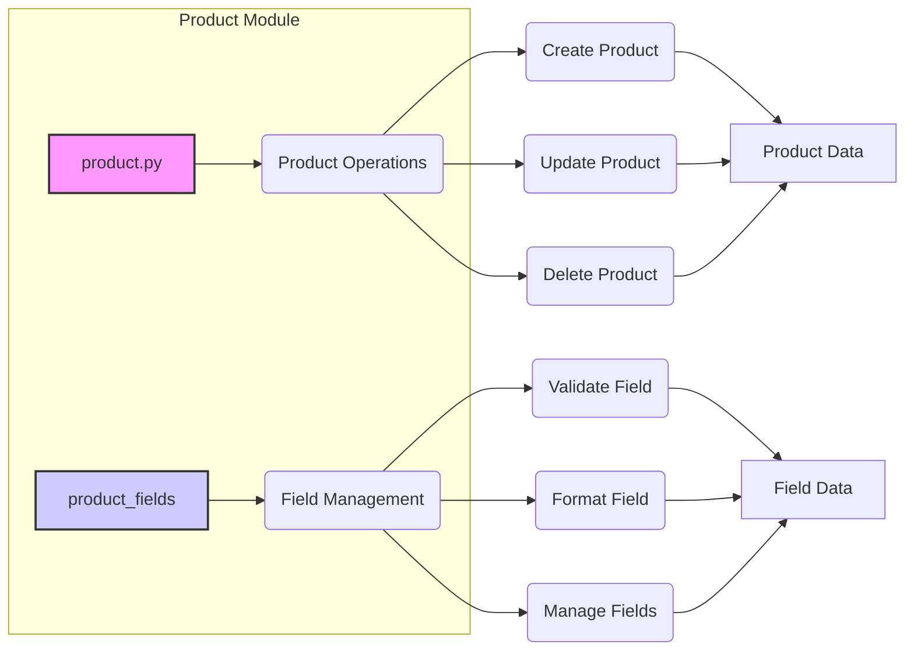

## Анализ кода `hypotez/src/product/README.MD`

### 1. <алгоритм>

**Общее описание:**
Данный `README.MD` файл описывает структуру и назначение модуля `product`, который отвечает за управление продуктами в приложении.  Модуль разбит на два основных компонента: `product.py`, отвечающий за основную логику работы с продуктами, и `product_fields`, управляющий логикой работы с полями продуктов.

**Блок-схема:**



**Пошаговое описание:**

1.  **Начало:** Начало процесса анализа документации `README.MD`.
2.  **Описание модуля `product`:**  Файл указывает, что модуль `product` отвечает за управление всеми аспектами данных продукта.
    *   *Пример:* Модуль отвечает за хранение, обработку и валидацию информации о продуктах.
3.  **Разделение на компоненты:** Модуль разделен на два компонента: `product.py` и `product_fields`.
    *   *Пример:*  `product.py` и `product_fields` - это отдельные файлы или каталоги в структуре проекта.
4.  **`product.py` - управление основными операциями с продуктами:** Этот компонент управляет основной логикой обработки продуктов, включая создание, обновление и удаление записей.
    *   *Пример:* Функции внутри `product.py` позволяют добавлять новые продукты в базу данных, редактировать существующие и удалять ненужные записи.
5.  **`product_fields` - управление полями продуктов:** Этот компонент контролирует логику, связанную с полями продуктов, включая валидацию, форматирование и общее управление полями.
    *   *Пример:*  `product_fields` обеспечивает, чтобы поле "цена" было числом, "наименование" не было пустым, а "описание" соответствовало определенным требованиям.
6.  **`product.py` - создание, обновление, удаление продуктов:** Этот подраздел `product.py` управляет непосредственно CRUD-операциями (создание, чтение, обновление, удаление) над продуктами.
    *   *Пример:* Функция `create_product` создаст новую запись о продукте, а `delete_product` удалит существующую.
7.  **`product_fields` - валидация, форматирование и управление полями:** Этот подраздел `product_fields` обеспечивает соответствие данных правилам и формату, прежде чем они сохранятся.
    *   *Пример:*  Функции в `product_fields` могут проверять корректность ввода даты истечения срока годности, переводить цену в нужный формат,  либо управлять требованиями к формату телефонного номера.
8.  **Конец:** Завершение процесса анализа модуля `product`.

### 2. <mermaid>



**Объяснение диаграммы `mermaid`:**

*   `Product Module`:  Обозначает общую область модуля `product`.
*   `product.py`:  Представляет компонент `product.py`, отвечающий за основные операции с продуктами.
*   `product_fields`: Представляет компонент `product_fields`, отвечающий за управление полями продуктов.
*   `Product Operations`: Указывает на функции, связанные с операциями над продуктами в `product.py`.
*   `Field Management`: Указывает на функции, связанные с управлением полями продуктов в `product_fields`.
*   `Create Product`, `Update Product`, `Delete Product`: Функции, которые реализуют CRUD-операции над продуктами.
*   `Validate Field`, `Format Field`, `Manage Fields`: Функции, которые управляют полями продуктов, их валидацией и форматом.
*   `Product Data`:  Обозначает данные продукта, которые обрабатываются через операции `product.py`.
*   `Field Data`:  Обозначает данные полей продукта, которыми управляет `product_fields`.

**Импортируемые зависимости:**
В этой диаграмме нет явных импортов. Диаграмма представляет структуру модуля и его компонентов. Зависимости будут реализованы на уровне кода в файлах `product.py` и `product_fields`, которые здесь не представлены.

### 3. <объяснение>

#### Импорты
В самом файле `README.MD` нет импортов. Он лишь описывает структуру модуля, но не содержит исполняемого кода. Импорты будут в файлах `product.py` и `product_fields`.  В этих файлах можно ожидать импорты, связанные с:

*   **Модулями для работы с базой данных:** Например, `sqlalchemy` для взаимодействия с базами данных.
*   **Модулями валидации:**  Например, `pydantic` для валидации данных.
*   **Модулями для работы с датами и форматами:** `datetime`, `locale`.
*   **Другими модулями проекта:** Возможно, другими частями `src`.

#### Классы
`README.MD` не описывает классы напрямую, но их наличие можно ожидать в файлах `product.py` и `product_fields`:

*   **В `product.py`:**
    *   Можно ожидать класс `Product` для представления сущности продукта.
    *   Атрибутами класса могут быть `product_id`, `name`, `description`, `price`, `category` и т.д.
    *   Методы могут включать `create()`, `update()`, `delete()`, `get()`, `list()`.
*   **В `product_fields`:**
    *   Могут быть классы, отвечающие за отдельные поля продукта, например, `ProductNameField`, `ProductPriceField`, `ProductDescriptionField`.
    *   Атрибуты этих классов будут содержать правила валидации и форматирования для соответствующих полей.
    *   Методы будут включать `validate()`, `format()`.

#### Функции
Функции будут определены в файлах `product.py` и `product_fields`:

*   **В `product.py`:**
    *   Функция `create_product(product_data)`: Создаёт новый продукт на основе предоставленных данных.
    *   Функция `update_product(product_id, product_data)`: Обновляет данные существующего продукта по его ID.
    *   Функция `delete_product(product_id)`: Удаляет продукт по его ID.
    *   Функция `get_product(product_id)`: Возвращает продукт по его ID.
    *   Функция `list_products()`: Возвращает список всех продуктов.
*   **В `product_fields`:**
    *   Функция `validate_name(name)`: Проверяет корректность имени продукта.
    *   Функция `format_price(price)`: Форматирует цену продукта в соответствии с требованиями.
    *   Функция `validate_description(description)`: Проверяет корректность описания продукта.

#### Переменные
В `README.MD` переменные не определены. Но в `product.py` и `product_fields` можно ожидать:

*   `product_id` (целое число): Идентификатор продукта.
*   `name` (строка): Название продукта.
*   `description` (строка): Описание продукта.
*   `price` (число): Цена продукта.
*   `category` (строка): Категория продукта.
*   `product_data` (словарь): Словарь с данными продукта.
*   `field_data` (словарь): Словарь с данными полей продукта.

#### Потенциальные ошибки и области для улучшения

*   **Отсутствие деталей**: `README.MD` дает общее представление, но не углубляется в детали реализации, что может затруднить понимание и использование модуля.
*   **Неопределенность зависимостей**: Без явного указания зависимостей (`requirements.txt` или др.) сложно оценить, как модуль взаимодействует с другими частями системы.
*   **Отсутствие документации по API**: Не ясно, какие аргументы ожидают функции, какие возвращают значения, и какие ошибки могут возникнуть. Это необходимо документировать для более легкого использования.

#### Взаимосвязь с другими частями проекта

*   **С модулем `src`**: Модуль `product` является частью модуля `src`, следовательно, он может использовать другие модули внутри `src`, если это необходимо.
*   **С модулями базы данных**: Модуль `product` должен взаимодействовать с модулями, отвечающими за базу данных, чтобы сохранять, извлекать и обновлять данные о продуктах.
*   **С модулями UI**: Если есть пользовательский интерфейс, то модуль `product` должен предоставлять данные для отображения в UI.

**Цепочка взаимосвязей:**
```mermaid
graph LR
    A[Пользовательский интерфейс] --> B(Модуль product);
    B --> C(Модуль базы данных);
    B --> D(Другие модули в src);