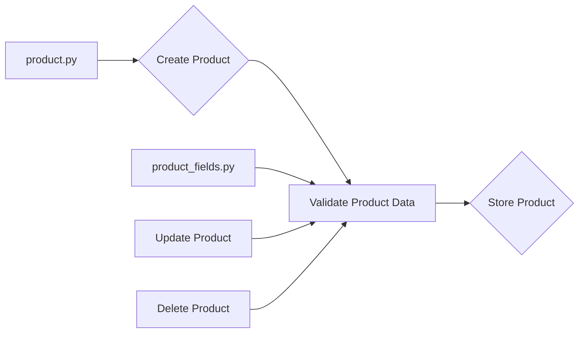

# Анализ кода модуля product

## <input code>

```
### **product Module**: Product Management

The **product** module is responsible for managing all aspects of product data, including processing, validation, and field management. It consists of the following components:

1. **product.py**  
   Manages the core logic for handling products, including operations such as creating, updating, and deleting product records. It provides functions to process product data and ensures compliance with business rules for managing products within the application.

2. **product_fields**  
   Controls the logic related to product fields, handling field validation, formatting, and management. This module ensures that product fields meet the necessary criteria for consistent data entry, enabling accurate and efficient processing of product information.
```

## <algorithm>

К сожалению, предоставленный код не содержит фактического кода. Он описывает *модуль* `product`, но не содержит реализацию.  Поэтому построить блок-схему или диаграмму невозможно.

## <mermaid>



## <explanation>

**Описание модуля:**

Модуль `product` отвечает за управление данными о продуктах.  Он предполагает разделение ответственности между файлами `product.py` и `product_fields.py`.  `product.py` - основная логика обработки продуктов (создание, обновление, удаление), а `product_fields.py` отвечает за валидацию и форматирование полей.


**Отсутствие кода:**

Из-за отсутствия кода, невозможно провести глубокий анализ:

* **Функции и классы:**  Неизвестны сигнатуры функций, методы классов и их поведение.
* **Взаимодействие:** Невозможно продемонстрировать потоки данных между модулями и компонентами.
* **Алгоритмы:** Невозможно проанализировать алгоритмы обработки данных.

**Предполагаемые импорты и взаимосвязи (гипотетически):**

* `product.py` вероятно импортирует функции из `product_fields.py` для валидации полей.
* Возможно, оба модуля используют дополнительные библиотеки для работы с базами данных или другими сервисами (например, для хранения и получения данных о продуктах).
* Модуль `product` скорее всего взаимодействует с другими частями проекта, например, с контроллерами или сервисами, для получения/обновления данных и управления состоянием приложений.


**Возможные ошибки и улучшения (на основе предположений):**

* **Отсутствие единого стиля кодирования:**  Необходим единый стандарт наименования переменных, функций, классов для улучшения читаемости и поддержки кода.
* **Недостаточная документация:** Добавьте комментарии к функциям и классам для лучшего понимания их назначения.
* **Управление ошибками:**  Важны обработчики ошибок, чтобы проект не падал при возникновении проблем.
* **Тестирование:** Необходимо тестировать модуль `product` для подтверждения корректности работы.


**Заключение:**

Предоставленный текст описывает *структуру* модуля, но не содержит *реализации*.  Для подробного анализа требуется код.