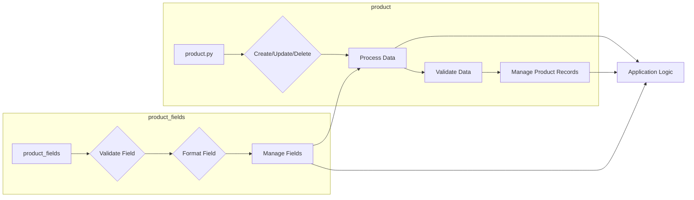

# Анализ кода модуля product

## <input code>

```
### **product Module**: Product Management

The **product** module is responsible for managing all aspects of product data, including processing, validation, and field management. It consists of the following components:

1. **product.py**
   Manages the core logic for handling products, including operations such as creating, updating, and deleting product records. It provides functions to process product data and ensures compliance with business rules for managing products within the application.

2. **product_fields**
   Controls the logic related to product fields, handling field validation, formatting, and management. This module ensures that product fields meet the necessary criteria for consistent data entry, enabling accurate and efficient processing of product information.
```

## <algorithm>

Данный код не содержит программного кода, а представляет собой описание модулей и их функциональности.  Алгоритм работы не может быть представлен в виде блок-схемы.  Здесь описывается *цель* модулей, а не их конкретная работа.


## <mermaid>



**Объяснение диаграммы:**

*   Модуль `product.py` отвечает за управление продуктами, включая создание, обновление и удаление записей.  Он обрабатывает данные, проверяет их и управляет записями.
*   Модуль `product_fields` отвечает за управление полями продуктов (валидация, форматирование).
*   Взаимодействие: `product_fields` участвует в обработке данных, валидации и управлении данными, которые затем использует `product.py` для управления продуктами.  Обработанные данные передаются в общий блок приложения.


## <explanation>

**Импорты:**
Нет импортов, так как это текстовое описание, а не код.

**Классы:**
Описание не содержит определений классов.

**Функции:**
Описание не содержит определений функций.  Вместо этого описаны задачи (операции) и функциональная роль модулей.


**Переменные:**
Описание не содержит определений переменных.


**Возможные ошибки или области для улучшений:**

*   Описание недостаточно конкретно.  Не указаны типы данных, которые обрабатываются, форматы данных, спецификации валидации и т.д.  Необходимо больше деталей для полного понимания, например:
    *   Какие типы продуктов?
    *   Какие поля содержатся в продуктах?
    *   Какие правила валидации применяются?
    *   Как данные передаются между модулями?

**Взаимосвязи с другими частями проекта:**
Описание указывает, что модуль `product` связан с приложением (`Application Logic`).  Подразумевается, что `product_fields` зависит от `product.py` для обработки и передачи данных между ними.  Для более глубокого анализа необходимо увидеть код и взаимодействие с другими частями проекта.  Это лишь *неявное* упоминание, так как сам код отсутствует.

**Выводы:**
Данный текст описывает архитектуру или функциональное назначение модулей, а не реализованный код.  Для более подробного анализа необходим исходный код, чтобы построить более подробную блок-схему и объяснить алгоритм работы в деталях.