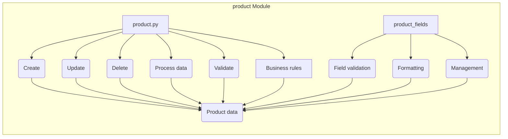

# Анализ кода модуля product

## <input code>

```
### **product Module**: Product Management

The **product** module is responsible for managing all aspects of product data, including processing, validation, and field management. It consists of the following components:

1. **product.py**  
   Manages the core logic for handling products, including operations such as creating, updating, and deleting product records. It provides functions to process product data and ensures compliance with business rules for managing products within the application.

2. **product_fields**  
   Controls the logic related to product fields, handling field validation, formatting, and management. This module ensures that product fields meet the necessary criteria for consistent data entry, enabling accurate and efficient processing of product information.
```

## <algorithm>

Данный код не содержит исходного кода на каком-либо языке программирования. Он представляет собой описание модуля, его компонентов и их функциональности, а не алгоритм.  Поэтому блок-схема не может быть построена.

## <mermaid>



Описание диаграммы:

Диаграмма показывает взаимодействие между компонентами `product` модуля.
* `product.py`: Обработка основных операций с продуктами (создание, обновление, удаление, обработка данных, валидация, правила бизнеса).
* `product_fields`: Обработка полей продукта (валидация, форматирование, управление).
*  Данные о продукте (`Product data`) - это центральный объект, на который воздействуют все компоненты.

## <explanation>

**Описание кода:**

Данный код представляет собой документирование модуля `product`, не содержащего функционального кода. Он описывает структуру и функциональность двух компонентов модуля: `product.py` и `product_fields`.  `product.py` отвечает за основные операции с продуктами, а `product_fields` — за управление полями продуктов.  Документация описывает, что эти компоненты выполняют, но не как именно.

**Импорты:**

Нет импортов, поскольку это описание, а не код.

**Классы:**

Нет классов, только описание возможных функций.

**Функции:**

Документ описывает *возможные* функции, но не содержит их определения.  Например, предполагается наличие функций для создания, обновления, удаления записей о продуктах в `product.py`.

**Переменные:**

Не описаны какие-либо переменные.

**Возможные ошибки и улучшения:**

* Не хватает деталей о логике. Необходимо более детальное описание того, как работают эти компоненты и как взаимодействуют между собой. Какие бизнес-правила проверяются?  Какие типы данных используются?  Например, какой тип возвращает функция для создания продукта?
* Нет информации о связях с другими частями проекта (`src`).
* Нет кода, который можно протестировать. Необходимо иметь код на языке программирования для корректного анализа.

**Цепочки взаимосвязей:**

Из описания неясно, как `product` модуль взаимодействует с другими частями проекта.  Для этого нужна дополнительная информация о структуре проекта.