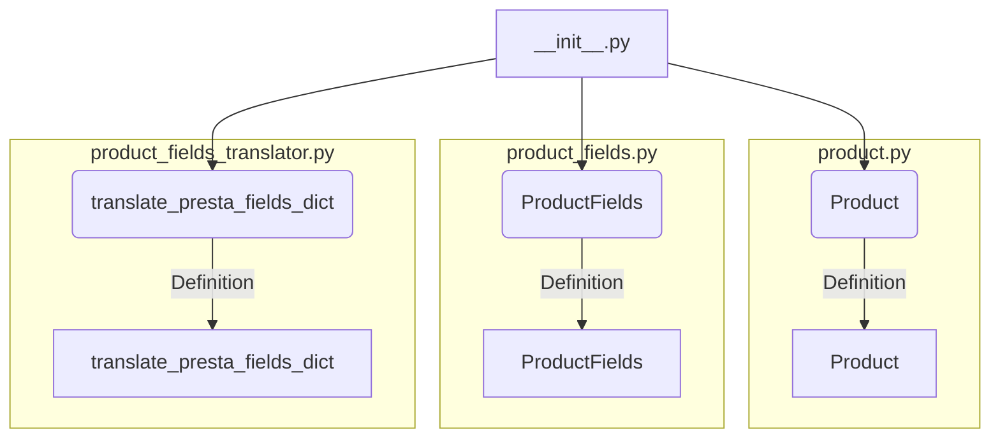

```MD
# Анализ кода hypotez/src/product/__init__.py

1. **<input code>**

```python
## \file hypotez/src/product/__init__.py
# -*- coding: utf-8 -*-
#! venv/Scripts/python.exe
#! venv/bin/python/python3.12

"""
.. module: src.product 
	:platform: Windows, Unix
	:synopsis: Product module
External classes and attributes:
- `Product`: Methods and attributes of the product. Detailed description in `product.py`
- `ProductFields`: Product fields. Detailed description in `product_fields.py`
- `record`: A dictionary of product fields in flat format (without nesting)
- `translate_presta_fields_dict`: Function that translates multilingual fields of `ProductFields`

"""
MODE = 'dev'

from .product import Product
from .product_fields.product_fields import ProductFields
from .product_fields.product_fields_translator import translate_presta_fields_dict
```

2. **<algorithm>**

Поскольку данный файл является инициализационным (`__init__.py`), он, в основном, выполняет импорт модулей и атрибутов из других файлов, которые относятся к продуктам.  Блок-схема будет проста: импортирование необходимых классов и функций. Нет динамического поведения или вызова функций в этом файле.

Пример:  Файл `product.py` содержит определение класса `Product`. При импорте `from .product import Product` этот класс становится доступным в текущем пространстве имен файла `__init__.py`.


3. **<mermaid>**



4. **<explanation>**

* **Импорты**: Файл `__init__.py` в папке `product` импортирует необходимые классы и функцию из других модулей внутри пакета `src.product`.
    * `from .product import Product`: Импортирует класс `Product` из файла `product.py` в текущем пакете. Значок `.` означает, что импортируемый модуль находится в текущем пакете.
    * `from .product_fields.product_fields import ProductFields`: Импортирует класс `ProductFields` из файла `product_fields.py` внутри подпакет `product_fields`.  Эта структура указывает на иерархию пакета.
    * `from .product_fields.product_fields_translator import translate_presta_fields_dict`: Импортирует функцию `translate_presta_fields_dict` из файла `product_fields_translator.py`.

* **Классы**:
    * `Product`: Представляет продукт. Определение класса находится в файле `product.py` и описывает его свойства и методы.
    * `ProductFields`: Класс, содержащий данные о характеристиках продукта. Определен в `product_fields.py`.
    *  В `__init__.py` сами классы не создаются - лишь импортируются для использования в других частях приложения.

* **Функции**:
    * `translate_presta_fields_dict`:  Функция, вероятно, предназначена для перевода полей продукта, которые могут быть многоязычными (например, названия, описания).  Реализация и подробности лежат в файле `product_fields_translator.py`.

* **Переменные**:
    * `MODE = 'dev'`:  Переменная глобальная, вероятно, определяет режим работы приложения (например, `dev`, `prod`).

* **Возможные ошибки/улучшения**:
    * Отсутствует ясное описание `record` - нужно пояснить, что это за словарь и где он будет использован.  Полагаем, что он содержит данные продукта в плоском формате, не содержащем вложенных структур.
    * Не описаны возможные исключения, которые могут возникнуть при импорте или использовании импортированных классов.
    * Нет примеров использования импортированных классов.

* **Взаимосвязи с другими частями проекта**:
    * Этот модуль предоставляет базовые классы и функции, которые будут использоваться другими частями приложения, работающими с данными о продуктах.  Связи будут существовать через вызовы методов этих классов и функций из других модулей проекта. Например, из модуля управления магазином, модуля представления данных, модуля обработки заказов.

Заключение:  Данный `__init__.py` выполняет роль интерфейса для модулей, связанных с продуктами, обеспечивая доступ к их функциональности.  Необходимо проанализировать связанные файлы (`product.py`, `product_fields.py`, `product_fields_translator.py`) для полного понимания логики приложения.