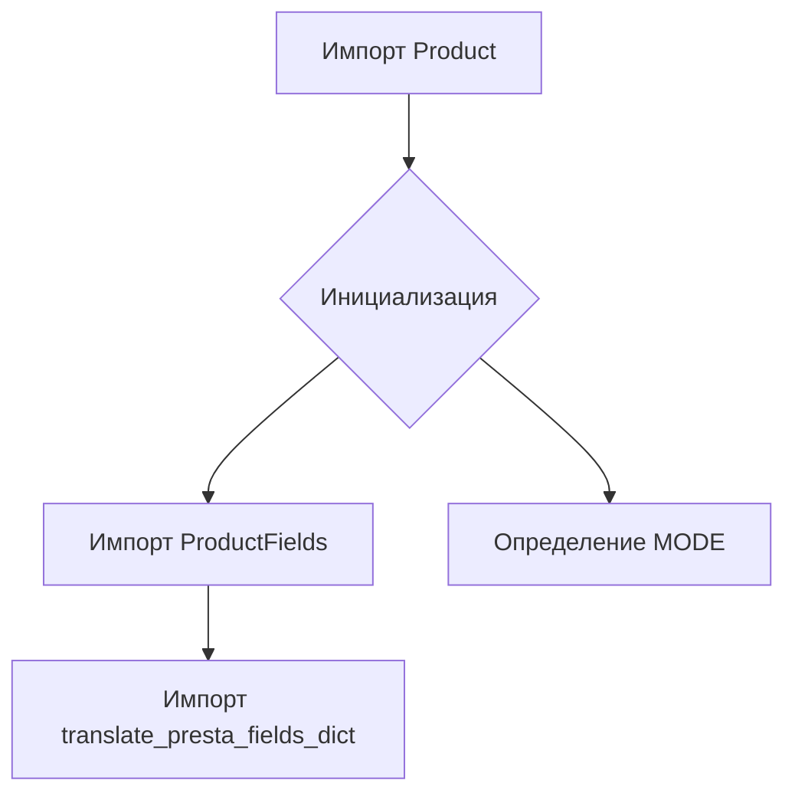
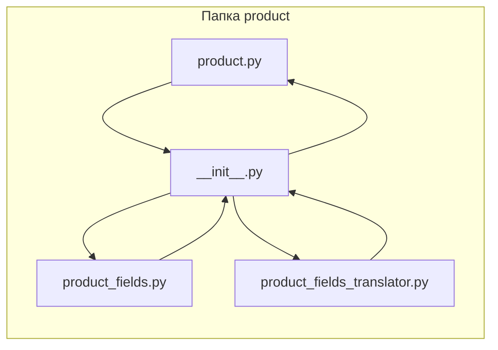

```MD
# Анализ кода hypotez/src/product/__init__.py

## <input code>

```python
## \file hypotez/src/product/__init__.py
# -*- coding: utf-8 -*-\
#! venv/Scripts/python.exe
#! venv/bin/python/python3.12

"""
.. module: src.product 
	:platform: Windows, Unix
	:synopsis: Product module
External classes and attributes:
- `Product`: Methods and attributes of the product. Detailed description in `product.py`
- `ProductFields`: Product fields. Detailed description in `product_fields.py`
- `record`: A dictionary of product fields in flat format (without nesting)
- `translate_presta_fields_dict`: Function that translates multilingual fields of `ProductFields`

"""
MODE = 'dev'

from .product import Product
from .product_fields.product_fields import ProductFields
from .product_fields.product_fields_translator import translate_presta_fields_dict
```

## <algorithm>

Этот код представляет собой модуль инициализации для пакета `product`.  Алгоритм работы заключается в импорте необходимых классов и функций из других модулей.  Блок-схема проста:



Пример:

Предположим, что в папке `hypotez/src/product/product.py` есть класс `Product`.  Тогда импорт `from .product import Product` загрузит этот класс в текущий модуль. Аналогично происходит импорт остальных элементов.

## <mermaid>



## <explanation>

**Импорты:**

* `from .product import Product`: Импортирует класс `Product` из модуля `product.py`, который, предположительно, находится в подпапке `hypotez/src/product`. Символ `.` указывает на поиск в текущем пакете `product`.
* `from .product_fields.product_fields import ProductFields`: Импортирует класс `ProductFields` из модуля `product_fields.py`, находящегося в подпапке `product_fields` внутри `hypotez/src/product`.
* `from .product_fields.product_fields_translator import translate_presta_fields_dict`: Импортирует функцию `translate_presta_fields_dict` из модуля `product_fields_translator.py`, который также находится в подпапке `product_fields`.

**Классы:**

* `Product`:  Представляет собой объект "продукт".  Подробное описание находится в файле `product.py`.  Важность этого класса для текущего файла - его доступность для использования в других частях приложения.
* `ProductFields`: Представляет атрибуты (поля) продукта. Подробности в `product_fields.py`.
* `record`:  Скорее всего, это словарь, представляющий данные продукта в плоском формате (без вложенных структур). Этот атрибут не создается в данном файле, а скорее, является внешним, описываемым в документации.
* `translate_presta_fields_dict`: Функция, предназначенная для перевода многоязычных полей `ProductFields`.

**Функции:**

Функции `translate_presta_fields_dict`  представлена для дальнейшего использования, но в данном модуле не используется напрямую.

**Переменные:**

* `MODE = 'dev'`: Глобальная переменная, которая, по всей видимости, определяет режим работы приложения (например, "dev", "prod").  Она задает конфигурацию и используется в других модулях приложения.

**Возможные ошибки и улучшения:**

* Отсутствует явное использование импортированных элементов. Файл `__init__.py` просто импортирует, но не использует классы и функции.
* Документация в строках документации должна быть более детализированной и соответствовать коду, например, описывая аргументы функций, тип возвращаемого значения и связи с другими компонентами.
* Отсутствует проверка существования импортируемых модулей.

**Взаимосвязи с другими частями проекта:**

Этот модуль является частью пакета `product`, следовательно, его классы, функции и переменные будут использоваться в других модулях приложения, таких как, например, в  модулях для обработки, отображения или управления данными о продуктах.