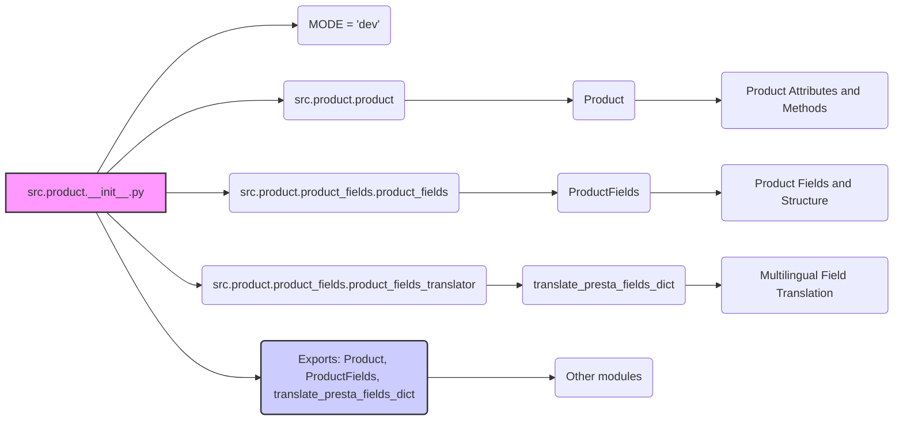

# Анализ кода `hypotez/src/product/__init__.py`

## <алгоритм>

1.  **Инициализация модуля:**
    *   Устанавливается режим работы модуля `MODE = 'dev'`.
    *   Импортируются необходимые классы и функции из других модулей пакета `src.product`.

2.  **Импорт класса `Product`:**
    *   Импортируется класс `Product` из модуля `src.product.product`.
        *   Пример: `product_instance = Product(name="Test Product", price=10.0)` создаст экземпляр класса `Product`.
    *   Класс `Product` отвечает за представление продукта в системе.

3.  **Импорт класса `ProductFields`:**
    *   Импортируется класс `ProductFields` из модуля `src.product.product_fields.product_fields`.
        *   Пример: `fields_instance = ProductFields(name="Product Name", description="Product Description")` создаст экземпляр `ProductFields`, где хранятся поля продукта.
    *   Класс `ProductFields` предназначен для определения структуры полей продукта.

4.  **Импорт функции `translate_presta_fields_dict`:**
    *   Импортируется функция `translate_presta_fields_dict` из модуля `src.product.product_fields.product_fields_translator`.
        *   Пример: `translated_fields = translate_presta_fields_dict({"name_en": "English Name", "description_fr": "Description in French"}, lang="en")` преобразует мультиязычные поля продукта в плоский формат словаря.
    *   Эта функция занимается преобразованием мультиязычных полей продукта в плоский словарь, пригодный для работы с PrestaShop.

5.  **Экспорт:**
    *   Модуль экспортирует классы `Product`, `ProductFields` и функцию `translate_presta_fields_dict` делая их доступными для использования в других модулях.
        *   Пример: `from src.product import Product, ProductFields, translate_presta_fields_dict` - импортирует необходимые сущности в другой модуль.

## <mermaid>

**Описание зависимостей:**

*   `src.product.__init__.py`:  Основной модуль, который импортирует классы `Product`, `ProductFields`, и функцию `translate_presta_fields_dict` из других модулей внутри пакета `src.product`.
*   `src.product.product`: Модуль, содержащий класс `Product`, который представляет собой модель продукта.
*   `src.product.product_fields.product_fields`:  Модуль, содержащий класс `ProductFields`, который определяет структуру и поля продукта.
*   `src.product.product_fields.product_fields_translator`: Модуль, содержащий функцию `translate_presta_fields_dict` для преобразования полей продукта.
*   `Product`: Класс, представляющий модель продукта с атрибутами и методами.
*   `ProductFields`: Класс, представляющий структуру и поля продукта.
*   `translate_presta_fields_dict`: Функция, отвечающая за перевод мультиязычных полей продукта в плоский словарь.
*   `Exports: Product, ProductFields, translate_presta_fields_dict`: Экспортируемые сущности, доступные для использования в других модулях.
*   `Other modules`: Другие модули, которые могут импортировать и использовать сущности из `src.product.__init__.py`.

## <объяснение>

### Импорты

*   `from .product import Product`:
    *   **Назначение**: Импортирует класс `Product` из модуля `product.py` в текущей директории.
    *   **Взаимосвязь**: Класс `Product` используется для создания экземпляров, представляющих продукты. Он может взаимодействовать с `ProductFields` для определения своей структуры и поля, а так же с `translate_presta_fields_dict` для работы с мультиязычными полями, получаемыми из PrestaShop.

*   `from .product_fields.product_fields import ProductFields`:
    *   **Назначение**: Импортирует класс `ProductFields` из модуля `product_fields.py` в подпапке `product_fields` текущей директории.
    *   **Взаимосвязь**: Класс `ProductFields` используется для определения структуры и полей продукта. `Product` может использовать экземпляры `ProductFields` для представления своих полей.

*   `from .product_fields.product_fields_translator import translate_presta_fields_dict`:
    *   **Назначение**: Импортирует функцию `translate_presta_fields_dict` из модуля `product_fields_translator.py` в подпапке `product_fields` текущей директории.
    *   **Взаимосвязь**: Функция `translate_presta_fields_dict` используется для преобразования мультиязычных полей продукта (например, из PrestaShop) в плоский словарь. Этот словарь может быть использован для дальнейшей обработки данных продукта или для сохранения в базе данных.

### Переменные

*   `MODE = 'dev'`:
    *   **Тип**: Строка (string).
    *   **Использование**: Определяет режим работы модуля. В данном случае установлен режим разработки (`dev`). Это может влиять на поведение кода (например, включение отладочных сообщений).

### Общее объяснение

Файл `__init__.py` в пакете `src.product` действует как точка входа для этого пакета. Он импортирует и делает доступными основные классы (`Product`, `ProductFields`) и функцию `translate_presta_fields_dict`, которые являются ключевыми компонентами для работы с продуктами в системе.

*   `Product` предназначен для представления сущности продукта, храня в себе его атрибуты и методы.
*   `ProductFields` обеспечивает структуру и описание полей продукта, позволяя унифицировать описание продуктов разных типов.
*  `translate_presta_fields_dict` обрабатывает мультиязычные поля продукта, полученные из PrestaShop, что обеспечивает возможность работать с локализованным контентом.

Модуль устанавливает `MODE = 'dev'`, что позволяет управлять поведением кода в зависимости от режима работы (например, во время разработки можно включать подробное логирование или отладочные сообщения).

**Потенциальные улучшения**:

*   Добавление обработки ошибок для импортов.
*   Более четкая документация для всех классов и функций в модулях `product.py`, `product_fields.py` и `product_fields_translator.py` , на которые ссылается данный модуль.
*   Возможное использование enum для константы `MODE`, чтобы избежать опечаток.
*   Расширить описание `__doc__` для модуля.

**Цепочка взаимосвязей:**

1.  `hypotez/src/product/__init__.py` импортирует классы и функции из модулей `hypotez/src/product/product.py`, `hypotez/src/product/product_fields/product_fields.py` и `hypotez/src/product/product_fields/product_fields_translator.py`.
2.  Другие модули в проекте могут импортировать `Product`, `ProductFields` и `translate_presta_fields_dict` из `hypotez/src/product` для работы с продуктами.
3.  Например, модуль, отвечающий за синхронизацию продуктов с PrestaShop, будет использовать `translate_presta_fields_dict` для обработки мультиязычных полей.
4.  Таким образом, модуль `__init__.py` выступает в качестве связующего звена, предоставляя удобный интерфейс для работы с сущностью "продукт" во всем проекте.