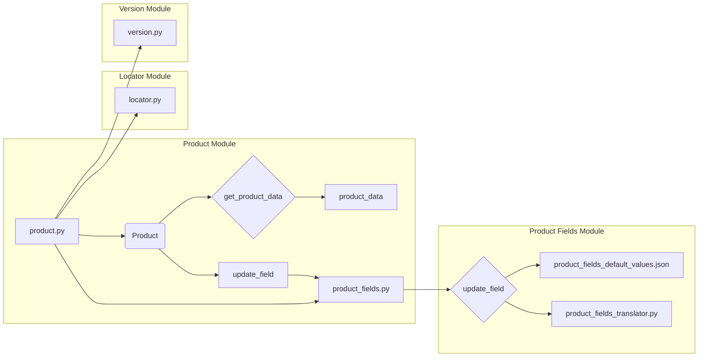

# <input code>

```
I'll start by extracting the contents of the `product.zip` file to see what it contains. Let's proceed with that.

I'll extract the contents of the `product.zip` file.

The `product` module contains several Python files, example files, and a JSON file. Here is a summary of the extracted contents:

1. `__init__.py`: Initializes the module.
2. `locator.py`: Likely contains locator definitions for web elements.
3. `product.py`: Contains the main logic related to products.
4. `product_fields`: Directory containing files related to product fields.
5. `version.py`: Manages the version information of the module.
6. `_examples`: Directory containing example scripts.

### Key Components

1. **Locator**
    - **Purpose**: Defines locators for web elements related to products.
    - **Functionality**:
        - Contains locators used by Selenium WebDriver to interact with web pages.

2. **Product**
    - **Purpose**: Manages product-related functionality.
    - **Functionality**:
        - Handles operations related to product data.
        - Interacts with the `product_fields` module to manage product attributes.

3. **Product Fields**
    - **Purpose**: Manages fields and attributes of products.
    - **Functionality**:
        - Defines product fields and their default values.
        - Translates product field names and values as needed.
        - Provides a central location for product attribute management.

4. **Version Management**
    - **Purpose**: Manages the versioning of the module.
    - **Functionality**:
        - Defines the current version of the module.
        - Provides version information for compatibility and updates.

5. **Documentation and Examples**
    - **Purpose**: Provides detailed documentation and usage examples for developers.
    - **Functionality**:
        - Explains the functionality and usage of the module.
        - Provides example scripts to demonstrate how to interact with product data.

### Example Usage

Here's an example of how you might use the `product` module:

```python
from product.product import Product
from product.product_fields import ProductFields

# Initialize the Product and ProductFields
product = Product()
product_fields = ProductFields()

# Example operation on product
product_data = product.get_product_data(product_id="12345")
product_fields.update_field("price", 19.99)

print(product_data)
```

### Additional Information

The `product_fields` directory contains additional scripts:

- **product_fields.py**: Defines the fields and their operations.
- **product_fields_default_values.json**: JSON file containing default values for product fields.
- **product_fields_translator.py**: Handles translation of field names and values.

### Documentation

The `_examples` directory contains example scripts and documentation files to help developers understand and use the module effectively.

---

This overview provides a comprehensive understanding of the `product` module's functionality. Let me know if you need any specific details or modifications!
```

# <algorithm>

Unfortunately, a detailed flowchart cannot be created from the provided text.  The text describes the *structure* and *intended functionality* of a Python module, not the *code* itself.  It outlines different components (classes, modules), their roles, and methods, but doesn't show the exact flow of execution.  To create a flowchart, the actual Python code from the files would be needed.


# <mermaid>



**Explanation of Dependencies (based on the description):**

* **`product.py` (Product Class):** Interacts with `product_fields.py` for updating product attributes (e.g., `update_field`). It potentially queries external resources (e.g., database, web API) for product data via `get_product_data`.
* **`product_fields.py` (Product Fields Module):** Contains the logic to update product fields. It interacts with `product_fields_default_values.json` to get default values, and `product_fields_translator.py` to handle translations or validations (which is inferred).
* **`locator.py`:** Used likely by `product.py` for web automation (Selenium or similar).
* **`version.py`:**  A separate module used for version management; potentially used to check for updates or compatibility.


# <explanation>

The provided text describes the *design* of a Python module, not the code itself.  Therefore, a detailed explanation of imports, classes, functions, variables, and possible errors requires the actual code.

**General understanding from the description:**

* **Imports:** The example usage shows imports `from product.product import Product` and `from product.product_fields import ProductFields`. These imports are necessary to use classes `Product` and `ProductFields` defined in their respective files. This implies a well-structured package (`src/product`) that adheres to the Python package structure, where `.py` files are defined as modules within a package.
* **Classes:**  `Product` and `ProductFields` are classes with methods (e.g., `Product.get_product_data` and `ProductFields.update_field`) to manage products and product attributes.
* **Functions:** The example shows `get_product_data` (likely part of the `Product` class) and `update_field` (likely part of the `ProductFields` class).  Without the code, we can't determine the function signatures (arguments, return values).
* **Variables:** The example mentions `product_id` and `price`, which are likely parameters (or attributes) of `Product` and arguments to methods within the `ProductFields` class.
* **Possible Errors/Improvements:**

    * **Missing Error Handling:**  The description lacks details on error handling (e.g., if a product with a given ID isn't found, or if an invalid field name is provided).
    * **Dependency Management:**  The description doesn't discuss how the module interacts with external services.   A good module would incorporate dependency management strategies.
    * **Data Validation:** The description mentions translation.  Validating input data is critical to avoid unexpected behavior.
    * **Testing:**  The description lacks details on testing.  Thorough testing is essential for quality assurance.

**Crucially:**  The provided text is a *design document* or a *high-level overview*.  It does not contain executable code, and thus, we can't provide a proper analysis or answer to the detailed analysis requested.