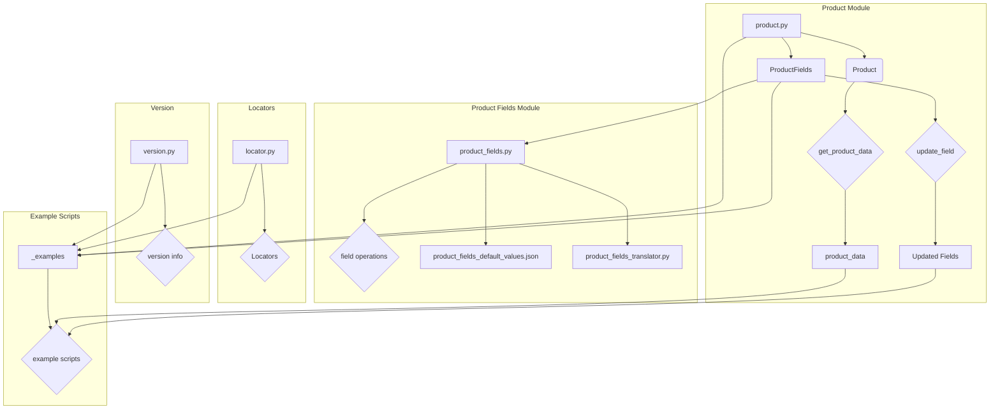

```MD
# Анализ кода модуля product

## <input code>

```
I'll start by extracting the contents of the `product.zip` file to see what it contains. Let's proceed with that.

I'll extract the contents of the `product.zip` file.

The `product` module contains several Python files, example files, and a JSON file. Here is a summary of the extracted contents:

1. `__init__.py`: Initializes the module.
2. `locator.py`: Likely contains locator definitions for web elements.
3. `product.py`: Contains the main logic related to products.
4. `product_fields`: Directory containing files related to product fields.
5. `version.py`: Manages the version information of the module.
6. `_examples`: Directory containing example scripts.

### Key Components

1. **Locator**
    - **Purpose**: Defines locators for web elements related to products.
    - **Functionality**:
        - Contains locators used by Selenium WebDriver to interact with web pages.

2. **Product**
    - **Purpose**: Manages product-related functionality.
    - **Functionality**:
        - Handles operations related to product data.
        - Interacts with the `product_fields` module to manage product attributes.

3. **Product Fields**
    - **Purpose**: Manages fields and attributes of products.
    - **Functionality**:
        - Defines product fields and their default values.
        - Translates product field names and values as needed.
        - Provides a central location for product attribute management.

4. **Version Management**
    - **Purpose**: Manages the versioning of the module.
    - **Functionality**:
        - Defines the current version of the module.
        - Provides version information for compatibility and updates.

5. **Documentation and Examples**
    - **Purpose**: Provides detailed documentation and usage examples for developers.
    - **Functionality**:
        - Explains the functionality and usage of the module.
        - Provides example scripts to demonStarte how to interact with product data.

### Example Usage

Here's an example of how you might use the `product` module:

```python
from product.product import Product
from product.product_fields import ProductFields

# Initialize the Product and ProductFields
product = Product()
product_fields = ProductFields()

# Example operation on product
product_data = product.get_product_data(product_id="12345")
product_fields.update_field("price", 19.99)

print(product_data)
```

### Additional Information

The `product_fields` directory contains additional scripts:

- **product_fields.py**: Defines the fields and their operations.
- **product_fields_default_values.json**: JSON file containing default values for product fields.
- **product_fields_translator.py**: Handles translation of field names and values.

### Documentation

The `_examples` directory contains example scripts and documentation files to help developers understand and use the module effectively.

---

This overview provides a comprehensive understanding of the `product` module's functionality. Let me know if you need any specific details or modifications!
```

## <algorithm>

(No algorithm can be described as the input is a documentation fragment, not executable code.)


## <mermaid>



## <explanation>

The provided text describes a Python module named `product`. It's a well-structured module organized to manage product-related data and operations. It leverages the following components:


* **Import Statements**:  The example code shows `from product.product import Product` and `from product.product_fields import ProductFields`.  Import statements allow you to use functions and classes defined in the modules (`product` and `product_fields`) without needing to write the full path each time.  This promotes better organization and code readability.

* **Classes**:
    * **`Product`**:  This class encapsulates product-related operations.  It likely has methods like `get_product_data(product_id)`.  The code snippet doesn't show the implementation, but hints that it interacts with the `product_fields` module.
    * **`ProductFields`**:  This class is responsible for managing product fields. It appears to have methods like `update_field(field_name, new_value)`.  It utilizes other components within the `product_fields` module.

* **Modules**:
    * **`product`**:  The root module containing various parts, such as the `product` class for manipulating product data and `product_fields` module handling of field management.
    * **`locator.py`**:  Likely contains Selenium locators for web elements related to product information.
    * **`product_fields`**:  Directory containing related files for product attribute management.
        * **`product_fields.py`**: This likely defines the structure of product fields, their possible values, and operations.
        * **`product_fields_default_values.json`**: This file contains default values for product fields.
        * **`product_fields_translator.py`**: It seems to manage translation or mapping of field names or values.
    * **`version.py`**: This file likely defines and manages the version information of the `product` module.
    * **`_examples`**: Directory containing examples that help demonStarte the use and usage of the `product` module and its components.

* **Functions**: The code snippet shows an example of usage, but details of individual functions are not available.  `get_product_data()` and `update_field()` are potential function calls within the respective classes.

* **Variables**: The example code shows `product_id="12345"` which is a variable. `product_data` is a variable whose type and content is implicit from its usage in the example.


* **Dependencies**: The `product` module depends on the `product_fields` module, and presumably on Selenium WebDriver if `locator.py` defines elements to interact with a web page.


* **Possible Errors or Improvements**:  The documentation lacks specific details on the internal implementation of the classes and functions.  More detailed docstrings within the code itself would improve maintainability and understanding. More specific comments about error handling in functions would greatly improve the reliability of the module.


**Relationship with Other Parts of the Project**: The `product` module clearly interacts with the `product_fields` module.  The relationships between `product.py`, `locator.py`, and potential other modules within the project (e.g. data storage, web scraping) aren't evident from the provided documentation. To fully analyze the dependencies, the full codebase would need to be examined.


**Overall**: This structure is well-organized, and the documentation provides a clear outline for understanding the components and their purpose. Additional details on the implementation would benefit further analysis and understanding.