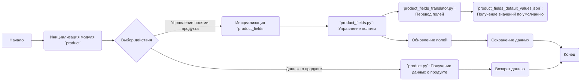
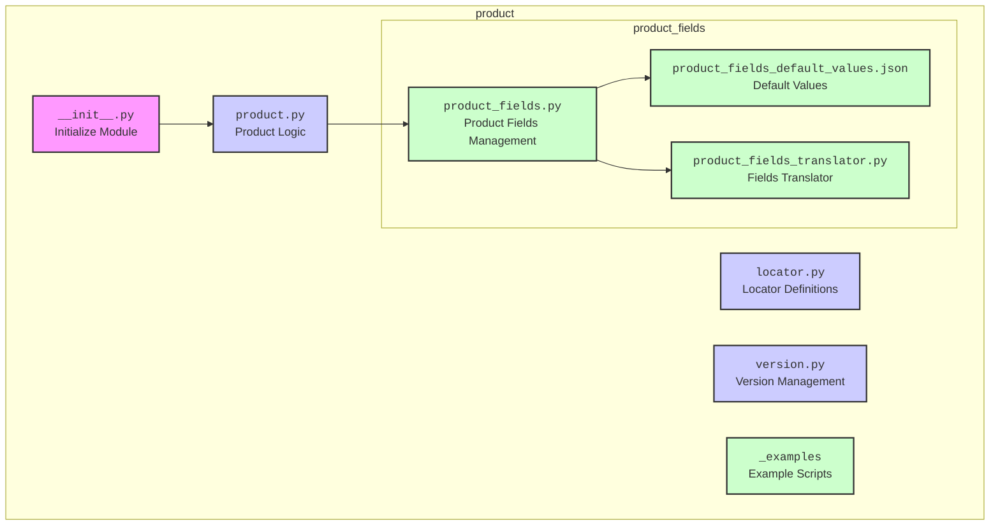

## АНАЛИЗ МОДУЛЯ `product`

### 1. <алгоритм>

Модуль `product` представляет собой структуру для управления данными о продуктах в рамках некоторой системы. Общая блок-схема выглядит следующим образом:

**Примеры:**

*   **Инициализация модуля `product`**: Загрузка и подготовка классов и функций для дальнейшей работы.
*   **Выбор действия**: Определение, какое действие нужно выполнить: получить данные о продукте или управлять его полями.
*   **`product.py`: Получение данных о продукте**:  Функция, принимающая идентификатор продукта и возвращающая его данные. Пример: `product.get_product_data(product_id="12345")` может вернуть `{'product_id': '12345', 'name': 'Example Product', 'price': 10.00}`.
*   **Инициализация `product_fields`**: Загрузка классов и функций для управления атрибутами продукта.
*   **`product_fields.py`: Управление полями**: Функции для добавления, обновления и удаления полей. Пример: `product_fields.update_field("price", 19.99)` обновляет значение поля "price".
*   **`product_fields_translator.py`: Перевод полей**: Функции для перевода названий полей на другие языки или форматы.
*   **`product_fields_default_values.json`: Получение значений по умолчанию**: Загрузка значений по умолчанию для полей продукта из JSON-файла.
*   **Возврат данных**: Возврат полученных или измененных данных о продукте.
*   **Обновление полей**: Изменение значений полей продукта.
*   **Сохранение данных**: Сохранение измененных данных в систему (например, в базу данных).
*   **Конец**: Завершение работы модуля.

### 2. <mermaid>

**Зависимости:**

*   `__init__.py` инициализирует модуль `product`, что делает доступными все его подмодули и функции.
*   `product.py` зависит от `product_fields.py` для управления полями продукта.
*   `product_fields.py` использует `product_fields_default_values.json` для получения значений по умолчанию и `product_fields_translator.py` для перевода полей.
*   `version.py` содержит информацию о версии модуля, которая может использоваться для управления совместимостью и обновлениями.
*   `_examples` предоставляет примеры использования модуля.

### 3. <объяснение>

**Импорты:**

*   `__init__.py`: Этот файл, хотя и не содержит явных импортов в этом описании, является инициализатором модуля. Он делает доступными все файлы внутри модуля `product`.
*   Импорты внутри других файлов модуля `product` не показаны в предоставленном тексте, но на основе анализа функциональности можно предположить, что:
    *   `product.py` может импортировать `product_fields.py` для доступа к функциям управления полями.
    *   `product_fields.py` может импортировать `product_fields_default_values.json` для получения значений по умолчанию, а также `product_fields_translator.py` для перевода.
    *   `_examples` могут импортировать `product.py` и `product_fields.py` для демонстрации использования.

**Классы:**

*   **`Product` (в `product.py`)**:
    *   **Роль:** Класс, инкапсулирующий логику работы с данными о продуктах.
    *   **Атрибуты:** Может содержать атрибуты, представляющие данные о продукте (например, `product_id`, `name`, `price`).
    *   **Методы:** Содержит методы для получения и обработки данных о продуктах, например, `get_product_data()`.
    *   **Взаимодействие:** Взаимодействует с классом `ProductFields` для управления атрибутами.
*   **`ProductFields` (в `product_fields.py`)**:
    *   **Роль:** Класс для управления полями и атрибутами продуктов.
    *   **Атрибуты:** Могут быть атрибуты для хранения списка полей и их значений.
    *   **Методы:** Методы для добавления, обновления, удаления и перевода полей. Например, `update_field()`, `get_field()`, `translate_field()`.
    *   **Взаимодействие:** Использует `product_fields_default_values.json` и `product_fields_translator.py`.

**Функции:**

*   **`get_product_data(product_id)` (в `product.py`)**:
    *   **Аргументы:** `product_id` (идентификатор продукта).
    *   **Возвращаемое значение:** Данные о продукте в виде словаря (например, `{'product_id': '12345', 'name': 'Example Product'}`).
    *   **Назначение:** Получение данных о продукте по его идентификатору.
    *   **Пример:** `product.get_product_data(product_id="12345")`
*   **`update_field(field_name, value)` (в `product_fields.py`)**:
    *   **Аргументы:** `field_name` (название поля), `value` (новое значение поля).
    *   **Возвращаемое значение:** Нет (обновляет данные внутри экземпляра `ProductFields`).
    *   **Назначение:** Обновление значения поля продукта.
    *   **Пример:** `product_fields.update_field("price", 19.99)`

**Переменные:**

*   В представленном тексте явных переменных нет, но можно предположить использование:
    *   `product`: Экземпляр класса `Product`.
    *   `product_fields`: Экземпляр класса `ProductFields`.
    *   `product_data`: Данные о продукте, полученные из `product.get_product_data()`.

**Потенциальные ошибки и области для улучшения:**

*   **Отсутствие конкретных реализаций:** Текст предоставляет лишь общий обзор и не содержит реальный код. Это затрудняет анализ ошибок.
*   **Обработка ошибок:** Нет явного упоминания обработки ошибок при доступе к файлам или базам данных.
*   **Необходимость контекста**: Понимание более глубоких связей с другими частями системы требует дополнительной информации.
*   **Версионирование**: Как обрабатывается изменение структуры `product_fields_default_values.json` с точки зрения версионирования, неясно.

**Цепочка взаимосвязей:**

1.  Модуль `product` зависит от подмодуля `product_fields` для управления полями продукта.
2.  `product_fields` зависит от `product_fields_default_values.json` для получения значений по умолчанию.
3.  `product_fields` зависит от `product_fields_translator.py` для перевода полей.
4.  Примеры использования в `_examples` зависят от `product.py` и `product_fields.py`.

Модуль `product` является ключевым компонентом системы для управления данными о продуктах. Для более глубокого анализа потребуется изучить исходные коды файлов, но текущая документация уже позволяет понять общую структуру и назначение модуля.