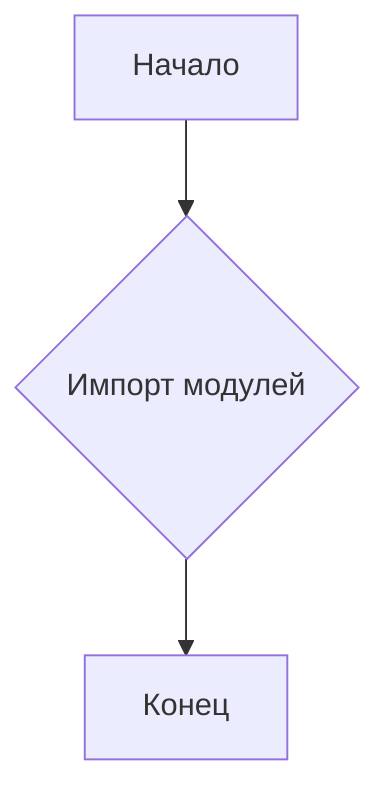
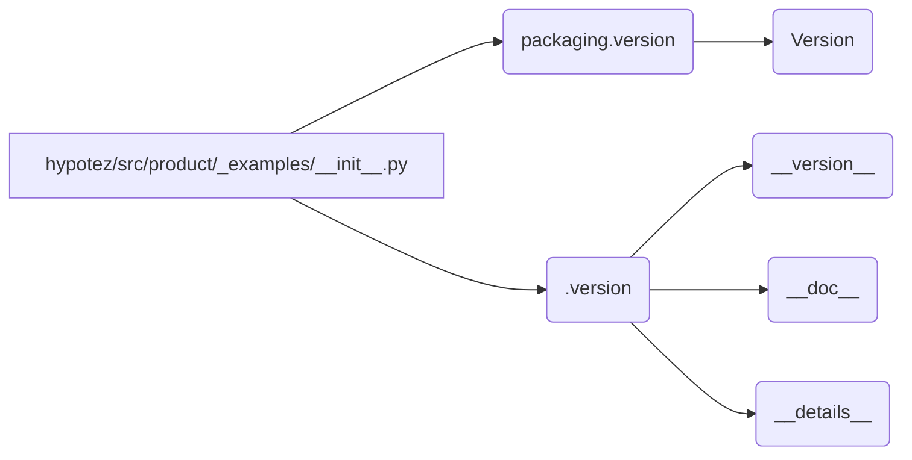

```MD
# Анализ кода hypotez/src/product/_examples/__init__.py

## <input code>

```python
## \file hypotez/src/product/_examples/__init__.py
# -*- coding: utf-8 -*-\
#! venv/Scripts/python.exe
#! venv/bin/python/python3.12

"""
.. module: src.product._examples 
	:platform: Windows, Unix
	:synopsis:

"""
MODE = 'dev'

"""
	:platform: Windows, Unix
	:synopsis:

"""


"""
	:platform: Windows, Unix
	:synopsis:

"""


"""
  :platform: Windows, Unix

"""
"""
  :platform: Windows, Unix
  :platform: Windows, Unix
  :synopsis:
"""MODE = 'dev'
  
""" module: src.product._examples """


from packaging.version import Version
from .version import __version__, __doc__, __details__
```

## <algorithm>

Этот код, по сути, является модулем инициализации для пакета `_examples` внутри модуля `product`.  Поскольку он пуст и содержит только импорты, алгоритм работы сводится к импорту.

**Блок-схема:**



**Примеры:**


## <mermaid>



**Объяснение диаграммы:**

Диаграмма показывает, что скрипт `hypotez/src/product/_examples/__init__.py` импортирует модули `packaging.version` и `./version`. Модуль `packaging.version` вероятно предоставляет функции для работы с версиями пакетов. Модуль `.version`, судя по именам импортируемых атрибутов, содержит информацию о версии, документации и других деталях модуля `_examples`.

## <explanation>

**Импорты:**

* `from packaging.version import Version`: Импортирует класс `Version` из пакета `packaging.version`. Этот пакет, скорее всего, часть стандартной библиотеки Python (или стороннего пакета), и используется для работы с версиями. В данном коде он, вероятно, используется для проверки или обработки версий в других частях проекта `hypotez`.
* `from .version import __version__, __doc__, __details__`: Импортирует атрибуты `__version__`, `__doc__`, и `__details__` из модуля `version.py` в текущем каталоге `_examples`. Эти атрибуты, вероятно, содержат информацию о версии модуля, документацию и другие метаданные.  Обратите внимание на относительный путь `.version`. Это означает, что файл `version.py` находится в том же каталоге, что и `__init__.py`.  Это типичная структура для пакетов Python.

**Классы, функции и переменные:**

В данном файле нет классов и функций, помимо импортов. Переменная `MODE` определена, но ее значение не используется в этом файле и скорее всего используется в других частях проекта `hypotez`.

**Возможные ошибки и улучшения:**

* **Неиспользуемые строки документации:** Большая часть строк документации (`""" """`) в данном файле пустая или неполная.  Стоит либо заполнить эту документацию, либо удалить эти строки для уменьшения нагромождения.
* **Дублирование переменной MODE:** Определение переменной `MODE` в двух разных местах скорее всего ошибка.  Необходимо выбрать один вариант и удалить дубликат.
* **Отсутствие функциональности:**  У этого `__init__.py` модуля нет собственной логики, он только импортирует атрибуты из `version.py`. Для практического использования, файл `version.py` должен быть дополнен функциональностью, связанной с версиями.

**Взаимосвязь с другими частями проекта:**

Файл `hypotez/src/product/_examples/__init__.py` импортирует модуль `version.py` из той же директории.  Это указывает на существование пакета `_examples` внутри `product`, в котором информация о версии и метаданные хранятся в отдельном файле.  Вероятно, в других частях проекта `hypotez` используется этот импортированный `__version__` для проверки версий или иных целей.