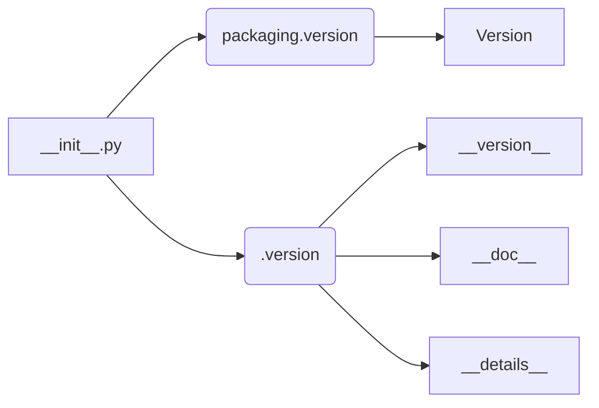

# <input code>

```python
## \file hypotez/src/product/_examples/__init__.py
# -*- coding: utf-8 -*-
#! venv/Scripts/python.exe
#! venv/bin/python/python3.12

"""
.. module: src.product._examples 
	:platform: Windows, Unix
	:synopsis:

"""
MODE = 'dev'

"""
	:platform: Windows, Unix
	:synopsis:

"""


"""
	:platform: Windows, Unix
	:synopsis:

"""


"""
  :platform: Windows, Unix

"""
"""
  :platform: Windows, Unix
  :platform: Windows, Unix
  :synopsis:
"""MODE = 'dev'
  
""" module: src.product._examples """


from packaging.version import Version
from .version import __version__, __doc__, __details__
```

# <algorithm>

Этот код представляет собой модуль `__init__.py` для пакета `_examples` внутри пакета `product` в проекте `hypotez`.  Поскольку он содержит только импорты и переменные, алгоритм довольно прост.  Нет явных вызовов функций или циклов.  Данные не перемещаются между функциями.

**Шаг 1:** Импорт модуля `Version` из пакета `packaging`.
**Шаг 2:** Импорт переменных `__version__`, `__doc__`, и `__details__` из подмодуля `.version`.


# <mermaid>



**Описание диаграммы:**

Модуль `__init__.py` импортирует переменные из модуля `.version` и модуля `packaging.version`. `packaging.version` содержит класс `Version`, а `.version` - переменные, которые, вероятно, представляют информацию о версии продукта (например, `__version__`, `__doc__`).


# <explanation>

**Импорты:**

- `from packaging.version import Version`: Импортирует класс `Version` из пакета `packaging`.  Пакет `packaging` предоставляет инструменты для работы с версиями программного обеспечения.  Он используется, скорее всего, для обработки и/или проверки версий в других частях проекта `hypotez`, связанных с продуктом.  Связь с другими частями: код `hypotez` наверняка использует информацию о версиях для управления зависимостями, ведения журналов, выявления несовместимостей и прочего.

- `from .version import __version__, __doc__, __details__`: Импортирует переменные `__version__`, `__doc__`, и `__details__` из модуля `version.py`, расположенного в папке `_examples` внутри `product`.  Это, скорее всего, информация о версии модуля `_examples` или связанном с ним продукте.  Связь с другими частями: эта информация, вероятно, используется в документации, системах управления версиями, или внутрикодовой проверке совместимости.  Данные о версии в этом модуле предоставляют информацию о конкретной реализации.

**Классы:**

Нет определенных классов.

**Функции:**

Нет определенных функций.

**Переменные:**

- `MODE = 'dev'`: Переменная, которая, скорее всего, определяет режим работы (`dev` — режим разработки).  Связь с другими частями: этот режим может влиять на конфигурацию, поведение и доступ к данным в других частях проекта.

**Возможные ошибки или улучшения:**

- **Неопределенное использование:** Неясно, как эти импорты используются в других частях проекта. Необходимо посмотреть на вызывающие модули, чтобы оценить назначение переменных и их роль в общем контексте.
- **Комментарии:** Комментарии `"""Docstrings"""` не очень информативные.  Они должны быть более конкретными и объясняющими назначение переменных `__version__`, `__doc__`, и `__details__`.
- **Дублирование `MODE`:**  Повторение определения переменной `MODE` — это ошибка, которую нужно исправить.  Это может привести к непредсказуемому поведению. Лучше всего оставить определение в одном месте, например, в `version.py`.


**Цепочка взаимосвязей:**

Модуль `_examples/__init__.py` предоставляет данные о версии (через импорты из `.version`). Эта информация о версии используется в других частях проекта `hypotez`, возможно, в `product` или в связанных модулях для обеспечения совместимости и обработки данных.