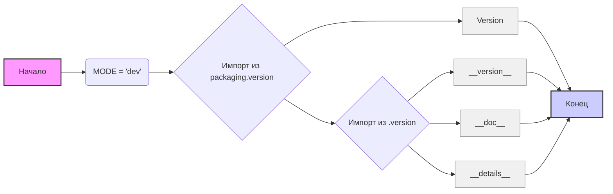

## Анализ кода `hypotez/src/product/_examples/__init__.py`

### 1. <алгоритм>

1. **Начало**: Инициализация модуля `src.product._examples`.
   - Пример: При загрузке модуля Python интерпретатор начинает выполнение кода в файле `__init__.py`.

2. **Установка режима**: Присваивание строкового значения 'dev' переменной `MODE`.
   - Пример: `MODE = 'dev'` устанавливает режим разработки.

3. **Импорт из `packaging.version`**: Импорт класса `Version`.
   - Пример: `from packaging.version import Version` позволяет использовать класс `Version` для работы с версиями пакетов.

4. **Импорт из `.version`**: Импорт переменных `__version__`, `__doc__` и `__details__`.
   - Пример: `from .version import __version__, __doc__, __details__` импортирует информацию о версии, документацию и детали модуля из файла `version.py` внутри текущего каталога.

5. **Конец**: Модуль готов к использованию, и импортированные переменные и классы доступны для использования.
   - Пример: Другие модули в пакете `src.product` могут импортировать и использовать `__version__`, `__doc__` и `__details__`, а также класс `Version`.

### 2. <mermaid>

**Объяснение зависимостей `mermaid`:**

*   **A [Начало]**:  Начало выполнения скрипта.
*   **B (MODE = 'dev')**: Установка переменной `MODE` в значение `'dev'`.
*   **C {Импорт из packaging.version}**:  Блок импорта из пакета `packaging.version`.
*   **D [Version]**: Импортированный класс `Version` из `packaging.version`.
*  **E {Импорт из .version}**: Блок импорта из файла `.version`, находящегося в той же директории.
*   **F [__version__]**: Импортированная переменная `__version__` из файла `version.py`, представляющая текущую версию модуля.
*   **G [__doc__]**: Импортированная переменная `__doc__` из файла `version.py`, представляющая документацию модуля.
*   **H [__details__]**: Импортированная переменная `__details__` из файла `version.py`, представляющая детали модуля.
*   **I [Конец]**: Конец выполнения скрипта.
* `classDef variable fill:#f0f0f0,stroke:#999,stroke-width:1px`: Определяет стиль для переменных.
* `style A fill:#f9f,stroke:#333,stroke-width:2px` и `style I fill:#ccf,stroke:#333,stroke-width:2px`: Применяет стили к блокам "Начало" и "Конец".

Диаграмма наглядно показывает последовательность операций в модуле, включая импорт зависимостей.

### 3. <объяснение>

**Импорты:**

*   `from packaging.version import Version`: Импортирует класс `Version` из пакета `packaging.version`. Этот класс используется для представления и сравнения версий программного обеспечения. Он не является частью `src.product`, а скорее внешней зависимостью, которая позволяет работать с версиями. Этот класс полезен для сравнения версий, проверки совместимости и обновления ПО.
*   `from .version import __version__, __doc__, __details__`: Импортирует три переменные из файла `version.py`, находящегося в той же директории, что и файл `__init__.py`.
    *   `__version__` - строка, содержащая текущую версию пакета/модуля.
    *   `__doc__` - строка, содержащая документацию модуля.
    *   `__details__` - строка, содержащая более подробную информацию о модуле.
    Эти переменные используются для предоставления информации о текущей версии и документации модуля. Они важны для документирования, отслеживания версий и предоставления подробной информации пользователям.

**Переменные:**

*   `MODE = 'dev'`: Строковая переменная, которая задает режим работы модуля. В данном случае устанавливает режим разработки ('dev'). Потенциально может использоваться для включения/отключения некоторых функций или для настройки поведения модуля в зависимости от окружения. Например, отладка кода будет доступна, если MODE = 'dev'.

**Объяснение:**

Файл `__init__.py` играет роль точки входа в пакет `src.product._examples`. Он выполняет несколько ключевых функций:

1.  **Объявление пакета**: Присутствие файла `__init__.py` указывает Python, что директория `_examples` должна интерпретироваться как пакет. Это позволяет импортировать модули из этого пакета.
2.  **Инициализация**:
    *   Установка режима `MODE` в `dev` может использоваться для настройки поведения пакета в различных средах (например, разработка, тестирование, продакшн).
    *   Импорт класса `Version` позволяет использовать его в других модулях пакета для работы с версиями.
    *   Импорт переменных из `.version` позволяет получить информацию о текущей версии и документации.
3.  **Предоставление API**: Экспорт переменных `__version__`, `__doc__` и `__details__` делает их доступными для импорта в другие модули пакета или в других частях проекта. Это позволяет использовать информацию о версии и документации в других частях проекта.

**Потенциальные улучшения:**

*   **Улучшить документацию**: Документация в виде docstring (`""" ... """`) может быть более подробной и информативной.
*   **Переменные среды**:  Вместо жесткого кодирования режима `MODE = 'dev'` можно использовать переменные среды для более гибкой настройки.
*   **Логирование**: Включение механизма логирования для отслеживания событий и ошибок.

**Взаимосвязь с другими частями проекта:**

*   Этот модуль является частью пакета `src.product`, что указывает на то, что он представляет собой компонент для какой-то продуктовой логики проекта.
*   Импорт `Version` из `packaging.version` указывает на зависимость от внешнего пакета, который нужно установить, что также может указываться в файле `requirements.txt`.
*   Переменные `__version__`, `__doc__` и `__details__` могут использоваться для контроля версий, создания документации и отображения подробной информации в других частях проекта.

В целом, данный код является типичным `__init__.py` файлом, который инициализирует пакет, устанавливает основные переменные и зависимости и обеспечивает базовую функциональность пакета `src.product._examples`.