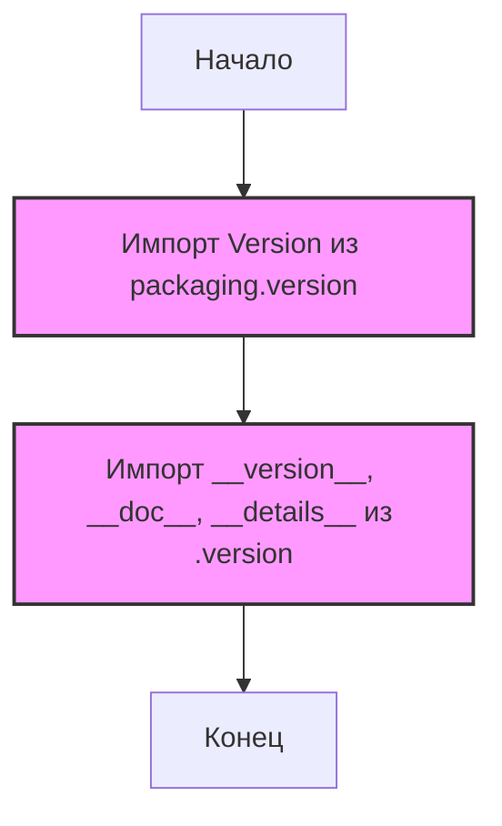

## Анализ кода `hypotez/src/product/_examples/__init__.py`

### 1. <алгоритм>

1. **Начало**: Инициализация модуля `src.product._examples`.
2. **Импорт `Version`**: Из пакета `packaging.version` импортируется класс `Version`. Этот класс используется для сравнения и работы с версиями.
   *   _Пример_: `Version("1.2.3")` создает объект версии, который можно сравнить с другими версиями.
3.  **Импорт из `.version`**: Импортируются переменные `__version__`, `__doc__`, и `__details__` из модуля `version.py`, находящегося в той же директории, что и `__init__.py`.
   *   _Пример_: `__version__` может содержать строку с номером версии (например, "1.0.0"), `__doc__` - строку с документацией модуля, а `__details__` - детальную информацию о модуле.
4.  **Конец**: Модуль готов к использованию, предоставляя доступ к импортированным переменным и классам.

### 2. <mermaid>

**Объяснение:**

*   `Start`: Начальная точка выполнения модуля.
*   `ImportVersion`: Импортирует класс `Version` из пакета `packaging.version`. Это зависимость от сторонней библиотеки, которая используется для управления версиями.
*   `ImportFromVersion`: Импортирует переменные `__version__`, `__doc__`, и `__details__` из файла `version.py`. Это внутренняя зависимость в пределах пакета `src.product._examples`.
*   `End`: Конечная точка выполнения модуля.

### 3. <объяснение>

**Импорты:**

*   `from packaging.version import Version`: Импортирует класс `Version` из библиотеки `packaging`, предназначенной для работы с версиями пакетов. Эта библиотека не является частью `src` и является внешней зависимостью.
*   `from .version import __version__, __doc__, __details__`: Импортирует переменные из файла `version.py`, находящегося в том же каталоге.
    *   `__version__`: Строка, содержащая версию текущего пакета (например, `"1.2.3"`).
    *   `__doc__`: Строка, содержащая документацию для пакета.
    *   `__details__`: Строка, содержащая дополнительную информацию о пакете.

**Назначение файла:**

Файл `__init__.py` играет роль входной точки для пакета `src.product._examples`. Он делает доступными для использования в других частях проекта  `Version` и переменные, содержащие информацию о версии.

**Взаимосвязи:**
*  `packaging.version`: Внешняя зависимость, не входящая в проект `src`.
*  `src.product._examples.version`: Внутренняя зависимость, находящаяся в том же каталоге.

**Потенциальные улучшения:**
*   Проверка наличия необходимых файлов, особенно `version.py` и пакета `packaging` в окружении.
*   Добавление более осмысленного `__doc__`.

**Цепочка взаимосвязей:**
`hypotez/src/product/_examples/__init__.py` -> `packaging.version.Version` (внешняя библиотека)
                                                                 -> `hypotez/src/product/_examples/version.py` (внутренний файл)

**Использование в проекте:**
Этот файл позволяет получить информацию о версии и документации для пакета `src.product._examples`. Он может использоваться в других модулях проекта для проверки версии пакета или вывода документации.