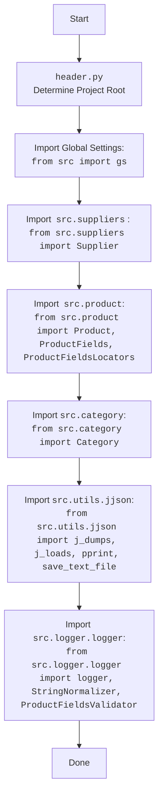

## Анализ кода `hypotez/src/product/_examples/header.py`

### 1. <алгоритм>

**Блок-схема:**

1.  **Определение корневой директории проекта (`dir_root`):**
    *   Начало: Получение текущей рабочей директории с помощью `os.getcwd()`.
    *   Поиск последнего вхождения строки "hypotez" в текущей директории с помощью `os.getcwd().rfind('hypotez')`.
        *   Пример: Если `os.getcwd()` возвращает `/home/user/projects/hypotez/src/product`, то `os.getcwd().rfind('hypotez')` вернёт `21`.
    *   Извлечение подстроки до найденного индекса + 11 (длина "hypotez" равна 7 + 4 символа) для получения корневой директории. 
        *   Пример: `/home/user/projects/hypotez`.
    *   Создание объекта `Path` из полученной строки.
2.  **Добавление корневой директории в `sys.path`:**
    *   Преобразование `Path` объекта `dir_root` в строку с помощью `str(dir_root)`.
        *   Пример: `/home/user/projects/hypotez`
    *   Добавление полученной строки в список путей поиска модулей `sys.path`.
3.  **Определение директории `src`:**
    *   Создание объекта `Path` для директории `src`, находящейся в корневой директории.
        *   Пример: `/home/user/projects/hypotez/src`
    *   Добавление полученной строки в список путей поиска модулей `sys.path`.
4.  **Вывод корневой директории:**
    *   Вывод значения переменной `dir_root` в консоль для отладки.
5.  **Импорт необходимых модулей:**
    *   Импорт стандартных библиотек: `pathlib`, `json`, `re`.
    *   Импорт внутренних модулей проекта: `gs`, `Supplier`, `Product`, `ProductFields`, `ProductFieldsLocators`, `Category`, `j_dumps`, `j_loads`, `pprint`, `save_text_file`, `logger`, `StringNormalizer`, `ProductFieldsValidator`.

**Поток данных:**

*   `os.getcwd()` -> `str` (текущая рабочая директория) -> `dir_root` (`Path`)
*   `dir_root` (`Path`) -> `str` -> `sys.path`
*   `dir_root` (`Path`) -> `dir_src` (`Path`)
*    `dir_src` (`Path`) -> `str` -> `sys.path`
*   `dir_root` -> `print()`

### 2. <mermaid>

```mermaid
flowchart TD
    Start(Start) --> GetCurrentDir[Get Current Working Directory: <br><code>os.getcwd()</code>];
    GetCurrentDir --> FindHypotez[Find 'hypotez' in Path: <br><code>os.getcwd().rfind('hypotez')</code>];
    FindHypotez --> ExtractRootDir[Extract Root Directory Path: <br><code>os.getcwd()[:os.getcwd().rfind('hypotez')+11]</code>];
    ExtractRootDir --> CreatePathObject[Create Path Object for Root Directory: <br><code>Path(rootDirString)</code>];
    CreatePathObject --> AddRootDirToSysPath[Add Root Directory to <code>sys.path</code>: <br><code>sys.path.append(str(dir_root))</code>];
    AddRootDirToSysPath --> CreateSrcDir[Create Path Object for <code>src</code> Directory: <br><code>Path(dir_root, 'src')</code>];
    CreateSrcDir --> AddSrcDirToSysPath[Add <code>src</code> Directory to <code>sys.path</code>: <br><code>sys.path.append(str(dir_src))</code>];
     AddSrcDirToSysPath --> PrintRootDir[Print Root Directory for debugging: <br><code>print(dir_root)</code>];

    PrintRootDir --> ImportModules[Import Standard and Project Modules]
    ImportModules --> Done[Done]


    style Start fill:#f9f,stroke:#333,stroke-width:2px
    style Done fill:#ccf,stroke:#333,stroke-width:2px
```



**Объяснение зависимостей в mermaid:**

*   **Первая диаграмма** отображает логику определения корневой директории проекта и добавления её в `sys.path`, что позволяет импортировать модули проекта.
    *   `GetCurrentDir`: Использует функцию `os.getcwd()` для получения текущей рабочей директории.
    *    `FindHypotez`: Находит индекс начала строки 'hypotez' в полученной директории.
    *    `ExtractRootDir`: Извлекает строку, представляющую корневую директорию проекта, на основе индекса 'hypotez'.
    *   `CreatePathObject`: Создает объект `Path` для представления корневой директории, что позволяет использовать объектно-ориентированные методы.
    *   `AddRootDirToSysPath`: Добавляет путь к корневой директории в `sys.path`, делая возможным импорт модулей.
    *   `CreateSrcDir`: Создает объект `Path` для представления директории `src` внутри корневой.
    *  `AddSrcDirToSysPath`: Добавляет путь к директории `src` в `sys.path`.
    *    `PrintRootDir`: Выводит значение переменной `dir_root` для отладки.
     *   `ImportModules`: Импортирует стандартные и внутренние модули проекта.
*   **Вторая диаграмма** показывает импорт внутренних модулей проекта, используя пути, добавленные в `sys.path` на первом этапе.
     *   `Header`: Начальная точка скрипта `header.py`.
    *   `import`: Импорт модуля `src.gs`, который скорее всего содержит глобальные настройки.
     * `import_suppliers`: Импорт модуля `src.suppliers.Supplier`, который содержит классы, связанные с поставщиками.
     *  `import_product`: Импорт классов `src.product.Product`, `src.product.ProductFields`, `src.product.ProductFieldsLocators`, связанных с продуктами.
     *  `import_category`: Импорт класса `src.category.Category`, связанного с категориями товаров.
      * `import_utils`: Импорт функций `src.utils.jjson.j_dumps`, `src.utils.jjson.j_loads`, `src.utils.jjson.pprint`, `src.utils.jjson.save_text_file`, для работы с JSON и текстом.
     * `import_logger`: Импорт `src.logger.logger` для логирования, а также вспомогательных классов `src.logger.StringNormalizer` и  `src.logger.ProductFieldsValidator`.

### 3. <объяснение>

**Импорты:**

*   `import sys`:  Модуль `sys` предоставляет доступ к некоторым переменным и функциям, взаимодействующим с интерпретатором Python. Здесь используется `sys.path.append()` для добавления путей поиска модулей, что позволяет импортировать модули из указанных директорий. Это важно для корректной работы проекта, поскольку модули не лежат в стандартных каталогах.
*   `import os`:  Модуль `os` предоставляет интерфейс для взаимодействия с операционной системой. Здесь используется `os.getcwd()` для получения текущей рабочей директории, а также `os.getcwd().rfind('hypotez')` для поиска индекса вхождения подстроки, что позволяет корректно определить корень проекта.
*   `from pathlib import Path`:  Класс `Path` из модуля `pathlib` предоставляет удобный способ работы с путями файлов и директорий в объектно-ориентированном стиле. Он используется для представления путей к корневой директории и директории `src`.
*   `import json`: Модуль `json` используется для работы с JSON-данными, включая сериализацию и десериализацию.
*    `import re`: Модуль `re` используется для работы с регулярными выражениями.
*   `from src import gs`: Импортирует модуль `gs` (предположительно "global settings") из пакета `src`. Это может содержать глобальные настройки для всего проекта. Взаимосвязано с другими частями проекта, предоставляя общие настройки.
*   `from src.suppliers import Supplier`: Импортирует класс `Supplier` из модуля `suppliers` в пакете `src`. Представляет модель данных для поставщика.
*   `from src.product import Product, ProductFields, ProductFieldsLocators`: Импортирует классы `Product`, `ProductFields`, и `ProductFieldsLocators` из модуля `product` пакета `src`. Эти классы отвечают за представление продуктов, их полей и локаторы соответственно.
*   `from src.category import Category`: Импортирует класс `Category` из модуля `category` пакета `src`. Этот класс представляет категории товаров.
*   `from src.utils.jjson import j_dumps, j_loads, pprint, save_text_file`: Импортирует функции `j_dumps`, `j_loads`, `pprint` и `save_text_file` из модуля `jjson` пакета `src.utils`. Эти функции предоставляют утилиты для работы с JSON и файлами.
    *   `j_dumps`: Вероятно, функция для сериализации данных в JSON-формат (аналогична `json.dumps`).
    *   `j_loads`: Вероятно, функция для десериализации JSON-данных в Python-объекты (аналогична `json.loads`).
    *   `pprint`: Вероятно, функция для "красивой" печати данных на экран.
    *   `save_text_file`: Функция для сохранения текстовых данных в файл.
*   `from src.logger.logger import logger, StringNormalizer, ProductFieldsValidator`: Импортирует `logger`, `StringNormalizer`, и `ProductFieldsValidator` из модуля `logger` пакета `src.logger`.
    *   `logger`: Объект для логирования событий в приложении.
    *   `StringNormalizer`: Класс или функция для нормализации строк (например, удаление лишних пробелов, приведение к нижнему регистру).
    *   `ProductFieldsValidator`: Класс или функция для валидации полей продуктов.

**Функции:**

*   В представленном коде определены переменные, такие как `dir_root`, `dir_src`, которые вычисляются. Функций нет.

**Переменные:**

*   `dir_root`: Объект `Path`, представляющий корневую директорию проекта. Он вычисляется на основе текущей рабочей директории и используется для добавления путей в `sys.path`.
*   `dir_src`: Объект `Path`, представляющий директорию `src` внутри корневой директории проекта.

**Потенциальные ошибки и улучшения:**

*   **Жестко заданный "hypotez"**: Поиск подстроки `"hypotez"` может привести к ошибке, если имя проекта изменится. Лучше использовать более надежный способ определения корневой директории (например, поиск файла с известным именем).
*  **Дублирование добавления в sys.path**: `sys.path.append (str (dir_root) )` дублируется. Необходимо оставить одно добавление.
*   **Отсутствие обработки ошибок**: Код не обрабатывает возможные ошибки, например, если не удается найти подстроку "hypotez".
*   **Неиспользуемые импорты**: В коде есть импорты, которые не используются (`json`, `re`). Их следует удалить, чтобы сделать код более чистым.
*   **Неявные зависимости**: В коде используются модули с именами `gs`, `Supplier`, `Product`, `Category`, `j_dumps`, `j_loads`, `pprint`, `save_text_file`, `logger`, `StringNormalizer`, `ProductFieldsValidator`. Необходимо убедится, что они существуют в проекте и их использование корректно.
*   **Многоточия**: В коде встречаются многоточия `...`. Необходимо заменить их на корректный код, который должен быть выполнен.
*  **Дублирование блока комментария**: Присутствуют дублирования блоков комментариев `"""\n\t:platform: Windows, Unix\n\t:synopsis:\n\n"""` Необходимо их убрать.

**Взаимосвязи с другими частями проекта:**

*   Этот код является частью процесса инициализации проекта, так как устанавливает пути для импорта модулей.
*   Импортированные модули, такие как `gs`, `Supplier`, `Product`, `Category`, `logger`, `StringNormalizer`, `ProductFieldsValidator`, используются другими частями проекта и предоставляют необходимую функциональность.
*   Модули  `src.utils.jjson` используются для работы с файлами.

**Заключение:**

Код выполняет важную функцию по определению корневой директории проекта и настройке путей импорта. Однако, он требует улучшений, таких как: обработки ошибок, более надежного способа определения корня проекта, удаления неиспользуемых импортов и избавления от многоточий, а также дублирования блоков комментариев. Правильное определение корневого пути важно для корректной работы всего проекта.