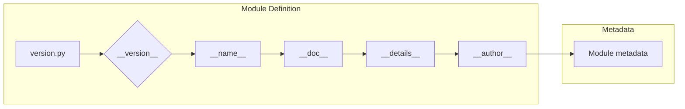

# <input code>

```python
## \file hypotez/src/product/_examples/version.py
# -*- coding: utf-8 -*-\
#! venv/Scripts/python.exe
#! venv/bin/python/python3.12

"""
.. module: src.product._examples 
	:platform: Windows, Unix
	:synopsis:

"""
MODE = 'dev'

"""
	:platform: Windows, Unix
	:synopsis:

"""


"""
	:platform: Windows, Unix
	:synopsis:

"""


"""
  :platform: Windows, Unix

"""
"""
  :platform: Windows, Unix
  :platform: Windows, Unix
  :synopsis:
"""MODE = 'dev'
  
""" module: src.product._examples """


"""
- `__version__`: This variable holds the version of the module or package.
- `__name__`: Contains the name of the module. If the script is being run directly, the value will be `"__main__"`.
- `__doc__`: The module's documentation string.
- `__details__`: This variable likely contains additional details about the module, but the exact purpose depends on the specific module or package.
- `__annotations__`: Contains type annotations for variables and functions in the module.
- `__author__`: The name(s) of the author(s) of the module.
"""
__name__:str
__version__="3.12.0.0.0.4"
__doc__:str
__details__:str="Details about version for module or class"
__annotations__

__author__='hypotez '
```

# <algorithm>

```mermaid
graph TD
    A[Start] --> B{Check __name__};
    B -- __name__ == "__main__" --> C[Print version];
    B -- __name__ != "__main__" --> D[Module initialization];
    C --> E[End];
    D --> E;
```

Этот код не содержит алгоритма в виде последовательности шагов, а представляет собой определение модуля, скорее всего, Python.  В нем заданы переменные, представляющие атрибуты (метаданные) модуля, такие как версия (`__version__`), имя (`__name__`), документация (`__doc__`), дополнительные детали (`__details__`) и автор (`__author__`).


# <mermaid>



# <explanation>

Этот код определяет Python-модуль, скорее всего, в рамках проекта `hypotez`.  Он содержит константы, строки документации (`docstrings`) и переменные, которые предоставляют метаданные о модуле.

**Импорты:**

Нет явных импортов.  Код самодостаточный.


**Классы:**

Нет классов.


**Функции:**

Нет функций.


**Переменные:**

- `MODE`: Строковая переменная, вероятно, определяющая режим работы модуля.  Значение `'dev'` указывает на режим разработки.
- `__version__`: Строковая переменная, хранящая версию модуля (`3.12.0.0.0.4`).
- `__name__`: Специальная переменная, хранящая имя модуля. Она определена в стандартной библиотеке Python.  Значение `__main__` устанавливается, когда скрипт запускается напрямую, а имя модуля, когда он импортируется.
- `__doc__`, `__details__`, `__annotations__`, `__author__`: Переменные, описывающие модуль.  `__doc__` - это строка документации (docstring) модуля.   `__details__` -  предположительно содержит дополнительные детали о версии модуля,  `__annotations__` —  типы данных аргументов и возвращаемых значений (не определено в данном примере). `__author__` —  автор(ы) модуля.


**Возможные ошибки или области для улучшений:**

- **Неинформативные комментарии:** Многие строки комментариев не содержат полезной информации, например, `"""\n	:platform: Windows, Unix\n	:synopsis:\n"""`.  Они должны быть более описательными,  более конкретными для улучшения понимания кода и его целей.
- **Избыточность:** Строки документации повторяют друг друга, особенно с платформой `Windows, Unix`.
- **Отсутствующая логика:** В коде отсутствует основная логика работы модуля.  Он просто определяет метаданные.


**Взаимосвязи с другими частями проекта:**

Вероятнее всего, этот модуль (`version.py`) предоставляет информацию о версии  для использования в других частях проекта `hypotez`, например, для проверки совместимости или для вывода сведений о версии при запуске.  Его использование будет во многом зависеть от того, как организована структура `hypotez`.