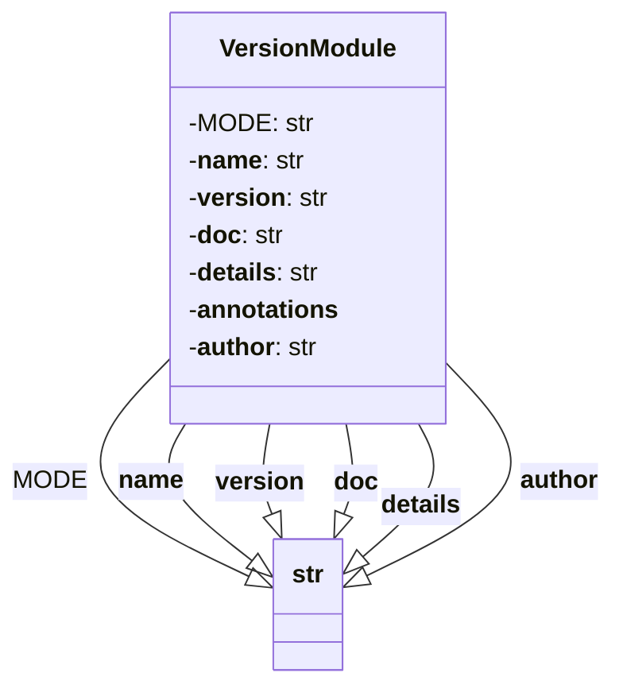

## Анализ кода `hypotez/src/product/_examples/version.py`

### 1. <алгоритм>

**Описание:**

Файл `version.py` предназначен для хранения и предоставления метаданных о версии и других атрибутах модуля `src.product._examples`. Он содержит переменные, такие как `__version__`, `__name__`, `__doc__`, `__details__`, `__annotations__`, и `__author__`, которые описывают модуль. Алгоритм работы файла очень прост: при импорте или выполнении файла интерпретатор Python присваивает этим переменным соответствующие значения.

**Блок-схема:**

```mermaid
graph LR
    A[Начало выполнения скрипта] --> B{Объявление MODE = 'dev'};
    B --> C[Объявление __name__:str];
    C --> D[Объявление __version__ = "3.12.0.0.0.4"];
    D --> E[Объявление __doc__:str];
    E --> F[Объявление __details__="Details about version for module or class"];
    F --> G[Объявление __annotations__];
    G --> H[Объявление __author__='hypotez '];
    H --> I[Конец выполнения скрипта];
    
    style A fill:#f9f,stroke:#333,stroke-width:2px
    style I fill:#ccf,stroke:#333,stroke-width:2px
```

**Примеры:**
- **`MODE = 'dev'`**:  Устанавливает режим разработки.
- **`__name__`**: Автоматически устанавливается интерпретатором Python. При прямом запуске скрипта будет `'__main__'`, иначе - имя модуля (`'src.product._examples'`).
- **`__version__ = "3.12.0.0.0.4"`**:  Указывает версию модуля.
- **`__doc__`**:  Документационная строка модуля, которая, в данном случае, пуста.
- **`__details__ = "Details about version for module or class"`**:  Предоставляет дополнительные сведения о версии.
- **`__annotations__`**: Хранит аннотации типов переменных, пустая в данном случае.
- **`__author__ = 'hypotez '`**:  Указывает автора модуля.

### 2. <mermaid>



**Описание диаграммы:**

- `classDiagram`: Определяет диаграмму классов.
- `class VersionModule`:  Представляет модуль `version.py`.
- `-MODE: str`: Приватный атрибут `MODE`, тип - строка.
- `-__name__: str`: Приватный атрибут `__name__`, тип - строка.
- `-__version__: str`:  Приватный атрибут `__version__`, тип - строка.
- `-__doc__: str`:  Приватный атрибут `__doc__`, тип - строка.
- `-__details__: str`: Приватный атрибут `__details__`, тип - строка.
- `-__annotations__`: Приватный атрибут `__annotations__`.
- `-__author__: str`:  Приватный атрибут `__author__`, тип - строка.
- `VersionModule --|> str : ...`: Указывает, что каждый атрибут является строковым значением или не имеет типа.

**Зависимости:**
В коде нет явных импортов других модулей. Вся функциональность реализуется за счёт внутренних переменных и их присваивания.
### 3. <объяснение>

**Импорты:**
В данном коде отсутствуют какие-либо импорты. Это означает, что файл использует только встроенные возможности Python.

**Классы:**
В данном коде нет определения классов. Весь код сосредоточен вокруг объявления переменных, описывающих модуль.

**Функции:**
В коде отсутствуют какие-либо функции.

**Переменные:**

- **`MODE`**:
   - **Тип:** `str` (строка).
   - **Использование:**  Указывает режим работы модуля (в данном случае, `'dev'` - режим разработки). Может использоваться в других частях проекта для определения поведения в зависимости от окружения.
- **`__name__`**:
    - **Тип:** `str` (строка).
    - **Использование:**  Предоставляет имя модуля.  При непосредственном запуске скрипта `__name__` будет равно `__main__`. Если модуль импортируется, `__name__` будет равно имени модуля (в данном случае, `src.product._examples`). Используется для определения, как был запущен скрипт (напрямую или как импортированный модуль).
- **`__version__`**:
   - **Тип:** `str` (строка).
   - **Использование:**  Содержит текущую версию модуля. Используется для контроля версий и может отображаться пользователям.
- **`__doc__`**:
    - **Тип:** `str` (строка).
    - **Использование:** Строка документации (docstring) модуля. В текущей реализации строка пуста, но предполагается, что она будет содержать описание модуля.
- **`__details__`**:
    - **Тип:** `str` (строка).
    - **Использование:**  Содержит дополнительные сведения о версии модуля. В данном случае, `Details about version for module or class`.
- **`__annotations__`**:
    - **Тип:** не указан, поскольку явно не инициализируется
    - **Использование:**  Предполагается хранить аннотации типов переменных и функций в модуле.
- **`__author__`**:
    - **Тип:** `str` (строка).
    - **Использование:**  Указывает автора модуля, в данном случае `'hypotez '`.

**Потенциальные ошибки или области для улучшения:**

1. **Пустая документация:** Переменная `__doc__` не содержит описания.  Стоит добавить документационную строку с описанием модуля.
2. **Неопределенный тип `__annotations__`:**  Переменная `__annotations__`  объявлена, но не имеет явного присвоения. Если она предназначена для хранения аннотаций, стоит правильно инициализировать её, например, `{}` или `dict[str,type]`.
3. **Жестко заданная версия:** Версия модуля жестко задана в коде. Стоит рассмотреть использование более гибких методов управления версиями, например, через инструменты `setuptools` или переменные окружения.
4. **Дублирование `MODE = 'dev'`**: Строка `MODE = 'dev'` повторяется дважды в файле, это избыточно.
5. **Нестандартная нумерация версии:**  Версия `3.12.0.0.0.4` не соответствует стандартным соглашениям о версионировании. Рекомендуется использовать более стандартный формат, например, `3.12.0-alpha.4`.

**Цепочка взаимосвязей с другими частями проекта:**

Этот файл является частью модуля `src.product._examples`, который вероятно, служит для демонстрации или тестирования возможностей проекта. Он может быть использован другими частями проекта для получения информации о версии модуля. Например, другие модули могут импортировать `__version__` или `__details__` для отображения информации о версии программы или для контроля совместимости. Этот модуль, вероятно, импортируется где-то для чтения переменных, таких как версия, автор и прочее.