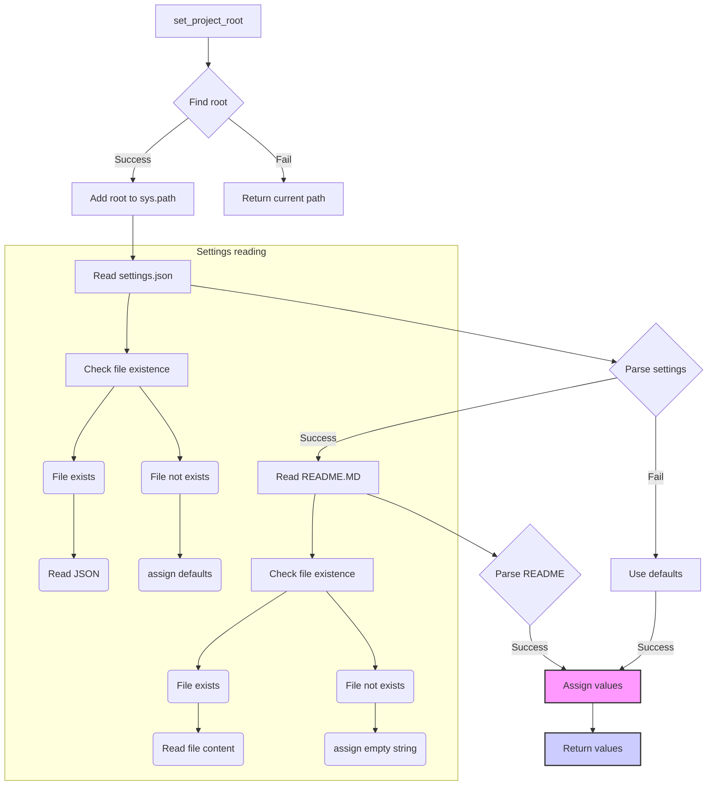

```MD
# Анализ кода из файла hypotez/src/product/header.py

## <input code>

```python
## \file hypotez/src/product/header.py
# -*- coding: utf-8 -*-\
#! venv/Scripts/python.exe
#! venv/bin/python/python3.12

"""
.. module: src.product 
	:platform: Windows, Unix
	:synopsis:

"""
MODE = 'dev'

"""
	:platform: Windows, Unix
	:synopsis:

"""


"""
	:platform: Windows, Unix
	:synopsis: Модуль определяющий корневой путь к проекту. Все импорты строятся относительно этого пути.
    :TODO: В дальнейшем перенести в системную переменную

"""

import sys
import json
from packaging.version import Version

from pathlib import Path
def set_project_root(marker_files=('pyproject.toml', 'requirements.txt', '.git')) -> Path:
    """
    Finds the root directory of the project starting from the current file's directory,
    searching upwards and stopping at the first directory containing any of the marker files.

    Args:
        marker_files (tuple): Filenames or directory names to identify the project root.
    
    Returns:
        Path: Path to the root directory if found, otherwise the directory where the script is located.
    """
    __root__:Path
    current_path:Path = Path(__file__).resolve().parent
    __root__ = current_path
    for parent in [current_path] + list(current_path.parents):
        if any((parent / marker).exists() for marker in marker_files):
            __root__ = parent
            break
    if __root__ not in sys.path:
        sys.path.insert(0, str(__root__))
    return __root__


# Get the root directory of the project
__root__ = set_project_root()
"""__root__ (Path): Path to the root directory of the project"""

from src import gs

settings:dict = None
try:
    with open(gs.path.root / 'src' /  'settings.json', 'r') as settings_file:
        settings = json.load(settings_file)
except (FileNotFoundError, json.JSONDecodeError):
    ...

doc_str:str = None
try:
    with open(gs.path.root / 'src' /  'README.MD', 'r') as settings_file:
        doc_str = settings_file.read()
except (FileNotFoundError, json.JSONDecodeError):
    ...


__project_name__ = settings.get("project_name", 'hypotez') if settings  else 'hypotez'
__version__: str = settings.get("version", '')  if settings  else ''
__doc__: str = doc_str if doc_str else ''
__details__: str = ''
__author__: str = settings.get("author", '')  if settings  else ''
__copyright__: str = settings.get("copyrihgnt", '')  if settings  else ''
__cofee__: str = settings.get("cofee", "Treat the developer to a cup of coffee for boosting enthusiasm in development: https://boosty.to/hypo69")  if settings  else "Treat the developer to a cup of coffee for boosting enthusiasm in development: https://boosty.to/hypo69"
```

## <algorithm>

**Шаг 1**: Функция `set_project_root` определяет корневой каталог проекта. Она начинает поиск с текущего каталога и движется вверх по дереву каталогов.
**Пример**: Если скрипт находится в `hypotez/src/product/header.py`, то поиск начнется с `hypotez/src/product`, затем `hypotez/src`, и так далее, пока не найдет директорию содержащую `pyproject.toml`, `requirements.txt` или `.git`.
**Шаг 2**: Если корневой каталог найден, он добавляется в `sys.path`. Это необходимо, чтобы Python мог импортировать модули из других каталогов проекта.
**Шаг 3**:  Считывание настроек из `settings.json` и `README.MD` с использованием `try-except` для обработки возможных ошибок (файла не существует или неправильный формат).
**Шаг 4**:  Получение значений настроек из словаря `settings` с использованием `settings.get()`. Задаются значения по умолчанию на случай отсутствия соответствующего ключа в `settings`.
**Пример**: Если в `settings.json` отсутствует ключ `project_name`, значение переменной `__project_name__` будет равно 'hypotez'.


## <mermaid>



## <explanation>

**Импорты:**
- `sys`: Предоставляет доступ к системным переменным Python, в частности к `sys.path`, что важно для импорта модулей из других частей проекта.
- `json`: Используется для сериализации и десериализации JSON-данных из файла `settings.json`.
- `packaging.version`: Используется для работы с версиями пакетов.
- `pathlib`: Обеспечивает работу с путями к файлам в системе независимо от операционной системы.
- `gs`: Скорее всего, это собственный модуль проекта,  `gs.path.root` используется для определения корневого каталога проекта. Необходимо дополнительно исследовать этот модуль.

**Классы:**
- Нет явных определений классов.


**Функции:**
- `set_project_root(marker_files) -> Path`: Находит корневой каталог проекта, начиная с текущего файла.  Важно для относительных путей. Аргументы: `marker_files`, кортеж маркеров для поиска (например, `pyproject.toml`). Возвращает путь к корневому каталогу.

**Переменные:**
- `MODE`: Строковая переменная, вероятно, для обозначения режима работы (например, 'dev', 'prod').
- `__root__`: Путь к корневому каталогу проекта, полученный из функции `set_project_root`.
- `settings`: Словарь, содержащий настройки проекта, загруженные из `settings.json`.
- `doc_str`: Строка с содержимым файла `README.MD`.
- `__project_name__`, `__version__`, `__doc__`, `__details__`, `__author__`, `__copyright__`, `__cofee__`: Переменные, хранящие значения из настроек проекта (например, название проекта, версия, автор). Они инициализируются на основе данных из словаря `settings`, с предустановленными значениями по умолчанию.


**Возможные ошибки или области для улучшений:**
- **Обработка исключений**: Использование `try-except` для обработки `FileNotFoundError` и `json.JSONDecodeError` — хороший подход. Но можно добавить более подробные сообщения об ошибках для отладки.
- **Модуль `gs`**: Непонятно, откуда берется модуль `gs`, его нужно изучить.  Необходимо понять, где определяется `gs.path.root`.
- **Документация**:  Документация в коде (docstrings) недостаточна, чтобы полностью понять логику работы. Дополните документацию для каждого элемента.
- **Использование системных переменных**:  Лучше использовать переменные окружения для хранения корневого пути проекта вместо жестко заданных файлов, это сделает код более гибким.


**Взаимосвязи с другими частями проекта:**

- Модуль `gs` явно связан с данной частью проекта, поскольку используется для работы с путями проекта.
-  `settings.json` и `README.MD` содержат конфигурацию проекта, что указывает на их связь с настройками и документацией проекта.


Этот код является важным компонентом для инициализации проекта, поэтому важно обеспечить его корректность и надежность.