## Анализ кода `hypotez/src/product/header.py`

### 1. <алгоритм>

**Пошаговая блок-схема:**

1.  **Инициализация:**
    *   `MODE = 'dev'`:  Устанавливается режим разработки.
    *   Импортируются модули `sys`, `json`, `packaging.version.Version`, `pathlib.Path`.
    *   Определяется функция `set_project_root(marker_files)`.

2.  **Функция `set_project_root(marker_files)`:**
    *   Начало: Получение абсолютного пути к директории текущего файла (`__file__`).
         *   Пример: Если `header.py` находится в `/home/user/hypotez/src/product/header.py`, то `current_path` будет `/home/user/hypotez/src/product`.
    *   Инициализация `__root__` как `current_path`.
    *   Обход родительских директорий, включая текущую:
        *   Проверка наличия любого файла из `marker_files` в текущей родительской директории.
            *   Пример: Если `marker_files` это (`pyproject.toml`, `requirements.txt`, `.git`) и в `/home/user/hypotez/` есть `pyproject.toml`, то цикл остановится, когда `parent` будет `/home/user/hypotez/`.
        *   Если найден маркерный файл:
            *   `__root__` устанавливается в родительскую директорию, где был найден маркерный файл.
            *   Цикл прерывается.
    *   Проверка наличия `__root__` в `sys.path`.
    *   Если `__root__` отсутствует в `sys.path`, то `__root__` добавляется в начало списка путей поиска модулей.
    *   Возвращается `__root__`.

3.  **Вызов `set_project_root()`:**
    *   `__root__` получает значение, возвращённое `set_project_root()`.
        *   Пример:  `__root__` станет `/home/user/hypotez/`.

4.  **Импорт `src.gs`:**
    *  Импортируется модуль `gs` из пакета `src`.

5.  **Загрузка `settings.json`:**
    *   Попытка открыть файл `src/settings.json` относительно `__root__`.
    *   Если открытие успешно, содержимое файла загружается в переменную `settings` как словарь.
        *   Пример: `settings` может быть `{"project_name": "hypotez", "version": "1.0.0", "author": "John Doe"}`.
    *   Если возникает `FileNotFoundError` или `json.JSONDecodeError`, то исключение обрабатывается, и `settings` остается `None`.

6.  **Загрузка `README.MD`:**
    *   Попытка открыть файл `src/README.MD` относительно `__root__`.
    *   Если открытие успешно, содержимое файла загружается в переменную `doc_str` как строка.
    *   Если возникает `FileNotFoundError` или исключение, то исключение обрабатывается, и `doc_str` остается `None`.

7. **Инициализация глобальных переменных:**
    *   `__project_name__` устанавливается либо значением из `settings['project_name']`, либо `hypotez`, если `settings` равно `None`.
    *   `__version__` устанавливается значением из `settings['version']` либо `''`, если `settings` равен `None`.
    *   `__doc__` устанавливается значением `doc_str` либо `''`, если `doc_str` равен `None`.
    *    `__details__`  устанавливается `''`.
    *   `__author__` устанавливается значением из `settings['author']` либо `''`, если `settings` равен `None`.
    *   `__copyright__` устанавливается значением из `settings['copyrihgnt']` либо `''`, если `settings` равен `None`.
    *   `__cofee__` устанавливается значением из `settings['cofee']` или строкой по умолчанию, если `settings` равен `None`.

```mermaid
graph LR
    A[Start] --> B(set_project_root);
    B --> C{Найти маркерный файл?};
    C -- Да --> D[Установить __root__];
    D --> E{__root__ в sys.path?};
     C -- Нет --> F[__root__ = current_path];
    F --> E
    E -- Нет --> G[Добавить __root__ в sys.path];
    E -- Да --> H[Return __root__];
    G --> H
    H --> I[Импорт gs];
    I --> J{Загрузить settings.json};
    J -- Успех --> K[Загрузить README.MD];
    J -- Ошибка --> K
    K -- Успех --> L[Инициализация глобальных переменных];
    K -- Ошибка --> L
    L --> M[End];

    style A fill:#f9f,stroke:#333,stroke-width:2px
    style M fill:#f9f,stroke:#333,stroke-width:2px
    style B fill:#ccf,stroke:#333,stroke-width:2px
    style D fill:#ccf,stroke:#333,stroke-width:2px
        style F fill:#ccf,stroke:#333,stroke-width:2px
         style G fill:#ccf,stroke:#333,stroke-width:2px
          style E fill:#ccf,stroke:#333,stroke-width:2px
      style J fill:#ccf,stroke:#333,stroke-width:2px
      style K fill:#ccf,stroke:#333,stroke-width:2px
```

### 2. <mermaid>

**Описание зависимостей:**

*   Диаграмма показывает поток выполнения программы, начиная с `Start` и заканчивая `End`.
*   `set_project_root` является ключевой функцией, которая определяет корневую директорию проекта.
*   Зависимости:
    *   `sys`:  используется для работы с путями поиска модулей, `sys.path`.
    *   `json`: используется для загрузки данных из `settings.json`.
    *   `pathlib.Path`:  используется для работы с путями к файлам.
    *    `src.gs`: используется для доступа к `gs.path.root`, который содержит путь к корневой директории проекта.
   * `settings.json`: файл настроек, который содержит информацию о проекте.
   *  `README.MD`: файл с документацией проекта.

### 3. <объяснение>

**Импорты:**

*   `sys`: Этот модуль предоставляет доступ к некоторым переменным и функциям, взаимодействующим с интерпретатором Python. В данном случае, он используется для добавления корневой директории проекта в `sys.path`, чтобы модули могли импортироваться корректно.
*   `json`: Модуль для работы с JSON-данными. Используется для загрузки настроек из `settings.json`.
*   `packaging.version.Version`:  Используется для работы с версиями пакетов, но в данном случае не используется напрямую. Импорт присутствует но не используется.
*   `pathlib.Path`: Модуль для работы с путями к файлам и директориям. Упрощает работу с путями, делая код более читаемым и кросс-платформенным.
*   `src.gs`:  Импортируется модуль `gs` из пакета `src`. Предположительно содержит глобальные переменные, в частности `gs.path.root`, который представляет путь к корневой директории проекта. Он используется при чтении `settings.json` и `README.MD`.

**Классы:**

*   В данном файле нет определения классов.

**Функции:**

*   **`set_project_root(marker_files: tuple) -> Path`**:
    *   **Аргументы**: `marker_files` (tuple) - кортеж строк, представляющих маркерные файлы или каталоги, которые указывают на корень проекта.
    *   **Возвращаемое значение**: `Path` - объект `pathlib.Path`, представляющий корневую директорию проекта.
    *   **Назначение**: Функция находит корневую директорию проекта, начиная с директории текущего файла и поднимаясь вверх по дереву каталогов. Она останавливается, когда находит директорию, содержащую хотя бы один из указанных маркерных файлов. Затем она добавляет корневую директорию в `sys.path`, что позволяет правильно импортировать модули.
    *   **Пример**: Если вызвать `set_project_root(('pyproject.toml', 'requirements.txt'))` и файл `pyproject.toml` находится в директории `/home/user/project`, то функция вернет `Path('/home/user/project')`, а  `/home/user/project` будет добавлено в `sys.path`.

**Переменные:**

*   `MODE`: Глобальная переменная, установленная в `'dev'`, вероятно, для обозначения режима разработки.
*   `__root__`:  `Path` - глобальная переменная, хранящая путь к корневой директории проекта, полученный из функции `set_project_root()`.
*   `settings`: `dict` - глобальная переменная, которая хранит настройки проекта, загруженные из файла `settings.json`. Если файл не найден или произошла ошибка декодирования, она будет `None`.
*   `doc_str`: `str` - глобальная переменная, которая хранит содержимое файла `README.MD`. Если файл не найден или возникла ошибка, она будет `None`.
*    `__project_name__`, `__version__`, `__doc__`,  `__details__`, `__author__`, `__copyright__`, `__cofee__` - глобальные переменные строкового типа, содержащие метаданные проекта, такие как имя, версия, описание, авторские права. Загружаются из `settings` если они существуют, иначе устанавливаются значения по умолчанию.

**Потенциальные ошибки и области для улучшения:**

*   **Обработка исключений**: В блоках `try/except` при загрузке `settings.json` и `README.MD` обрабатываются `FileNotFoundError` и `json.JSONDecodeError`, но исключения никак не логируются или обрабатываются. Возможно, стоит добавить логирование ошибок.
*   **Жестко заданный путь**:  Использование путей `src/settings.json` и `src/README.MD` может быть не гибким. Возможно, стоит использовать относительные пути, зависящие от структуры проекта.
*   **Системные переменные**:  В документации `set_project_root` указано  `TODO: В дальнейшем перенести в системную переменную`, что было бы хорошим улучшением.
*   **Отсутствие логирования**: В коде отсутствует логирование, что усложняет отладку и понимание того, какие действия были выполнены.

**Взаимосвязь с другими частями проекта:**

*   Этот модуль является точкой входа для настройки проекта. Он настраивает `sys.path` для корректного импорта модулей и загружает общие настройки из `settings.json` и документацию из `README.MD`.
*   Модуль зависит от `src.gs`, который содержит путь к корню проекта.
*   Другие модули могут использовать переменные `__root__`, `settings`, `__version__` и т.д., для настройки своей работы.

**Дополнительные замечания:**

*   Код структурирован и понятен.
*   Использование `pathlib.Path` улучшает читаемость и переносимость кода.
*   Добавление логирования и обработки исключений сделает код более надежным.
*  Не используется `packaging.version.Version`.