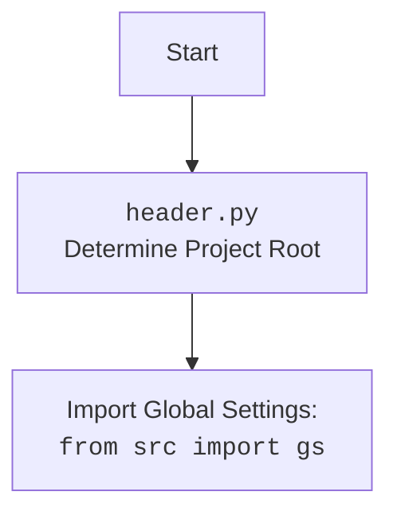

## Анализ кода `hypotez/src/product/header.py`

### 1. `<алгоритм>`

**Функция `set_project_root(marker_files)`:**

1.  **Начало:** Функция `set_project_root` принимает на вход кортеж `marker_files` (по умолчанию `('__root__',)`) как маркерные файлы для поиска корня проекта.
2.  **Определение текущего пути:** Определяется текущий путь к файлу, где объявлена функция, и устанавливается как начальный `__root__`.
    *   Пример: Если `header.py` находится в `hypotez/src/product`, то `current_path` будет `hypotez/src/product`.
3.  **Цикл по родительским директориям:** Проходит вверх по родительским директориям, включая текущую.
    *   Начальный список директорий: `[hypotez/src/product, hypotez/src, hypotez]`.
4.  **Поиск маркерного файла:** Для каждой родительской директории проверяется, существует ли хотя бы один из маркерных файлов или папок.
    *   Пример: Для `marker_files = ('__root__',)` проверяется наличие файла или папки `__root__` в `hypotez/src/product`, затем в `hypotez/src`, и т.д.
5.  **Обновление корня проекта:** Если маркерный файл найден, текущая родительская директория становится корнем проекта (`__root__`), и цикл прерывается.
    *   Пример: Если файл `__root__` был найден в `hypotez`, то `__root__` устанавливается в `hypotez`.
6.  **Добавление корня в `sys.path`:** Проверяется, есть ли `__root__` в списке путей поиска (`sys.path`). Если нет, то он добавляется в начало списка.
7.  **Возврат корня проекта:** Возвращается объект `Path` представляющий путь к корню проекта.

**Основной блок кода:**

1. **Вызов `set_project_root()`:** Вызывается функция `set_project_root()`, для определения корня проекта.
2.  **Импорт `src.gs`:** Импортируется модуль `gs` из пакета `src`.
3.  **Чтение `settings.json`:** Пытается открыть и прочитать файл `settings.json` из папки `src` относительно корня проекта.
    *   Пример: Если корень проекта `hypotez`, то читается `hypotez/src/settings.json`.
    *   Если файл не найден или произошла ошибка декодирования JSON, то переменная `settings` остается `None`.
4. **Чтение `README.MD`:** Пытается открыть и прочитать файл `README.MD` из папки `src` относительно корня проекта.
    *   Пример: Если корень проекта `hypotez`, то читается `hypotez/src/README.MD`.
    *   Если файл не найден или произошла ошибка декодирования JSON, то переменная `doc_str` остается `None`.
5.  **Инициализация глобальных переменных:** Инициализируются глобальные переменные `__project_name__`, `__version__`, `__doc__`, `__details__`, `__author__`, `__copyright__` и `__cofee__` на основе данных из `settings.json` или устанавливаются значения по умолчанию.

### 2. `<mermaid>`

```mermaid
flowchart TD
    Start[Start] --> FindRoot[Find Project Root<br>set_project_root()]
    FindRoot --> ImportGS[Import Global Settings<br>from src import gs]
    ImportGS --> ReadSettings[Read settings.json]
    ReadSettings -- Success --> ReadDoc[Read README.MD]
    ReadSettings -- Fail --> ReadDoc
    ReadDoc -- Success --> InitGlobals[Initialize Global Variables]
    ReadDoc -- Fail --> InitGlobals
    InitGlobals --> End[End]

    subgraph "header.py"
    FindRoot
    ImportGS
    ReadSettings
    ReadDoc
    InitGlobals
    end

    style FindRoot fill:#f9f,stroke:#333,stroke-width:2px
```



**Объяснение диаграммы `mermaid`:**

*   **`flowchart TD`**:  Указывает, что это диаграмма потока (flowchart) с направлением сверху вниз (TD - Top Down).
*   **`Start`**: Начало процесса.
*   **`FindRoot`**: Блок, представляющий функцию `set_project_root()`, которая определяет корень проекта. Стиль блока выделен цветом.
*   **`ImportGS`**: Блок, представляющий импорт глобальных настроек `from src import gs`.
*   **`ReadSettings`**: Блок, представляющий попытку чтения файла `settings.json`.
*   **`ReadDoc`**: Блок, представляющий попытку чтения файла `README.MD`.
*  **`InitGlobals`**: Блок, представляющий инициализацию глобальных переменных.
*   **`End`**: Конец процесса.
*   **Стрелки**: Указывают направление потока управления.
*   **Подграф `header.py`**: Показывает, что все блоки относятся к файлу `header.py`.

Вторая диаграмма показывает импорт модуля `header.py`, где происходит определение корневой директории проекта.

### 3. `<объяснение>`

**Импорты:**

*   **`import sys`**: Модуль `sys` используется для работы с системными параметрами и функциями. В данном случае, он используется для добавления пути к корню проекта в `sys.path`, чтобы Python мог находить модули и пакеты в рамках проекта.
*   **`import json`**: Модуль `json` используется для работы с данными в формате JSON. Он используется для чтения файла `settings.json`, который предположительно содержит настройки проекта.
*  **`from packaging.version import Version`**: Этот импорт не используется в текущем коде, но он указывает на то, что в будущем может понадобиться работа с версиями.
*   **`from pathlib import Path`**:  Класс `Path` из модуля `pathlib` предоставляет удобный способ работы с путями к файлам и каталогам. Здесь он используется для представления путей и манипуляций с ними.
*   **`from src import gs`**:  Импортируется модуль `gs` из пакета `src`. Предположительно, `gs` содержит глобальные настройки проекта или пути. Это указывает на зависимость `header.py` от других частей проекта.

**Классы:**

*   В данном коде нет пользовательских классов, используется только класс `Path` из модуля `pathlib`.

**Функции:**

*   **`set_project_root(marker_files)`:**
    *   **Аргументы:**
        *   `marker_files`: Кортеж строк с именами маркерных файлов/директорий (по умолчанию `('__root__',)`).
    *   **Возвращаемое значение:** Объект `Path`, представляющий путь к корню проекта.
    *   **Назначение:** Функция определяет корень проекта путем поиска маркерных файлов в текущей и родительских директориях.  Она гарантирует, что все остальные модули будут импортироваться относительно корня проекта.
    *   **Пример:**
        *   Если `header.py` находится в `hypotez/src/product` и в `hypotez` есть файл `__root__`, то функция вернет путь `hypotez`.

**Переменные:**

*   **`MODE`**: Строковая константа, установленная в `'dev'`. Может использоваться для определения режима работы проекта (например, `dev`, `test`, `prod`).
*   **`__root__`**: Переменная типа `Path`, хранит путь к корневой директории проекта, полученный из функции `set_project_root()`.
*  **`settings`**: Словарь (dict), хранит настройки проекта из `settings.json` файла. Изначально установлено значение `None`.
*   **`doc_str`**: Строка, хранит контент файла `README.MD`. Изначально установлено значение `None`.
*   **`__project_name__`**: Имя проекта, полученное из `settings.json` или по умолчанию `hypotez`.
*   **`__version__`**: Версия проекта, полученная из `settings.json` или по умолчанию пустая строка.
*   **`__doc__`**: Строка, содержащая содержимое файла `README.MD`, либо пустая строка.
*   **`__details__`**: Строка с деталями проекта, в текущей версии пустая строка.
*   **`__author__`**: Автор проекта, полученный из `settings.json` или по умолчанию пустая строка.
*   **`__copyright__`**: Авторские права проекта, полученные из `settings.json` или по умолчанию пустая строка.
*   **`__cofee__`**: Строка с предложением угостить разработчика кофе, полученная из `settings.json` или строка по умолчанию.

**Потенциальные ошибки и области для улучшения:**

*   **Обработка ошибок:** Использование `try-except` блоков для обработки `FileNotFoundError` и `json.JSONDecodeError` позволяет избежать ошибок при отсутствии файла `settings.json` или его невалидном формате. Однако, пропуск исключения через `...` может затруднить отладку. Лучше добавить логирование или выдачу предупреждения.
*   **Маркерные файлы:**  Использование `__root__` в качестве маркерного файла может быть неинтуитивным. Можно использовать более наглядное имя, например `.project_root`.
*   **`MODE`**: Переменная `MODE` не используется в текущем коде, но ее наличие указывает на возможность переключения режимов работы, что можно развить в будущем.
*   **Документация:** Использование docstring для документирования функций и модулей повышает читаемость кода.  Документация, указанная в начале кода, относится не к модулю, а к коду. Необходимо уточнить.
*   **Перенос в системную переменную:** Комментарий "В дальнейшем перенести в системную переменную" указывает на потенциальную возможность сделать определение корня проекта более гибким.
*   **`__details__`**: Переменная `__details__` инициализируется пустой строкой, хотя предполагается, что она должна содержать детали проекта.
*   **Кофе:** Переменная `__cofee__` содержит текст для угощения разработчика кофе, и может быть полезным для мотивации, но ее название неинтуитивно.

**Цепочка взаимосвязей:**

1.  **`header.py`** определяет корень проекта и глобальные настройки, которые используются в других модулях.
2.  **`header.py`** импортирует `gs` из `src`, что указывает на зависимость от настроек и утилит пакета `src`.
3.  Другие модули (например, модули в `src.product` или `src.core`) могут импортировать переменные из `header.py`  (например, `__root__`, `__project_name__`, `__version__`), для работы с файловой системой и получения данных о проекте.
4.  Файлы `settings.json` и `README.MD` используются для получения настроек проекта и документации.

В целом, `header.py` является важным модулем для инициализации проекта, определения его корня и загрузки глобальных настроек. Он устанавливает контекст для всех других модулей проекта.