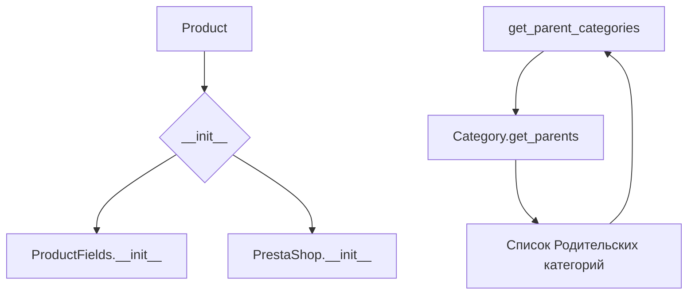

# <input code>

```python
## \file hypotez/src/product/product.py
# -*- coding: utf-8 -*-
#! venv/Scripts/python.exe
#! venv/bin/python/python3.12

"""
.. module: src.product 
	:platform: Windows, Unix
	:synopsis: Interaction between website, product, and PrestaShop.
Defines the behavior of a product in the project.

"""
MODE = 'dev'

import header
from src import gs
from src.endpoints.prestashop import PrestaShop  # Explicit import
from src.category import Category
from src.product.product_fields import ProductFields
from src.logger import logger


class Product(ProductFields, PrestaShop):
    """  Manipulations with the product.
    Initially, I instruct the grabber to fetch data from the product page,
    and then work with the PrestaShop API.
    """
    def __init__(self, *args, **kwargs):
        """
        Initializes a Product object.

        :param args: Variable length argument list.
        :param kwargs: Arbitrary keyword arguments.
        """
        super().__init__(*args, **kwargs)
        # ... (rest of the __init__ method)


    @staticmethod
    def get_parent_categories(id_category: int, dept: int = 0) -> list:
        """ Collects parent categories from the specified category.
        Duplicates the function get_parents() from the Category class.

        :param id_category: ID of the category.
        :type id_category: int
        :param dept: Depth of the category.
        :type dept: int
        :raises TypeError: if id_category is not an integer.
        :returns: List of parent categories.
        :rtype: list
        """
        if not isinstance(id_category, int):
            raise TypeError("id_category must be an integer")
        return Category.get_parents(id_category, dept)
```

# <algorithm>

**Алгоритм работы:**

1. **Инициализация:**
   - Создается объект `Product`, наследующий от `ProductFields` и `PrestaShop`.
   - Вызывается метод `__init__` родительских классов.
   - (Дальнейшая часть `__init__` не представлена, но она, вероятно, инициализирует атрибуты объекта `Product`, связанные с продуктом, и с PrestaShop).

2. **Получение родительских категорий:**
   - Функция `get_parent_categories` принимает `id_category` и `dept` (глубина).
   - Проверяет, является ли `id_category` целым числом.
   - Если нет, генерируется исключение `TypeError`.
   - В противном случае, вызывается метод `get_parents` из класса `Category` с передачей `id_category` и `dept`.
   - Возвращается список родительских категорий.

**Пример:**

Предположим, `Category.get_parents(123, 0)` возвращает `[456, 789]`. Тогда `Product.get_parent_categories(123, 0)` вернёт `[456, 789]`.


# <mermaid>



# <explanation>

**Импорты:**

- `import header`: Импортирует модуль `header`, который, вероятно, содержит общие конфигурационные настройки или служебные функции.  Необходимость в нем можно оценить только при анализе `header.py`.
- `from src import gs`: Импортирует модуль `gs` из пакета `src`, вероятно, для доступа к общим сервисам.  Без анализа `gs.py` сложно судить о точном назначении.
- `from src.endpoints.prestashop import PrestaShop`: Импортирует класс `PrestaShop` из модуля `prestashop` в папке `endpoints` пакета `src`. Это указывает на взаимодействие с API PrestaShop.
- `from src.category import Category`: Импортирует класс `Category` из модуля `category` пакета `src`. Вероятно, для работы с категориями продуктов.
- `from src.product.product_fields import ProductFields`: Импортирует класс `ProductFields` из модуля `product_fields` в подпапке `product` пакета `src`. Вероятно, содержит базовые атрибуты и методы для представления продукта.
- `from src.logger import logger`: Импортирует логгер `logger` из модуля `logger` пакета `src`.  Для ведения журналов.

**Классы:**

- `Product`: Класс для работы с продуктами. Наследует от `ProductFields` и `PrestaShop`, комбинируя функциональность. В `__init__` происходит инициализация свойств, связанных с продуктом и PrestaShop.
- `ProductFields`: Базовый класс для хранения данных о продукте. Точный набор атрибутов и методов неизвестен без анализа кода.
- `PrestaShop`: Класс для взаимодействия с API PrestaShop. Неизвестны детали реализации без анализа.
- `Category`: Класс для работы с категориями. Содержит метод `get_parents` для получения родительских категорий, что используется в `Product`.

**Функции:**

- `get_parent_categories`: Статический метод, который собирает родительские категории для заданной категории. Принимает `id_category` и необязательный параметр `dept`.  Важная функция для иерархической работы с категориями.  Проверка типа `id_category` является важной частью.

**Переменные:**

- `MODE`: Строковая переменная, вероятно, для определения режима работы (например, `dev`, `prod`).

**Возможные ошибки и улучшения:**

- Необходимо проанализировать реализацию методов `__init__` в классах `Product`, `ProductFields` и `PrestaShop` для понимания их работы.
- Добавьте обработку исключений для других возможных ошибок, таких как `ValueError` или `AttributeError` в методе `get_parent_categories`, если `Category.get_parents` может их генерировать.
- Рассмотрите возможность использования `try...except` блоков для обработки потенциальных ошибок в `Category.get_parents`.
- Разъясните роль `header` в проекте.


**Цепочка взаимосвязей:**

`Product` использует `ProductFields` и `PrestaShop` для работы с данными продукта и PrestaShop API. `Product` использует `Category` для получения родительских категорий продукта.  Все эти классы, вероятно, взаимодействуют с данными, хранящимися в базе данных или внешних источниках.