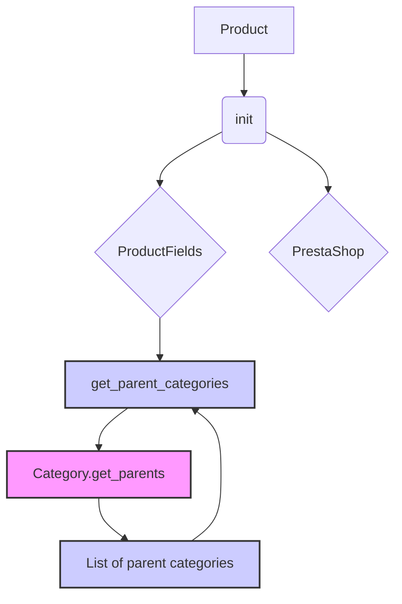

```MD
# <input code>

```python
## \file hypotez/src/product/product.py
# -*- coding: utf-8 -*-
#! venv/Scripts/python.exe
#! venv/bin/python/python3.12

"""
.. module: src.product 
	:platform: Windows, Unix
	:synopsis: Interaction between website, product, and PrestaShop.
Defines the behavior of a product in the project.

"""
MODE = 'dev'

import header
from src import gs
from src.endpoints.prestashop import PrestaShop  # Explicit import
from src.category import Category
from src.product.product_fields import ProductFields
from src.logger import logger


class Product(ProductFields, PrestaShop):
    """  Manipulations with the product.
    Initially, I instruct the grabber to fetch data from the product page,
    and then work with the PrestaShop API.
    """
    def __init__(self, *args, **kwargs):
        """
        Initializes a Product object.

        :param args: Variable length argument list.
        :param kwargs: Arbitrary keyword arguments.
        """
        super().__init__(*args, **kwargs)
        # ... (rest of the __init__ method)


    @staticmethod
    def get_parent_categories(id_category: int, dept: int = 0) -> list:
        """ Collects parent categories from the specified category.
        Duplicates the function get_parents() from the Category class.

        :param id_category: ID of the category.
        :type id_category: int
        :param dept: Depth of the category.
        :type dept: int
        :raises TypeError: if id_category is not an integer.
        :returns: List of parent categories.
        :rtype: list
        """
        if not isinstance(id_category, int):
            raise TypeError("id_category must be an integer")
        return Category.get_parents(id_category, dept)
```

# <algorithm>

**Шаг 1:** Инициализация `Product` объекта.
   * Пример: `product = Product(id=123, name='Example Product')`
   * Происходит вызов `__init__` родительских классов (`ProductFields`, `PrestaShop`).

**Шаг 2:** Получение родительских категорий.
   * Пример: `parent_categories = Product.get_parent_categories(id_category=5)`
   * Происходит проверка типа `id_category`.
   * Функция `get_parent_categories` делегирует вызов функции `get_parents` из класса `Category`.

**Шаг 3:** Возвращение списка родительских категорий.
   * Пример: `parent_categories` — список ID категорий.
   * Функция возвращает список родительских категорий.

# <mermaid>



**Описание диаграммы:**

* **Product:** Главный класс, использующий наследование.
* **ProductFields:** Класс, содержащий общие методы для работы с полями продукта.
* **PrestaShop:** Класс, содержащий методы для взаимодействия с API PrestaShop.
* **Category.get_parents:** Метод, получающий родительские категории из базы данных или другого источника.
* **get_parent_categories:** Метод, вызывающий `get_parents` и проверяет тип входных данных.

# <explanation>

**Импорты:**

* `header`: Вероятно, содержит вспомогательные функции или конфигурацию, специфичную для проекта.
* `gs`:  Возможно, содержит вспомогательные функции или объекты, относящиеся к обработке данных (например, к работе с Google Sheets).
* `src.endpoints.prestashop`: Определяет интерфейс взаимодействия с API PrestaShop.
* `src.category`: Класс `Category` для работы с категориями.
* `src.product.product_fields`: Класс `ProductFields` для работы с полями продукта.
* `src.logger`: Система логирования.

**Классы:**

* `Product`: Базовый класс для работы с продуктами. Он использует множественное наследование от `ProductFields` и `PrestaShop`, объединяя функциональность работы с полями продукта и API PrestaShop.
* `ProductFields`:  Предположительно содержит методы для работы с атрибутами продукта (например, название, описание, цена).
* `PrestaShop`: Предоставляет методы для взаимодействия с API PrestaShop.
* `Category`: Класс для работы с категориями. Содержит методы для получения родительских категорий.

**Функции:**

* `get_parent_categories`: Статический метод класса `Product`. Получает родительские категории продукта по заданному ID категории. Валидирует входные данные (`id_category`).  Важно, что эта функция повторяет функциональность метода `get_parents` из класса `Category`. Это не оптимально, лучше один источник правды и повторного кода (например, через абстракцию или инкапсуляцию).

**Переменные:**

* `MODE`: Переменная, определяющая режим работы (например, 'dev', 'prod').
* `id_category`: Целочисленное значение, представляющее ID категории.
* `dept`: Целочисленное значение глубины категории (необязательный параметр).
* `parent_categories`: Список родительских категорий.


**Возможные ошибки и улучшения:**

* **Повторный код:** Функция `get_parent_categories` повторяет функциональность  `get_parents`. Лучше перенести логику получения родительских категорий в класс `Category` и использовать ее в `get_parent_categories`.
* **Валидация `dept`:** Необходимо добавить валидацию `dept`, чтобы избежать ошибок.
* **Документация:**  Недостаточно детальная документация для некоторых методов.
* **Передача данных:**  Как данные передаются между классами `Product`, `ProductFields`, `PrestaShop` и `Category` не очевидно. Необходимо более подробное описание.
* **Отсутствие `__init__`:** Метод `__init__` в классе `Product` неполный (не представлен полностью).
* **Зависимости:**  Непонятно, как `header` связан с другими модулями, какие данные он предоставляет или использует.


**Цепочка взаимосвязей:**

`Product` использует `ProductFields` и `PrestaShop`.  `Product` вызывает `Category.get_parents` через `get_parent_categories`. `Category` вероятно взаимодействует с базой данных или другим источником данных, чтобы получить родительские категории.