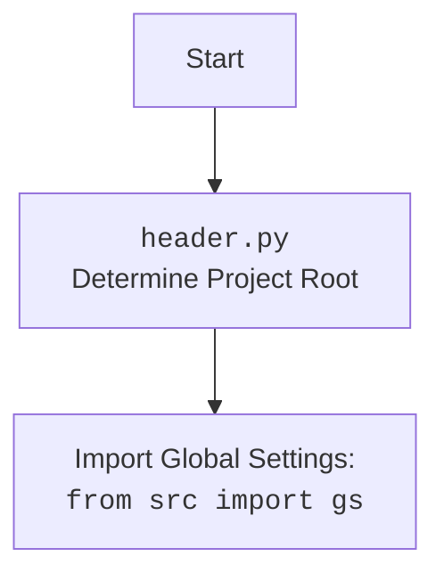

## <алгоритм>

1. **Инициализация объекта `Product`**:
   - Создается объект класса `Product`. При этом вызывается конструктор `__init__`, который наследуется от классов `ProductFields` и `PrestaShop`.
   - В конструкторе `__init__` происходит инициализация объекта, но конкретная логика в предоставленном коде отсутствует.

2. **Вызов метода `get_parent_categories`**:
   - Вызывается статический метод `get_parent_categories` класса `Product` с аргументом `id_category` (целое число) и опциональным `dept` (целое число, по умолчанию 0).
     *Пример*: `Product.get_parent_categories(id_category=123, dept=2)`
   - Проверяется, что `id_category` является целым числом.
   - Если `id_category` не целое число, генерируется исключение `TypeError`.
     *Пример*: `Product.get_parent_categories(id_category='abc')` вызовет `TypeError`.
   - Вызывается метод `Category.get_parents()` с теми же аргументами `id_category` и `dept`.
     *Пример*: если `id_category = 123` и `dept = 2`, то вызывается `Category.get_parents(123, 2)`.
   - Возвращается результат вызова `Category.get_parents()`, который представляет собой список родительских категорий.

## <mermaid>

```mermaid
flowchart TD
    Start --> ProductInit[Initialize Product Object];
    ProductInit --> CheckIdCategoryType{Check if id_category is int?};
    CheckIdCategoryType -- Yes --> CallCategoryGetParents[Call Category.get_parents(id_category, dept)];
    CheckIdCategoryType -- No --> TypeErrorException[Raise TypeError];
    CallCategoryGetParents --> ReturnParentCategories[Return list of parent categories];
    TypeErrorException --> End;
    ReturnParentCategories --> End;
    
    
    subgraph Product Class
        ProductInit
        CheckIdCategoryType
        CallCategoryGetParents
        TypeErrorException
        ReturnParentCategories
     end
     
    
    subgraph Category Class
        CategoryGetParents(Category.get_parents)
    end
    
    CallCategoryGetParents --> CategoryGetParents
     
```



**Импорт зависимостей в mermaid:**

*   `header`:  Этот модуль используется для определения корневой директории проекта, что важно для импорта глобальных настроек и других модулей проекта.
*   `gs`: Это модуль глобальных настроек. Вероятно, он содержит общие переменные и параметры конфигурации, используемые во всем проекте.
*   `PrestaShop`: Этот класс, вероятно, инкапсулирует логику взаимодействия с API PrestaShop, что позволяет программе получать и отправлять данные в PrestaShop.
*   `Category`: Этот класс, вероятно, содержит логику работы с категориями товаров, в том числе методы получения родительских категорий.
*   `ProductFields`: Этот класс, вероятно, содержит определения полей продукта.
*   `logger`:  Это модуль для логирования. Он используется для записи информации о работе программы, что помогает при отладке и мониторинге.

## <объяснение>

**Импорты:**

*   `import header`: Импортирует модуль `header`, который используется для определения корневого каталога проекта. Это позволяет использовать относительные импорты для других модулей. Этот модуль  важен для правильной настройки путей к файлам проекта.
*   `from src import gs`: Импортирует глобальные настройки проекта из модуля `gs`. `gs` содержит настройки, используемые во всех модулях проекта, обеспечивая единую конфигурацию.
*   `from src.endpoints.prestashop import PrestaShop`: Импортирует класс `PrestaShop` из модуля `prestashop`. Этот класс предназначен для взаимодействия с API PrestaShop. Он инкапсулирует логику для отправки запросов и получения данных от PrestaShop.
*   `from src.category import Category`: Импортирует класс `Category` из модуля `category`. Этот класс отвечает за работу с категориями товаров, включая получение родительских категорий.
*   `from src.product.product_fields import ProductFields`: Импортирует класс `ProductFields` из модуля `product_fields`. Этот класс, вероятно, определяет поля, необходимые для описания продукта, такие как имя, цена, описание и т.д.
*   `from src.logger.logger import logger`: Импортирует объект `logger` из модуля `logger`. Этот объект используется для ведения журнала работы программы. Он помогает отслеживать ошибки, предупреждения и другую важную информацию о выполнении кода.

**Классы:**

*   `Product(ProductFields, PrestaShop)`:
    *   Является подклассом `ProductFields` и `PrestaShop`, что позволяет ему наследовать атрибуты и методы от этих классов.
    *   Предназначен для управления продуктами. Он сочетает в себе логику работы с данными продукта и взаимодействия с PrestaShop API.
    *   Метод `__init__` инициализирует объект `Product`, но предоставленный код не содержит конкретной логики инициализации.
    *   Метод `get_parent_categories`:
        *   `staticmethod`: Метод может вызываться напрямую через класс, без создания экземпляра класса `Product`.
        *   `id_category`: ID категории, родительские категории которой нужно получить.
        *   `dept`: Глубина, до которой нужно искать родительские категории. По умолчанию 0.
        *   Проверяет, что `id_category` является целым числом. Вызывает `TypeError`, если `id_category` не является целым.
        *   Использует `Category.get_parents` для получения родительских категорий.
        *   Возвращает список родительских категорий.

**Функции:**

*   `__init__(self, *args, **kwargs)`:
    *   Конструктор класса `Product`.
    *   Принимает произвольное количество позиционных (`*args`) и именованных (`**kwargs`) аргументов.
    *   Вызывает конструкторы родительских классов (наследует инициализацию от `ProductFields` и `PrestaShop`).
*   `get_parent_categories(id_category: int, dept: int = 0) -> list`:
    *   Статический метод класса `Product`, используемый для сбора родительских категорий.
    *   Принимает целочисленный ID категории (`id_category`) и глубину поиска родительских категорий (`dept`).
    *   Вызывает метод `Category.get_parents()` для фактического сбора родительских категорий.
    *   Возвращает список родительских категорий.

**Переменные:**

*   ``:
    *   Глобальная переменная, определяющая режим работы. В данном случае установлен режим "dev" (разработка).
    *   Может использоваться для переключения между режимами разработки и продакшена.

**Потенциальные ошибки и улучшения:**

*   **Неполная реализация `__init__`**: В предоставленном коде нет конкретной логики инициализации в методе `__init__`. Возможно, требуется добавление логики, например, инициализация атрибутов класса.
*   **Дублирование логики**: Метод `get_parent_categories` дублирует логику `Category.get_parents()`. Возможно, стоит пересмотреть дизайн и использовать непосредственно метод класса `Category`.
*   **Отсутствие обработки исключений**:  Хотя в коде есть проверка типа `id_category`, нет других обработок исключений при вызове методов, особенно API PrestaShop.  Стоит добавить `try-except` блоки для обработки возможных ошибок, например сетевых ошибок, ошибок API, и т.д.
*   **Расширение логирования**: Можно добавить логирование в `get_parent_categories` для отслеживания процесса сбора родительских категорий и выявления потенциальных проблем.

**Взаимосвязи:**

*   Класс `Product` использует классы `Category`, `ProductFields` и `PrestaShop`. Это говорит о том, что класс `Product` является центральным компонентом, объединяющим различные части приложения.
*   Модуль `header` используется для определения корневой директории проекта, что важно для импорта глобальных настроек `gs` и других модулей.
*   Модуль `logger` обеспечивает централизованное логирование работы приложения.

Таким образом, данный код представляет собой основу для работы с продуктами, которые взаимодействуют с PrestaShop API и используют другие модули проекта.