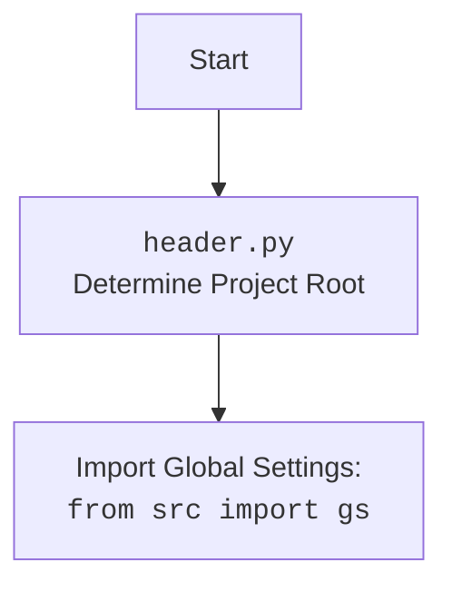

## АНАЛИЗ КОДА: `ProductFields`

### 1. `<алгоритм>`:
1.  **Инициализация (`__init__`)**:
    *   Загружает список полей продукта из файла (`fields_list.txt`).
        *   Пример: `['id_product', 'name', 'description', 'price', 'associations']`.
    *   Инициализирует словарь `language` для хранения соответствий языков и их идентификаторов (например, `{'en': 1, 'he': 2, 'ru': 3}`).
    *   Создает объект `SimpleNamespace` (`presta_fields`) для хранения полей продукта, устанавливая начальные значения `None`.
        *   Пример: `presta_fields.id_product = None`, `presta_fields.name = None`.
    *   Создает словарь `assist_fields_dict` для дополнительных полей, таких как `default_image_url` и `images_urls`.
        *   Пример: `assist_fields_dict = {'default_image_url': '', 'images_urls': []}`.
    *   Вызывает метод `_payload` для загрузки значений по умолчанию.
2.  **Загрузка списка полей (`_load_product_fields_list`)**:
    *   Читает файл `fields_list.txt` из директории `src/product/product_fields`.
    *   Возвращает список строк, где каждая строка - это имя поля.
        *   Пример: `['id_product', 'name', 'description', 'price', 'associations']`.
3.  **Загрузка значений по умолчанию (`_payload`)**:
    *   Читает JSON файл `product_fields_default_values.json` из директории `src/product/product_fields`.
        *   Пример: `{"id_product": 0, "price": "0.00", "name": {}}`.
    *   Если файл не найден или не удалось прочитать, записывает сообщение об ошибке в логи и возвращает `False`.
    *   Перебирает пары ключ-значение из загруженных данных и присваивает их как атрибуты объекта `ProductFields`.
        *   Пример: `self.id_product = 0`, `self.price = "0.00"`, `self.name = {}`.
    *   Возвращает `True` после успешной загрузки.
4.  **Установка и получение значений полей (например, `id_product`)**:
    *   **Getter** (`@property`): возвращает текущее значение поля из объекта `presta_fields`.
        *   Пример: `return self.presta_fields.id_product` возвращает значение, хранящееся в `presta_fields.id_product`.
    *   **Setter** (`@<field>.setter`): устанавливает значение поля в `presta_fields`, обрабатывая возможные исключения.
        *   Пример:  `self.presta_fields.id_product = value`.
        *   Если происходит исключение `ProductFieldException`, оно перехватывается, записывается в лог и функция возвращает `None`.
5.  **Установка и получение значений многоязычных полей (например, `name`)**:
    *   **Getter** (`@property`): возвращает значение поля `name` из `presta_fields` или пустую строку если значение не задано.
        *   Пример: `return self.presta_fields.name or ''`.
    *   **Setter** (`@name.setter`): устанавливает значение поля `name` для заданного языка (например, 'en', 'he', 'ru') в виде словаря в `presta_fields`, обрабатывая возможные исключения.
        *   Пример: `self.presta_fields.name = {'language': [{'attrs': {'id': self.language[lang]}, 'value': value}]}`
        *   Если происходит исключение `ProductFieldException`, оно перехватывается, записывается в лог и функция возвращает `None`.
6. **Установка и получение значений ассоциаций (`associations`)**:
    *   **Getter** (`@property`): возвращает текущее значение поля `associations` из `presta_fields` или None если значение не задано.
        *   Пример: `return self.presta_fields.associations or None`.
    *   **Setter** (`@associations.setter`): устанавливает значение поля `associations` в `presta_fields`.
        *   Пример: `self.presta_fields.associations = value`.

### 2. `<mermaid>`:

```mermaid
flowchart TD
    Start[Start] --> Init[<code>__init__</code><br>Initialize Product Fields]
    Init --> LoadFieldsList[<code>_load_product_fields_list</code><br>Load Product Fields List]
    LoadFieldsList --> ReadFile[Read <code>fields_list.txt</code>]
    ReadFile --> ReturnList[Return List of Fields]
    Init --> InitLanguage[Initialize Language Dictionary]
    Init --> CreatePrestaFields[Create <code>presta_fields</code> (SimpleNamespace)]
    Init --> InitAssistFields[Initialize <code>assist_fields_dict</code>]
    Init --> LoadDefaultValues[<code>_payload</code><br>Load Default Values]
    LoadDefaultValues --> ReadJSON[Read <code>product_fields_default_values.json</code>]
    ReadJSON -- "Data Loaded" --> SetDefaultValues[Set Default Values]
    ReadJSON -- "Data Load Fail" --> LogError[Log Debug Error]
    SetDefaultValues --> ReturnTrue[Return True]
    LogError --> ReturnFalse[Return False]    
    
    
    
    
    
    
    
    
    
    subgraph Single Language Field
        GetSingleField[Get Field Value (e.g., <code>id_product</code>)]
        SetSingleField[Set Field Value (e.g., <code>id_product</code>)]
        SetSingleField --> UpdatePrestaFields[Update <code>presta_fields</code>]        
    end
    
    subgraph Multi Language Field
        GetMultiField[Get Field Value (e.g., <code>name</code>)]
        SetMultiField[Set Field Value (e.g., <code>name</code>, <code>lang</code>)]
        SetMultiField --> CreateLangDict[Create Language Dictionary]
        CreateLangDict --> UpdatePrestaFieldsLang[Update <code>presta_fields</code> with Lang data]
    end
    
    subgraph Associations
    
        GetAssociations[Get Associations Value]
         SetAssociations[Set Associations Value]
         SetAssociations --> UpdatePrestaFieldsAssociations[Update <code>presta_fields.associations</code>]
    end

    
    
    Init --> GetSingleField
    Init --> SetSingleField    
    Init --> GetMultiField    
    Init --> SetMultiField
    Init --> GetAssociations
    Init --> SetAssociations
        
   
    
    
    

    
```
**Разбор зависимостей `mermaid`:**

1.  **`Start`**: Начало процесса.
2.  **`__init__`**: Метод инициализации класса `ProductFields`.
3.  **`_load_product_fields_list`**: Метод для загрузки списка полей продукта.
4.  **`ReadFile`**: Чтение файла `fields_list.txt`.
5.  **`ReturnList`**: Возвращение списка полей продукта.
6.   **`InitLanguage`**: Инициализация словаря `language`.
7.  **`CreatePrestaFields`**: Создание объекта `SimpleNamespace` для хранения полей.
8.  **`InitAssistFields`**: Инициализация словаря `assist_fields_dict` для дополнительных полей.
9.  **`_payload`**: Метод для загрузки значений по умолчанию для полей.
10. **`ReadJSON`**: Чтение файла `product_fields_default_values.json`.
11. **`SetDefaultValues`**: Установка значений по умолчанию для полей.
12. **`LogError`**: Логирование ошибки, если файл JSON не удалось загрузить.
13. **`ReturnTrue`**: Возвращение `True` после успешной загрузки данных из JSON.
14. **`ReturnFalse`**: Возвращение `False` после неудачной загрузки данных из JSON.
15. **`GetSingleField`**: Получение значения поля в рамках одноязычного поля, например `id_product`.
16. **`SetSingleField`**: Установка значения поля в рамках одноязычного поля, например `id_product`.
17.  **`UpdatePrestaFields`**: Обновление значения в объекте `presta_fields`.
18. **`GetMultiField`**: Получение значения поля в рамках многоязычного поля, например `name`.
19. **`SetMultiField`**: Установка значения поля в рамках многоязычного поля, например `name`.
20. **`CreateLangDict`**: Создание словаря для многоязычных данных.
21. **`UpdatePrestaFieldsLang`**: Обновление значения в объекте `presta_fields` с учетом языка.
22. **`GetAssociations`**: Получение значения поля `associations`.
23. **`SetAssociations`**: Установка значения поля `associations`.
24. **`UpdatePrestaFieldsAssociations`**: Обновление значения поля `associations` в объекте `presta_fields`.

**Объяснение:**

Диаграмма `mermaid` показывает поток выполнения программы при инициализации класса `ProductFields`, а также при взаимодействии с его полями.
Начинается с инициализации, где происходит загрузка списка полей, создание структур данных, и загрузка значений по умолчанию.
После инициализации класс готов к работе с различными типами полей: одноязычные, многоязычные и ассоциации.
Диаграмма также показывает пути обработки ошибок при загрузке данных из JSON.
Стрелки показывают последовательность вызовов методов и передачу данных между ними.



**Объяснение `header.py`:**

`header.py` определяет корень проекта и импортирует глобальные настройки `gs`, которые используются для определения путей к файлам и другим ресурсам проекта. Это позволяет централизовано управлять конфигурацией и путями проекта.

### 3. `<объяснение>`:

**Импорты:**
*   `SimpleNamespace` из `types`: Используется для создания объектов, атрибуты которых можно устанавливать как обычные переменные. В данном случае используется для хранения полей продукта (`presta_fields`). Это упрощает работу с набором полей, позволяя обращаться к ним как `self.presta_fields.id_product` вместо `self.presta_fields['id_product']`.
*   `Path` из `pathlib`: Используется для работы с путями файлов и директорий в операционной системе. Обеспечивает кроссплатформенность путей.
*   `List`, `Dict`, `Optional` из `typing`: Используются для аннотации типов, что делает код более читаемым и помогает отлаживать. `List[str]` указывает, что переменная должна быть списком строк, `Dict` – словарем, `Optional[int]` – может быть целым числом или `None`.
*   `read_text_file` из `src.utils.file_utils`: Функция, которая используется для чтения текстового файла.
*   `j_loads` из `src.utils.json_utils`: Функция для загрузки данных из JSON файла.
*   `logger` из `src.logger`: Используется для логирования ошибок и отладочной информации.
*    `gs` из `src`: глобальные настройки проекта, которые используются для доступа к путям и другой конфигурационной информации.

**Класс `ProductFields`:**
*   **Роль**: Управляет структурой данных продукта для PrestaShop API, обеспечивая корректное форматирование и валидацию полей.
*   **Атрибуты:**
    *   `product_fields_list`: Список полей продукта, загружается из файла.
    *   `language`: Словарь соответствия языка и его ID (например, {'en': 1, 'he': 2, 'ru': 3}).
    *   `presta_fields`: Объект `SimpleNamespace` для хранения значений полей продукта.
    *   `assist_fields_dict`: Словарь для хранения вспомогательных полей, таких как `default_image_url` и `images_urls`.
*   **Методы:**
    *   `__init__()`: Инициализирует класс, загружает список полей, устанавливает значения по умолчанию и инициализирует основные структуры данных.
    *   `_load_product_fields_list()`: Загружает список полей из файла.
    *   `_payload()`: Загружает значения по умолчанию для полей из JSON файла.
    *   Геттеры (`@property`) и сеттеры (`@<field>.setter`) для каждого поля продукта (например, `id_product`, `name`, `associations`).

**Функции:**

*   `__init__(self)`:
    *   Аргументы: `self` (ссылка на экземпляр класса).
    *   Возвращает: `None`.
    *   Назначение: Инициализирует атрибуты класса, вызывая методы загрузки полей и значений по умолчанию.
    *   Пример:
        ```python
        product = ProductFields() # Создает экземпляр класса
        # Загружает список полей, инициализирует словарь language, создает объект SimpleNamespace для хранения полей, загружает значения по умолчанию из JSON файла.
        ```
*   `_load_product_fields_list(self) -> List[str]`:
    *   Аргументы: `self` (ссылка на экземпляр класса).
    *   Возвращает: Список строк (имена полей).
    *   Назначение: Читает файл `fields_list.txt` и возвращает список полей продукта.
    *   Пример:
        ```python
        fields = self._load_product_fields_list() # Возвращает список ['id_product', 'name', 'description', ...]
        ```
*   `_payload(self) -> bool`:
    *   Аргументы: `self` (ссылка на экземпляр класса).
    *   Возвращает: `True` при успешной загрузке значений по умолчанию, `False` при неудаче.
    *   Назначение: Загружает значения по умолчанию для полей продукта из JSON файла.
    *   Пример:
        ```python
        success = self._payload() # Возвращает True, если загрузка прошла успешно, иначе False
        ```
*   Геттеры (`@property`):
    *   Аргументы: `self` (ссылка на экземпляр класса).
    *   Возвращает: Значение соответствующего поля продукта.
    *   Назначение: Предоставляет доступ на чтение к значениям полей.
    *   Пример:
        ```python
        product_id = product.id_product # Возвращает значение поля id_product из объекта presta_fields
        ```
*   Сеттеры (`@<field>.setter`):
    *   Аргументы: `self` (ссылка на экземпляр класса), `value` (новое значение поля), `lang` (для многоязычных полей).
    *   Возвращает: `None` (для одноязычных полей) или `True` (для многоязычных полей).
    *   Назначение: Устанавливает значения полей продукта, обрабатывая возможные исключения.
    *   Пример:
        ```python
        product.id_product = 123 # Устанавливает значение поля id_product равным 123
        product.name = "Product Name", lang='en' # Устанавливает значение поля name для языка 'en'
        ```

**Переменные:**

*   `product_fields_list`: `List[str]` - список имен полей продукта.
*   `language`: `Dict[str, int]` - словарь для соответствия языка и его идентификатора в PrestaShop.
*   `presta_fields`: `SimpleNamespace` - объект для хранения полей продукта.
*   `assist_fields_dict`: `Dict` - словарь для хранения дополнительных полей продукта.

**Потенциальные ошибки и области для улучшения:**

*   **Отсутствие валидации типов данных**: В сеттерах не проводится явная валидация типов данных, что может привести к ошибкам во время работы с API.
*   **Обработка ошибок**: Хотя предусмотрен блок `try...except` для `ProductFieldException`, было бы полезно конкретизировать обработку исключений, включая проверку типов данных и логику обработки различных ошибок.
*   **Использование `SimpleNamespace`**: Хотя `SimpleNamespace` удобен для быстрого доступа к атрибутам, он может затруднить динамическое добавление полей. Рассмотреть использование `dict` с методами `__getattr__` и `__setattr__` может повысить гибкость.
*   **Отсутствие описания `ProductFieldException`**: Необходимо добавить информацию об этом пользовательском исключении, включая его назначение и как оно генерируется.
*   **Жестко закодированные пути**: Использование `gs.path.src` более гибкое, чем жестко закодированные пути, но можно расширить этот механизм, сделав пути более настраиваемыми через файл конфигурации.
*   **Управление многоязычными данными**: Текущая реализация перезаписывает предыдущие данные при повторном вызове сеттера для многоязычного поля. Было бы полезно реализовать логику добавления новых языков или обновления существующих.

**Взаимосвязь с другими частями проекта:**

*   Класс `ProductFields` зависит от модулей `src.utils.file_utils` и `src.utils.json_utils` для чтения файлов.
*   Класс `ProductFields` использует `src.logger` для логирования.
*   Класс `ProductFields` использует `src` для доступа к глобальным настройкам через объект `gs`.
*   Класс `ProductFields` может использоваться модулями, которые взаимодействуют с API PrestaShop для создания и обновления товаров.

В целом, класс `ProductFields` представляет собой хорошо структурированный инструмент для управления данными продукта, но есть несколько областей, которые можно улучшить, в частности, это явная валидация данных и обработка ошибок, а также более гибкое управление многоязычными данными.