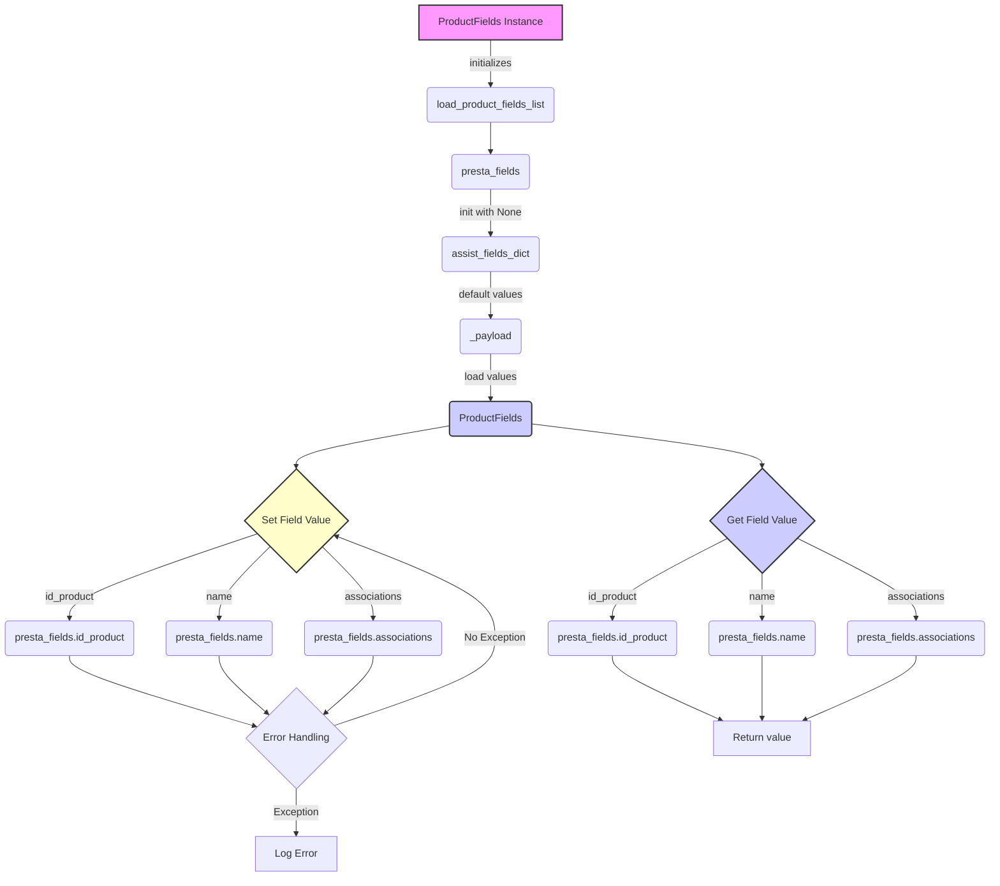

## Анализ кода `ProductFields`

### <алгоритм>

1. **Инициализация `ProductFields`:**
   - Вызывается метод `__init__`.
   - Загружается список полей продукта из файла `fields_list.txt` с помощью `_load_product_fields_list`.
     - `_load_product_fields_list`: читает файл, каждый ряд которого - название поля продукта.
        *Пример*: файл `fields_list.txt` содержит:
        ```text
        id_product
        name
        description
        price
        ```
        Результат: `['id_product', 'name', 'description', 'price']`.
   - Инициализируется словарь `language`, сопоставляющий коды языков с их ID. *Пример*: `{'en': 1, 'he': 2, 'ru': 3}`
   - Создается объект `SimpleNamespace` `presta_fields` для хранения значений полей продукта. Все поля инициализируются значением `None`.
      *Пример*: `presta_fields` содержит:
        ```
        SimpleNamespace(id_product=None, name=None, description=None, price=None)
        ```
   - Создается словарь `assist_fields_dict` для хранения дополнительных полей, таких как URL изображений. *Пример*: `{'default_image_url': '', 'images_urls': []}`.
   - Вызывается метод `_payload` для загрузки значений по умолчанию.
     - `_payload`: загружает значения полей по умолчанию из JSON файла (`product_fields_default_values.json`).
         *Пример*: файл `product_fields_default_values.json` содержит:
            ```json
            {
            "id_product": 1,
            "price": 10.0
            }
            ```
         Результат: `self.id_product` устанавливается в `1`, `self.price` устанавливается в `10.0`.
2. **Работа с полями (пример на `id_product`):**
    - Для доступа к значению поля `id_product` используется геттер `id_product`, возвращающий значение из `self.presta_fields.id_product`.
    - Для установки значения поля `id_product` используется сеттер `id_product`:
      - Происходит попытка присвоить значение `value` полю `self.presta_fields.id_product`.
      - Если происходит исключение `ProductFieldException`, оно перехватывается, и в лог записывается ошибка, функция завершается.
       *Пример*: вызов `product.id_product = 123` установит `self.presta_fields.id_product` в `123`.
3. **Работа с многоязычными полями (пример на `name`):**
   - Для доступа к значению поля `name` используется геттер `name`, возвращающий значение `self.presta_fields.name`, если оно есть, или пустую строку.
   - Для установки значения поля `name` используется сеттер `name`:
     - Формируется словарь с ключом `language`, содержащий список словарей с `attrs` (аттрибутами) и `value` (значением).
        *Пример*: вызов `product.name = "Product Name", lang='en'` сформирует:
         ```json
        {
            "language": [
                {
                  "attrs": {
                    "id": 1
                  },
                  "value": "Product Name"
                }
              ]
        }
         ```
      - Происходит попытка присвоить это значение полю `self.presta_fields.name`.
      - Если происходит исключение `ProductFieldException`, оно перехватывается, и в лог записывается ошибка, функция завершается.
4. **Работа с ассоциациями:**
   - Для доступа к значению поля `associations` используется геттер `associations`, возвращающий значение из `self.presta_fields.associations`.
   - Для установки значения поля `associations` используется сеттер `associations`, устанавливающий значение `value` в поле `self.presta_fields.associations`.
      *Пример*: вызов `product.associations = {'categories': [{'id': 2}, {'id': 3}]}` установит `self.presta_fields.associations` в `{'categories': [{'id': 2}, {'id': 3}]}`.

### <mermaid>



**Объяснение зависимостей:**

*   **`ProductFields Instance`**: Представляет экземпляр класса `ProductFields`, являющийся точкой входа для всей логики.
*   **`load_product_fields_list`**: Функция, загружающая список полей из внешнего файла.
*   **`presta_fields`**: Объект `SimpleNamespace`, который хранит значения полей продукта.
*   **`assist_fields_dict`**: Словарь для хранения дополнительных полей, таких как URL-адреса изображений.
*   **`_payload`**: Функция, загружающая значения по умолчанию из JSON-файла.
*  **`ProductFields`**: Объект класса, представляющий контейнер для данных продукта.
*   **`Set Field Value`**: Представляет процесс установки значения поля через сеттеры.
    *  `presta_fields.id_product`, `presta_fields.name`, `presta_fields.associations` -  поля в объекте `presta_fields`, где хранятся значения.
*  **`Error Handling`**: Блок, обрабатывающий исключения, возникающие при установке значений полей.
*  **`Log Error`**: Блок, записывающий информацию об ошибке в лог.
*  **`Get Field Value`**:  Представляет процесс получения значения поля через геттеры.
*   **`Return value`**: Возвращает значение запрашиваемого поля.

### <объяснение>

**Импорты:**

*   `from types import SimpleNamespace`: Импортирует класс `SimpleNamespace`, который используется для создания объекта для хранения полей продукта, что позволяет обращаться к полям как к атрибутам. Это полезно для хранения динамического набора полей.
*   `from typing import List, Dict, Optional`: Импортирует типы данных для аннотации кода, улучшая его читаемость и помогая избежать ошибок типизации.
*   `from pathlib import Path`: Импортирует класс `Path` для работы с путями к файлам и директориям.
*   `from src.utils.files import read_text_file, j_loads`: Импортирует функции `read_text_file` и `j_loads` для чтения текстовых файлов и JSON-файлов соответственно,  из модуля `src.utils.files`. Это указывает на то, что класс `ProductFields` зависит от этих утилит для загрузки данных.
*  `from src.utils.logger import logger`: Импортирует объект `logger` для логирования сообщений. Это позволяет отслеживать ошибки и другие события.
*   `from src.exceptions import ProductFieldException`: Импортирует пользовательское исключение `ProductFieldException`, которое будет использоваться для обработки ошибок, связанных с полями продукта.
*   `import src.settings as gs`: Импортирует модуль `settings` как `gs`, что позволяет получать доступ к глобальным настройкам проекта, таким как пути к файлам.

**Классы:**

*   `ProductFields`:
    *   **Роль:** Управляет и структурирует данные о продуктах в формате, необходимом для API PrestaShop.
    *   **Атрибуты:**
        *   `product_fields_list`: Список названий полей продукта.
        *   `language`: Словарь, сопоставляющий языковые коды с их ID.
        *   `presta_fields`: Объект `SimpleNamespace` для хранения значений полей продукта.
        *   `assist_fields_dict`: Словарь для хранения дополнительных полей.
    *   **Методы:**
        *   `__init__`: Инициализирует класс, загружая список полей, устанавливая значения по умолчанию и иницилизируя `SimpleNamespace`.
        *   `_load_product_fields_list`: Загружает список полей продукта из файла.
        *   `_payload`: Загружает значения по умолчанию для полей продукта из файла JSON.
        *   `id_product` (getter и setter): Обрабатывает поле `id_product`, включая логику установки и чтения его значения.
         *   `name` (getter и setter): Обрабатывает поле `name`, включая логику установки и чтения его значения, обеспечивая поддержку нескольких языков.
       *   `associations` (getter и setter): Обрабатывает поле `associations`, позволяющее устанавливать связи продукта с другими объектами.
    *   **Взаимодействие:**
        *   Взаимодействует с утилитами `read_text_file` и `j_loads` для загрузки данных.
        *   Использует объект `logger` для логирования ошибок и других сообщений.
        *   Использует `ProductFieldException` для обработки ошибок, связанных с полями продукта.

**Функции:**

*   `__init__(self)`:
    *   **Аргументы:** `self` (экземпляр класса).
    *   **Возвращаемое значение:** `None`.
    *   **Назначение:** Инициализирует объект `ProductFields`, загружая список полей, устанавливая значения по умолчанию и создавая объект `presta_fields`.
        *   *Пример*:  При создании экземпляра `ProductFields`,  этот метод подгружает список полей и значения по умолчанию.
*   `_load_product_fields_list(self) -> List[str]`:
    *   **Аргументы:** `self` (экземпляр класса).
    *   **Возвращаемое значение:** `List[str]` - список названий полей продукта.
    *   **Назначение:** Загружает список полей продукта из текстового файла.
        *   *Пример*: возвращает `['id_product', 'name', 'description']` из файла `fields_list.txt`.
*   `_payload(self) -> bool`:
    *   **Аргументы:** `self` (экземпляр класса).
    *   **Возвращаемое значение:** `bool` - `True`, если загрузка прошла успешно, `False` - в противном случае.
    *   **Назначение:** Загружает значения по умолчанию для полей продукта из JSON-файла.
        *   *Пример*: Устанавливает `self.id_product` в `1` и `self.price` в `10.0` из файла `product_fields_default_values.json`.
*   `id_product` (getter):
    *   **Аргументы:** `self` (экземпляр класса).
    *   **Возвращаемое значение:** `Optional[int]` - значение поля `id_product` или `None`.
    *   **Назначение:** Возвращает значение поля `id_product` из `presta_fields`.
        *   *Пример*: возвращает `123`, если `self.presta_fields.id_product` равно `123`.
*   `id_product` (setter):
    *   **Аргументы:** `self` (экземпляр класса), `value` - новое значение (по умолчанию `None`).
    *   **Возвращаемое значение:** `None`.
    *   **Назначение:** Устанавливает значение поля `id_product`.
        *   *Пример*: `product.id_product = 123` установит `self.presta_fields.id_product` в `123`.
*   `name` (getter):
    *  **Аргументы:** `self` (экземпляр класса).
    *  **Возвращаемое значение:** Значение поля `name` или пустая строка `''`.
    *  **Назначение**: Возвращает значение поля `name` из `presta_fields`.
         *  *Пример*:  если `self.presta_fields.name` имеет значение  `{'language': [{'attrs': {'id': 1}, 'value': 'Product Name'}]}`, то вернет его.
* `name` (setter):
     *  **Аргументы:** `self` (экземпляр класса), `value` (новое значение),  `lang` (код языка по умолчанию 'en').
     *  **Возвращаемое значение:** `bool` - `True` в случае успеха, `None` - если не удалось установить.
     *  **Назначение**: Устанавливает значение поля `name` для определенного языка.
         *  *Пример*: `product.name = "Product Name", lang='en'` установит значение поля `name` как словарь с информацией о языке.
* `associations` (getter):
    *  **Аргументы:** `self` (экземпляр класса).
    *  **Возвращаемое значение:** `Optional[Dict]` - значение поля `associations` или `None`.
    *  **Назначение**: Возвращает значение поля `associations` из `presta_fields`.
        *  *Пример*: если `self.presta_fields.associations` имеет значение  `{'categories': [{'id': 2}, {'id': 3}]}`, то вернет его.
*   `associations` (setter):
    *   **Аргументы:** `self` (экземпляр класса), `value` - новое значение для поля.
    *   **Возвращаемое значение:** `None`.
    *   **Назначение:** Устанавливает значение поля `associations` в объекте `presta_fields`.
        *   *Пример*: `product.associations = {'categories': [{'id': 2}, {'id': 3}]}` установит  `self.presta_fields.associations` в `{'categories': [{'id': 2}, {'id': 3}]}`

**Переменные:**

*   `self.product_fields_list`: Список строк, представляющих названия полей продукта.
*   `self.language`: Словарь, сопоставляющий языковые коды с их числовыми идентификаторами (например, `{'en': 1, 'he': 2, 'ru': 3}`).
*   `self.presta_fields`: Объект `SimpleNamespace`, используемый для хранения значений полей продукта.
*   `self.assist_fields_dict`: Словарь для хранения дополнительных полей, таких как URL-адреса изображений.
*   `value`: Параметр, который используется для установки значения поля через сеттеры.
*   `data`: Временная переменная, которая хранит данные, загруженные из JSON-файла в методе `_payload`.
*   `name`: Параметр, который используется для итерации по именам ключей в JSON-данных при загрузке значений по умолчанию.
*  `lang`: Параметр, который используется для определения языка, для которого устанавливается значение многоязычного поля.

**Потенциальные ошибки и области для улучшения:**

*   **Обработка ошибок:**  Обработка ошибок в сеттерах не позволяет продолжить выполнение программы, нужно доработать механизм обработки ошибок, а именно позволять продолжать работу, но при этом логировать ошибку и возвращать ошибку.
*   **Типизация:** Можно добавить более конкретную типизацию для `self.presta_fields` ,чтобы обеспечить большую безопасность типов.
*  **Валидация данных**: Можно добавить валидацию для входящих данных в сеттерах, чтобы не позволять вводить некорректные данные.
*  **Рефакторинг**: Можно добавить более гибкий способ  работы с многоязычными полями, вынеся логику формирования словаря  в отдельную функцию.
*   **Модульность:** Класс `ProductFields` может стать более модульным, если выделить логику загрузки и обработки полей в отдельные классы.

**Взаимосвязь с другими частями проекта:**

*   **`src.utils.files`**:  Класс `ProductFields` зависит от утилит `read_text_file` и `j_loads` для загрузки данных из файлов, что указывает на связь с модулем управления файлами.
*   **`src.utils.logger`**:  Класс `ProductFields` использует  `logger` для логирования ошибок,  показывает связь с модулем логирования.
*   **`src.exceptions`**: Класс `ProductFields` использует `ProductFieldException` для обработки ошибок, связанных с полями продукта, указывая на связь с модулем исключений.
*  **`src.settings`**: Класс `ProductFields` использует настройки из `src.settings` для получения пути к файлам, что указывает на связь с модулем настроек.

Этот анализ обеспечивает полное понимание класса `ProductFields`, его функциональности и взаимосвязей с другими частями проекта.