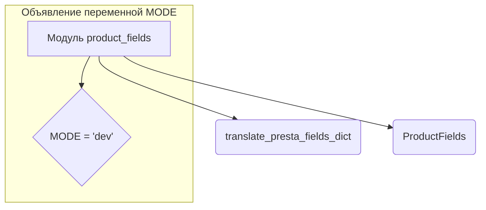
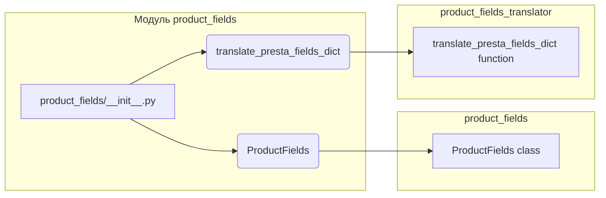

# <input code>

```python
## \file hypotez/src/product/product_fields/__init__.py
# -*- coding: utf-8 -*-
#! venv/Scripts/python.exe
#! venv/bin/python/python3.12

"""
.. module: src.product.product_fields 
	:platform: Windows, Unix
	:synopsis: Модуль полей товара

"""
MODE = 'dev'

from .product_fields import ProductFields
from .product_fields_translator import translate_presta_fields_dict
```

# <algorithm>



**Описание алгоритма:**

Модуль `product_fields` импортирует классы и функции из подпапок.  Переменная `MODE` определяет режим работы.

**Примеры:**

*   `MODE = 'dev'` — указывает на режим разработки.


# <mermaid>



**Объяснение диаграммы:**

Диаграмма показывает импорты из модулей `product_fields` и `product_fields_translator`. `ProductFields` и `translate_presta_fields_dict` импортируются в `product_fields/__init__.py`.


# <explanation>

**Импорты:**

*   `from .product_fields import ProductFields`: Импортирует класс `ProductFields` из файла `product_fields.py` в текущем каталоге (`./`).
*   `from .product_fields_translator import translate_presta_fields_dict`: Импортирует функцию `translate_presta_fields_dict` из файла `product_fields_translator.py` в текущем каталоге.

**Классы:**

*   `ProductFields`:  Этот класс, вероятно, определяет структуру и поведение данных, связанных с полями товара.  Подробности о его внутренней реализации находятся в файле `product_fields.py`.

**Функции:**

*   `translate_presta_fields_dict`: Эта функция, вероятно, преобразует словарь полей, полученных из системы управления товарами (например, PrestaShop), в формат, подходящий для использования в текущем приложении.  Подробности о ее реализации находятся в файле `product_fields_translator.py`.

**Переменные:**

*   `MODE = 'dev'`:  Это переменная, определяющая режим работы программы. В данном случае, `dev` — вероятно, режим разработки.   Это может использоваться для переключения конфигурации или поведения кода в зависимости от среды.

**Возможные ошибки или области для улучшений:**

*   Отсутствует описание функций и класса `ProductFields`.  Для улучшения кода необходимо добавить документацию в файлах `product_fields.py` и `product_fields_translator.py` с описанием аргументов, возвращаемых значений и назначений.
*   Нет указания на то, как `MODE` используется в коде.  Это необходимо для полноценного анализа.
*   Непонятно, из какого проекта/модуля приходят данные, используемые `translate_presta_fields_dict`.


**Взаимосвязи с другими частями проекта:**

Этот модуль, скорее всего, входит в состав более крупного проекта, связанного с обработкой данных о товарах.  Функции и классы из `product_fields` взаимодействуют с другими компонентами, которые считывают, обрабатывают и используют данные о полях товаров, извлеченные с помощью `translate_presta_fields_dict`.  Без доступа к остальной части кода, сложно сделать более точное заключение.