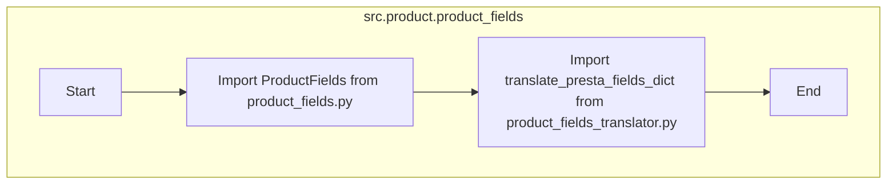

## АНАЛИЗ КОДА: `hypotez/src/product/product_fields/__init__.py`

### <алгоритм>

1.  **Импорт `ProductFields`:**  Импортирует класс `ProductFields` из модуля `product_fields.py`, расположенного в текущей директории. Этот класс, вероятно, отвечает за управление и представление полей продукта.
    *   **Пример:** В коде модуля `product_fields.py` может быть определен класс `ProductFields` с методами для добавления, удаления или модификации полей товара.
2.  **Импорт `translate_presta_fields_dict`:** Импортирует функцию `translate_presta_fields_dict` из модуля `product_fields_translator.py`, расположенного в текущей директории. Эта функция, по всей видимости, предназначена для преобразования словаря полей в формат, совместимый с PrestaShop.
    *   **Пример:**  Функция может принимать словарь с полями товара в одном формате и возвращать словарь, адаптированный для API PrestaShop.
3.  **Инициализация модуля:** Данный файл (`__init__.py`)  используется для инициализации пакета `product_fields`. Он позволяет обращаться к классам и функциям, как к атрибутам пакета.
    *  **Пример:**  После импорта этого пакета,  можно будет использовать `from src.product.product_fields import ProductFields` и `from src.product.product_fields import translate_presta_fields_dict`.

### <mermaid>

**Объяснение зависимостей `mermaid`:**

1. **`src.product.product_fields`**: Это подграф, представляющий текущий пакет `product_fields`.
2. **`Start`**: Начало процесса импорта внутри текущего пакета.
3.  **`Import_ProductFields`**: Импорт класса `ProductFields` из `product_fields.py`.  Класс `ProductFields`  представляет собой логику для работы с полями продукта.
4.  **`Import_Translator`**: Импорт функции `translate_presta_fields_dict` из `product_fields_translator.py`. Эта функция  преобразует структуру полей для PrestaShop.
5. **`End`**: Конец процесса импорта, означающий, что пакет готов к использованию.

### <объяснение>

**Импорты:**

*   `from .product_fields import ProductFields`: Импортирует класс `ProductFields` из модуля `product_fields.py`.  Точка перед именем модуля указывает на то, что импорт происходит из текущего пакета. Этот класс, вероятно, содержит логику для работы с полями товара, такую как добавление, удаление или обновление.
*   `from .product_fields_translator import translate_presta_fields_dict`: Импортирует функцию `translate_presta_fields_dict` из модуля `product_fields_translator.py`. Эта функция предположительно занимается переводом или трансформацией полей товара в формат, требуемый PrestaShop API.

**Классы:**

*   `ProductFields`: Класс, импортированный из `product_fields.py`, не описан в данном файле. Он, вероятно, является основным компонентом пакета для управления полями товара. Он может содержать методы для создания, чтения, обновления и удаления полей, а также методы для проверки валидности полей.

**Функции:**

*   `translate_presta_fields_dict`: Функция, импортированная из `product_fields_translator.py`, также не описана в данном файле. Она предназначена для преобразования словаря полей товара в формат, совместимый с PrestaShop API. Она может принимать словарь с полями, например, вида `{'name': 'Product Name', 'description': 'Product Description'}` и возвращать словарь в формате PrestaShop.

**Переменные:**

*   В этом файле переменных нет, так как он в основном служит для инициализации пакета и импорта.

**Потенциальные ошибки и области для улучшения:**

*   Отсутствие документации в самом коде (например, docstring) затрудняет понимание его работы без просмотра других файлов.
*   Недостаточно информации о структуре классов `ProductFields` и функции `translate_presta_fields_dict` без изучения соответствующих файлов.

**Взаимосвязь с другими частями проекта:**

*   Этот пакет `product_fields`  является частью модуля `product`.  Он может быть использован для управления полями товаров в других частях проекта, особенно тех, что взаимодействуют с PrestaShop.
*   Предположительно, класс `ProductFields` может использоваться для валидации, добавления и модификации данных о продукте перед отправкой в PrestaShop API, где функция `translate_presta_fields_dict`  адаптирует формат данных к PrestaShop.

**Дополнительно:**

Файл `__init__.py` позволяет рассматривать пакет `product_fields`  как модуль, что упрощает импорт его содержимого в других частях проекта.