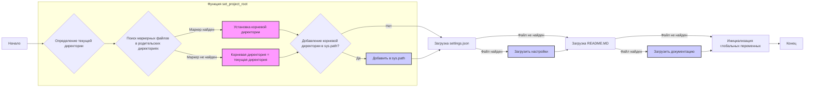

## Анализ кода `hypotez/src/product/product_fields/header.py`

### <алгоритм>

1.  **Инициализация:**
    *   Устанавливается константа `MODE` в значение `'dev'`.
    *   Импортируются необходимые модули: `sys`, `json`, `Version` из `packaging.version` и `Path` из `pathlib`.
2.  **Функция `set_project_root`:**
    *   Принимает кортеж `marker_files` (файлы-маркеры) для определения корневой директории проекта, по умолчанию `('pyproject.toml', 'requirements.txt', '.git')`.
    *   Определяет текущую директорию скрипта (`__file__`).
    *   Итерируется по текущей директории и её родительским директориям.
    *   Проверяет наличие хотя бы одного файла-маркера в каждой директории.
    *   Если маркер найден, устанавливает найденную директорию как корневую (`__root__`) и прекращает итерацию.
    *   Если корневая директория не в `sys.path`, добавляет её в `sys.path`.
    *   Возвращает путь к корневой директории (`__root__`).
    *   _Пример:_ Если `hypotez/src/product/product_fields/header.py` лежит в директории, где есть файл `pyproject.toml`, то эта директория будет определена как корневая.
3.  **Определение корневой директории:**
    *   Вызывается `set_project_root()` для определения корневой директории проекта и результат присваивается глобальной переменной `__root__`.
4.  **Загрузка настроек:**
    *   Импортируется `gs` из модуля `src`.
    *   Пытается открыть файл `settings.json` из папки `/src/` относительно корневой директории.
        *   Если файл существует, загружает JSON-данные в словарь `settings`.
        *   Если файл не найден или возникают проблемы при разборе JSON, то `settings` остается `None`.
5.  **Загрузка документации:**
    *   Пытается открыть файл `README.MD` из папки `/src/` относительно корневой директории.
        *   Если файл существует, считывает текст в переменную `doc_str`.
        *   Если файл не найден или возникают проблемы при разборе, то `doc_str` остается `None`.
6.  **Инициализация глобальных переменных:**
    *   Инициализируются переменные, используя данные из `settings`, если они есть, иначе используются значения по умолчанию.
        *   `__project_name__` : "hypotez" или значение из `settings["project_name"]`.
        *   `__version__` : пустая строка или значение из `settings["version"]`.
        *   `__doc__` : `doc_str` или пустая строка.
        *   `__details__` : пустая строка.
        *   `__author__` : пустая строка или значение из `settings["author"]`.
        *   `__copyright__`: пустая строка или значение из `settings["copyrihgnt"]`.
        *   `__cofee__`: строка по умолчанию или значение из `settings["cofee"]`.

### <mermaid>

**Описание зависимостей `mermaid`:**

*   `A` (Начало): Начальная точка выполнения скрипта.
*   `B` (Определение текущей директории): Определяется текущая директория файла `header.py`.
*   `C` (Поиск маркерных файлов в родительских директориях): Ищет маркерные файлы в текущей и родительских директориях.
*   `D` (Установка корневой директории):  Устанавливает корневую директорию, если маркерный файл найден.
*   `E` (Корневая директория = текущая директория): Устанавливает корневую директорию равной текущей, если маркерные файлы не найдены.
*   `F` (Добавление корневой директории в `sys.path`?): Проверяет, добавлена ли корневая директория в `sys.path`.
*   `G` (Добавить в `sys.path`): Добавляет корневую директорию в `sys.path`, если её там нет.
*  `H` (Загрузка `settings.json`): Пытается загрузить `settings.json`.
*  `I` (Загрузить настройки): Если `settings.json` найден, то из него загружаются настройки.
*  `J` (Загрузка `README.MD`): Пытается загрузить `README.MD`.
*  `K` (Загрузить документацию): Если `README.MD` найден, то из него загружается документация.
*  `L` (Инициализация глобальных переменных): Инициализирует глобальные переменные на основе загруженных настроек и документации.
*   `M` (Конец): Конечная точка выполнения скрипта.
*   "Функция set\_project\_root" - это подграф, который выделяет блок кода, отвечающий за определение корневой директории.

### <объяснение>

**Импорты:**

*   `sys`:  Используется для модификации пути поиска модулей (`sys.path`) и добавления корневой директории проекта для импорта других модулей проекта.
*   `json`:  Используется для загрузки данных из файла `settings.json`.
*   `packaging.version.Version`: Используется для работы с версиями, но в данном коде не используется напрямую. Вероятно, планируется использовать в будущем.
*   `pathlib.Path`: Используется для работы с путями файловой системы в кроссплатформенном режиме.

**Функции:**

*   `set_project_root(marker_files: tuple = ('pyproject.toml', 'requirements.txt', '.git')) -> Path`:
    *   **Аргументы**: `marker_files` (кортеж строк): Список файлов-маркеров для определения корневой директории.
    *   **Возвращает**: `Path`: Объект, представляющий путь к корневой директории проекта.
    *   **Назначение**: Находит корневую директорию проекта, начиная с директории текущего скрипта, и добавляет её в `sys.path`, позволяя импортировать модули проекта.
    *   **Примеры**:
        *   `set_project_root()`: Ищет маркерные файлы по умолчанию.
        *   `set_project_root(marker_files=('config.ini', '.svn'))`:  Ищет маркерные файлы `config.ini` или `.svn`.

**Переменные:**

*   `MODE: str`: Устанавливает режим работы (здесь `'dev'`). Возможно, используется для переключения между режимами разработки и продакшн.
*   `__root__: Path`:  Путь к корневой директории проекта, определяемый функцией `set_project_root()`.
*   `settings: dict`: Словарь с настройками проекта, загруженными из `settings.json`. Может быть `None`, если файл не найден.
*   `doc_str: str`: Строка, содержащая текст из файла `README.MD`. Может быть `None`, если файл не найден.
*   `__project_name__: str`: Имя проекта, значение по умолчанию `hypotez` или из `settings.get("project_name")`.
*   `__version__: str`: Версия проекта, пустая строка или из `settings.get("version")`.
*   `__doc__: str`: Документация проекта, `doc_str` или пустая строка.
*   `__details__: str`: Детали проекта, пустая строка.
*   `__author__: str`: Автор проекта, пустая строка или из `settings.get("author")`.
*   `__copyright__: str`: Авторские права проекта, пустая строка или из `settings.get("copyrihgnt")`.
*   `__cofee__: str`: Сообщение с приглашением поддержать разработчика, значение по умолчанию или из `settings.get("cofee")`.

**Цепочка взаимосвязей:**

1.  Скрипт начинает работу, определяется корневая директория проекта с помощью функции `set_project_root` и записывается в `__root__`.
2.  Корневая директория добавляется в `sys.path`, чтобы можно было импортировать модули проекта, например `src.gs`.
3.  Загружаются данные из `settings.json` и сохраняются в словаре `settings` (если файл найден).
4.  Загружается документация из `README.MD` и сохраняется в переменной `doc_str`.
5.  Инициализируются глобальные переменные (`__project_name__`, `__version__`, `__doc__`, и т.д.) либо из файла настроек (`settings.json`), либо значениями по умолчанию.
6.  Далее, эти переменные могут быть использованы в других частях проекта для получения информации о проекте.

**Потенциальные ошибки и области для улучшения:**

1.  **Обработка ошибок**:
    *   В блоках `try...except` используется `...` для пропуска ошибок.  Это не информативно. Лучше логировать ошибки или выводить сообщения, чтобы понимать, какие файлы не удалось загрузить.
2.  **Жестко заданные пути**:
    *   Пути к `settings.json` и `README.MD` жестко заданы относительно корневой директории. Можно сделать их настраиваемыми через переменные окружения или другие конфигурационные файлы.
3.  **Неиспользуемый импорт**:
     *   `packaging.version.Version` импортируется, но не используется. Стоит удалить этот импорт, если он не нужен.
4.  **Отсутствие проверки settings**:
     *   Необходимо убедиться, что все ключи, которые вызываются из settings, есть в словаре.
5.  **Унификация**:
     *  Возможно, стоит вынести загрузку настроек и документации в отдельные функции, чтобы сделать код более читаемым и удобным для поддержки.
6.  **Использование `gs.path.root`**:
    *   Предполагается, что в модуле `src.gs`  есть `path.root`.  Нужно убедиться, что `src.gs` правильно инициализирует путь к корню проекта, который является копией значения `__root__`  в этом файле.
7. **Комментарии**:
  *  Комментарии в начале файла,  повторяют сами себя.  Нужно оставить только значимые комментарии.
8. **Имена переменных**:
    * Имена переменных вида  `__var__` - это специальные имена, лучше использовать другие имена если нет в этом необходимости.

Этот анализ предоставляет подробное объяснение кода, его функциональности и возможных улучшений, что делает его полезным для понимания работы модуля `header.py`.