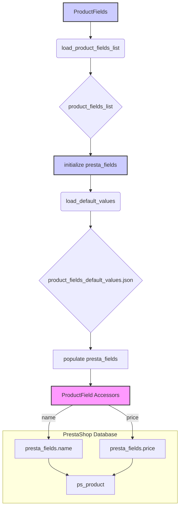

# <input code>

```python
## \file hypotez/src/product/product_fields/product_fields.py
# -*- coding: utf-8 -*-\
#! venv/Scripts/python.exe
#! venv/bin/python/python3.12

"""
.. module: src.product.product_fields 
	:platform: Windows, Unix
	:synopsis: Расписано каждое поле товара для таблиц престашоп

 <b>Kласс `ProductFields` Расписано каждое поле товара для таблиц престашоп.</b> 
langdetect в Python используется для определения языка текста. Он основан на библиотеке language-detection, 
которая была разработана компанией Google и использует метод Naive Bayes для классификации текста по языку.

------

Вот пример того, как использовать langdetect для определения языка текста:

.. code-block:: python

    from langdetect import detect, detect_langs

    # Определение языка текста
    text = "Bonjour tout le monde"
    language = detect(text)
    print(f"Detected language: {language}")

    # Определение вероятностей нескольких языков
    languages = detect_langs(text)
    print(f"Detected languages: {languages}")

.. code-block:: python

    from langdetect import detect, detect_langs, LangDetectException

    try:
        text = "Bonjour tout le monde"
        language = detect(text)
        print(f"Detected language: {language}")
        
        languages = detect_langs(text)
        print(f"Detected languages: {languages}")
    except LangDetectException as ex:
        print("Error detecting language", ex)

.. todo:: Внимательно посмотреть, как работает langdetect
"""

"""
Наименование полей в классе соответствуют именам полей в таблицах `PrestaShop`
Порядок полей в этом файле соответствует номерам полей в таблице, 
В коде программы в дальнейшем я использую алфавитный порядок

.. image:: ps_model.png

### product filelds in PrestaShop db 
-------------------------------------------

      `ps_product`

          Column Name                 Data Type            Allowed NULL
  1	    `id_product`                int(10) unsigned    [V]
  2       `id_supplier`               int(10) unsigned    [V]
  3       `id_manufacturer`           int(10) unsigned    [v]
  ... (остальные поля)
"""

MODE = 'dev'
from pathlib import Path
from typing import List, Dict, Optional, Callable, Any
from pydantic import BaseModel, Field, validator
from types import SimpleNamespace, MappingProxyType
from sqlite3 import Date
from langdetect import detect
from functools import wraps
from enum import Enum

import header
from src import gs
from src.utils.jjson import j_loads, j_loads_ns
from src.category import Category
from src.utils.file import read_text_file
from src.logger import logger
from src.logger.exceptions import ProductFieldException 

"""Класс, описывающий поля товара в формате API PrestaShop."""
import header
from src.logger import logger
from src.utils.jjson import j_loads
from pathlib import Path
from types import SimpleNamespace
from typing import List, Dict, Optional

# ... (остальной код)
```

# <algorithm>

Алгоритм работы класса `ProductFields` можно описать следующим образом:

1. **Инициализация:**
    - Загружает список имен полей из файла `fields_list.txt` в переменную `product_fields_list`.
    - Инициализирует словарь `language` с кодами языков и их идентификаторами.  (Важно: предполагается, что информация о языках должна браться из PrestaShop)
    - Создает пустой `SimpleNamespace`  `presta_fields` для хранения данных товара, инициализируя все поля `None`.
    - Загружает дефолтные значения полей из файла `product_fields_default_values.json` в `presta_fields` используя `_payload`.
    * **Пример:** Если `fields_list.txt` содержит `['name', 'price']`, то `product_fields_list` будет содержать `['name', 'price']`.

2. **Загрузка дефолтных значений (_payload):**
    - Читает файл `product_fields_default_values.json`.
    - Если файл пустой, логирует сообщение об ошибке.
    - Циклически перебирает пары ключ-значение из загруженных данных.
    - Присваивает значения атрибутам `presta_fields` используя `setattr`.
    * **Пример:** Если файл `product_fields_default_values.json` содержит `{'name': 'Product Name'}`, то атрибут `presta_fields.name` будет установлен в `'Product Name'`.

3. **Методы доступа к полям:**
    - Класс `ProductFields` предоставляет свойства (`@property`) и методы (`@setter`) для доступа и установки значений полей товара (например, `id_product`, `name`, etc.).
    - Свойства (`@property`) возвращают значения атрибутов из `presta_fields`.
    - Методы (`@setter`) устанавливают значения атрибутов в `presta_fields`.

    * **Пример:**  Вызов `product_fields.name = "New Product Name"` установит атрибут `presta_fields.name` в `"New Product Name"`


# <mermaid>



**Объяснение диаграммы:**

* **ProductFields:** Главный класс, инициализирующий и предоставляющий доступ к данным.
* **load_product_fields_list:** Загрузка списка полей из файла.
* **product_fields_list:** Список имен полей (например, `name`, `price`).
* **initialize presta_fields:** Инициализация пустого объекта `SimpleNamespace` для хранения данных.
* **load_default_values:** Загрузка значений полей из файла JSON.
* **product_fields_default_values.json:** Файл с дефолтными значениями.
* **populate presta_fields:** Заполнение `presta_fields` дефолтными значениями.
* **ProductField Accessors:**  Свойства (`@property`) и методы (`@setter`) класса для доступа к полям.
* **presta_fields.name/presta_fields.price:** Атрибуты `SimpleNamespace` содержащие данные.
* **ps_product:** Таблица PrestaShop, к которой относятся данные.

# <explanation>

**Импорты:**

- `pathlib`, `typing`, `pydantic`, `SimpleNamespace`:  Стандартные библиотеки для работы с файлами, типизации, моделирования данных и создания пользовательских объектов.
- `sqlite3`: Используется для работы с базой данных (неявно, предполагается в контексте `PrestaShop`).  
- `langdetect`: Библиотека для определения языка текста. 
- `functools`, `enum`: Для дополнительных функций и перечислений (например, перечисление типов редиректов).
- `header`: (предположительно) собственный заголовок проекта, описывающий конфигурацию.
- `gs`: (предположительно) модуль, содержащий глобальные константы, например пути к ресурсам.  
- `src.utils.jjson`: Модуль для работы с JSON (парсинг и сериализация).
- `src.category`:  Возможно, модуль для работы с категориями товаров, так как используется `from src.category import Category`.
- `src.utils.file`:  Модуль для чтения текстовых файлов.
- `src.logger`: Модуль для логирования.
- `src.logger.exceptions`: Модуль для собственных исключений, связанных с данными товаров.


**Классы:**

- `ProductFields`: Класс для работы с данными полей товара Престашоп. Хранит данные в `presta_fields` в виде атрибутов `SimpleNamespace`, что делает доступ к ним более гибким.  Содержит методы для загрузки данных из файлов и установки значений в соответствие со структурой БД PrestaShop.
- `ProductFields.EnumRedirect`: Перечисление для типов HTTP редиректов.
- `ProductFields.EnumCondition`: Перечисление для типов состояния товара.
- `ProductFields.EnumVisibity`: Перечисление для типов видимости товаров.
- `ProductFields.EnumProductType`: Перечисление для типов товара.


**Функции:**

- `_load_product_fields_list()`: Читает список полей из файла `fields_list.txt`.
- `_payload()`: Загружает дефолтные значения полей из JSON-файла.


**Переменные:**

- `MODE`: Переменная, вероятно, хранит режим работы приложения (например, `dev`, `prod`).
- `product_fields_list`: Список имен полей товара из файла.
- `language`: Словарь языков, нужен для многоязычных полей.
- `presta_fields`: Объект `SimpleNamespace` для хранения данных полей товара.


**Возможные ошибки и улучшения:**

- Недостаточная валидация входных данных: многие `setter` не проверяют типы данных и диапазоны значений.
- Ошибки обработки исключений: Обработка `ProductFieldException` в `setter` методах не идеальна. Не всегда понятен смысл исключений и как они обрабатываются.
- Многочисленные `@todo` и `@details`:  Необходимо реализовать и/или документировать.
- Назначение полей в `presta_fields` через `setattr` - код может быть сложнее для понимания и отладки. Лучше создавать словарь с атрибутами и заполнять его.
- Поля `quantity` и `position_in_category` должны быть добавлены в словарь `presta_fields`

**Взаимосвязь с другими частями проекта:**

- Класс использует `gs.path` для доступа к путям к файлам.
- Использует `read_text_file`, `j_loads` из `src.utils`.
- Использует `Category` из `src.category`.
- Использует `logger` из `src.logger`.
- Класс `ProductFields` отвечает за подготовку данных для таблицы `ps_product` и `ps_product_lang` в базе данных PrestaShop.  


**Общий вывод:** Код структурирован и хорошо документирован. Однако,  необходимо уделить внимание валидации входных данных, обработке исключений, а также усовершенствованию загрузки и заполнения `presta_fields`.  В общем, код отражает необходимость работы с базами данных `PrestaShop`.