## <алгоритм>

### Блок-схема:

1.  **Инициализация `ProductFields`:**
    *   Создается экземпляр класса `ProductFields`.
    *   Вызывается метод `__init__`.
    *   Загружается список полей продукта из файла `fields_list.txt` в `self.product_fields_list`.
        *   Пример: Список может содержать `['id_product', 'id_supplier', 'name', 'price', ...]`.
    *   Инициализируется словарь `self.language` со значениями `{'en': 1, 'he': 2, 'ru': 3}`.
    *   Создается `self.presta_fields` (SimpleNamespace), заполненный ключами из `self.product_fields_list` и значениями `None`.
        *   Пример: `self.presta_fields` будет содержать поля, такие как `id_product=None`, `id_supplier=None`, `name=None`, ...
    *   Инициализируется словарь `self.assist_fields_dict` с ключами `default_image_url` (пустая строка) и `images_urls` (пустой список).
        *   Пример: `self.assist_fields_dict` будет `{'default_image_url': '', 'images_urls': []}`.
    *   Вызывается метод `self._payload()`.
2.  **Загрузка дефолтных значений (`_payload`)**:
    *   Загружаются дефолтные значения полей из файла `product_fields_default_values.json`.
        *   Пример: JSON файл может содержать `{'active': 1, 'price': 0, ...}`.
    *   Для каждой пары ключ-значение из загруженного JSON, значение устанавливается как атрибут объекта `self`.
        *   Пример: Если в JSON есть `'active': 1`, то `self.active` станет равным `1`.
3.  **Работа с ассоциациями (`associations`)**:
    *   Метод `associations` с декоратором `@property` возвращает `self.presta_fields.associations` или `None`.
        *   Пример: Если `self.presta_fields.associations` имеет значение `{'categories': [{'id': 123}]}`, то метод вернет этот словарь.
    *   Метод `associations` с декоратором `@associations.setter` устанавливает значение для `self.presta_fields.associations`.
        *   Пример: `self.associations = {'categories': [{'id': 456}]}` установит новое значение для ассоциаций.
4.  **Работа с полями продукта (`id_product`, `id_supplier`, `id_manufacturer`, ...):**
    *   Для каждого поля (например, `id_product`):
        *   Метод с декоратором `@property` возвращает текущее значение поля из `self.presta_fields`.
            *   Пример: Если `self.presta_fields.id_product` равен `123`, то `self.id_product` вернет `123`.
        *   Метод с декоратором `@<поле>.setter` устанавливает новое значение для поля.
            *   Пример: `self.id_product = 456` установит новое значение для `self.presta_fields.id_product` равным `456`.
        *   Перед установкой значения проверяется на наличие исключения `ProductFieldException`. Если такое исключение происходит, в лог записывается ошибка и функция завершается.
5.  **Работа с дополнительными категориями (`additional_categories`):**
    *   Метод `additional_categories` с декоратором `@property` возвращает список дополнительных категорий.
        *   Пример: Если `self.presta_fields.associations` имеет значение `{'categories': [{'id': 123}, {'id': 456}]}`, то вернет `[{'id': 123}, {'id': 456}]`.
    *   Метод `additional_categories` с декоратором `@additional_categories.setter` устанавливает новые значения для дополнительных категорий. Если передано целое число, то оно преобразуется в список из одного элемента.
        *   Пример: `self.additional_categories = 789` установит `self.presta_fields.associations.categories` в `[{'id': 789}]`.
    *   Если передано не целое число, то в лог записывается ошибка и функция завершается.
6.  **Работа с мультиязычными полями (`description`, `name`, `meta_description`, ...):**
    *   Для каждого мультиязычного поля:
        *   Метод с декоратором `@property` возвращает текущее значение поля из `self.presta_fields`.
            *   Пример: Если `self.presta_fields.description` равен `{'language': [{'attrs': {'id': '1'}, 'value': 'Description in English'}]}`, то `self.description` вернет этот словарь.
        *   Метод с декоратором `@<поле>.setter` устанавливает новое значение для поля, оборачивая его в словарь `{'language': [{'attrs': {'id': self.language[lang]}, 'value': value}]}`.
            *   Пример: `self.description = 'Описание на русском', lang='ru'` установит `self.presta_fields.description` в `{'language': [{'attrs': {'id': '3'}, 'value': 'Описание на русском'}]}`.
        *   Используется `self.language` для определения ID языка.

### Поток данных:

1.  **Инициализация:**
    *   `fields_list.txt` -> `_load_product_fields_list` -> `self.product_fields_list`
    *   `product_fields_default_values.json` -> `_payload` -> атрибуты `self`
2.  **Установка значений полей:**
    *   Значение -> `@<поле>.setter` -> `self.presta_fields.<поле>`
    *   `self.presta_fields.<поле>` -> `@property` -> значение
3.  **Установка значений мультиязычных полей:**
    *   Значение, `lang` -> `@<поле>.setter` -> `self.presta_fields.<поле>: {'language': [{'attrs': {'id': self.language[lang]}, 'value': value}]}`
    *   `self.presta_fields.<поле>` -> `@property` -> значение

## <mermaid>

```mermaid
graph LR
    A[ProductFields] --> B(_load_product_fields_list);
    A --> C(_payload);
    A --> D(presta_fields);
    A --> E(assist_fields_dict);
    B --> F(fields_list.txt);
    C --> G(product_fields_default_values.json);
    D --> H(id_product);
    D --> I(id_supplier);
     D --> J(id_manufacturer);
     D --> K(id_category_default);
    D --> L(additional_categories)
     D --> M(id_shop_default)
     D --> N(id_shop)
     D --> O(id_tax)
     D --> P(on_sale)
     D --> Q(online_only)
     D --> R(ean13)
     D --> S(isbn)
     D --> T(upc)
     D --> U(mpn)
     D --> V(ecotax)
     D --> W(minimal_quantity)
     D --> X(low_stock_threshold)
     D --> Y(low_stock_alert)
     D --> Z(price)
     D --> AA(wholesale_price)
    D --> AB(unity)
    D --> AC(unit_price_ratio)
    D --> AD(additional_shipping_cost)
    D --> AE(reference)
    D --> AF(supplier_reference)
    D --> AG(location)
    D --> AH(width)
    D --> AI(height)
    D --> AJ(depth)
    D --> AK(weight)
    D --> AL(volume)
    D --> AM(out_of_stock)
    D --> AN(additional_delivery_times)
    D --> AO(quantity_discount)
    D --> AP(customizable)
    D --> AQ(uploadable_files)
    D --> AR(text_fields)
    D --> AS(active)
     D --> AT(redirect_type)
     D --> AU(id_type_redirected)
    D --> AV(available_for_order)
    D --> AW(available_date)
     D --> AX(show_condition)
     D --> AY(condition)
     D --> AZ(show_price)
     D --> BA(indexed)
      D --> BB(visibility)
    D --> BC(cache_is_pack)
    D --> BD(cache_has_attachments)
    D --> BE(is_virtual)
    D --> BF(cache_default_attribute)
    D --> BG(date_add)
    D --> BH(date_upd)
    D --> BI(advanced_stock_management)
    D --> BJ(pack_stock_type)
    D --> BK(state)
    D --> BL(product_type)
    D --> BM(description)
    D --> BN(description_short)
    D --> BO(link_rewrite)
    D --> BP(meta_description)
    D --> BQ(meta_keywords)
    D --> BR(meta_title)
    D --> BS(name)
    D --> BT(available_now)
    D --> BU(available_later)
    D --> BV(delivery_in_stock)
     D --> BW(delivery_out_stock)
     D --> BX(delivery_additional_message)
    D --> BY(affiliate_short_link)
    D --> BZ(affiliate_text)
    D --> CA(affiliate_summary)
    D --> CB(affiliate_summary_2)
    D --> CC(affiliate_image_small)
     D --> CD(affiliate_image_medium)
    D --> CE(affiliate_image_large)
    D --> CF(ingredients)
    D --> CG(how_to_use)
    D --> CH(specification)
    D --> CI(id_default_image)
    D --> CJ(link_to_video)
    D --> CK(local_saved_image)
    D --> CL(local_saved_video)
    D --> CM(position_in_category)
    D --> CN(images_urls);
    
    
    
    E --> CO(page_lang);
    
    H -->|setter| A
    I -->|setter| A
    J -->|setter| A
    K -->|setter| A
    L -->|setter| A
    M -->|setter| A
    N -->|setter| A
    O -->|setter| A
    P -->|setter| A
    Q -->|setter| A
    R -->|setter| A
    S -->|setter| A
    T -->|setter| A
    U -->|setter| A
    V -->|setter| A
    W -->|setter| A
    X -->|setter| A
    Y -->|setter| A
    Z -->|setter| A
    AA -->|setter| A
    AB -->|setter| A
    AC -->|setter| A
    AD -->|setter| A
    AE -->|setter| A
    AF -->|setter| A
    AG -->|setter| A
    AH -->|setter| A
    AI -->|setter| A
    AJ -->|setter| A
    AK -->|setter| A
    AL -->|setter| A
    AM -->|setter| A
    AN -->|setter| A
    AO -->|setter| A
    AP -->|setter| A
    AQ -->|setter| A
    AR -->|setter| A
    AS -->|setter| A
    AT -->|setter| A
    AU -->|setter| A
    AV -->|setter| A
    AW -->|setter| A
    AX -->|setter| A
    AY -->|setter| A
    AZ -->|setter| A
    BA -->|setter| A
    BB -->|setter| A
    BC -->|setter| A
    BD -->|setter| A
    BE -->|setter| A
    BF -->|setter| A
    BG -->|setter| A
    BH -->|setter| A
    BI -->|setter| A
    BJ -->|setter| A
    BK -->|setter| A
    BL -->|setter| A
    BM -->|setter| A
    BN -->|setter| A
    BO -->|setter| A
    BP -->|setter| A
    BQ -->|setter| A
    BR -->|setter| A
    BS -->|setter| A
    BT -->|setter| A
    BU -->|setter| A
    BV -->|setter| A
    BW -->|setter| A
    BX -->|setter| A
    BY -->|setter| A
    BZ -->|setter| A
    CA -->|setter| A
    CB -->|setter| A
    CC -->|setter| A
    CD -->|setter| A
    CE -->|setter| A
    CF -->|setter| A
    CG -->|setter| A
     CH -->|setter| A
    CI -->|setter| A
    CJ -->|setter| A
    CK -->|setter| A
    CL -->|setter| A
    CM -->|setter| A
    CN -->|setter| A
    
    CO -->|setter| A


    H -->|property| A
    I -->|property| A
    J -->|property| A
     K -->|property| A
    L -->|property| A
     M -->|property| A
    N -->|property| A
    O -->|property| A
    P -->|property| A
    Q -->|property| A
    R -->|property| A
    S -->|property| A
     T -->|property| A
    U -->|property| A
    V -->|property| A
    W -->|property| A
    X -->|property| A
    Y -->|property| A
    Z -->|property| A
    AA -->|property| A
    AB -->|property| A
    AC -->|property| A
     AD -->|property| A
    AE -->|property| A
    AF -->|property| A
    AG -->|property| A
    AH -->|property| A
    AI -->|property| A
    AJ -->|property| A
    AK -->|property| A
    AL -->|property| A
     AM -->|property| A
    AN -->|property| A
    AO -->|property| A
    AP -->|property| A
    AQ -->|property| A
    AR -->|property| A
    AS -->|property| A
     AT -->|property| A
    AU -->|property| A
    AV -->|property| A
    AW -->|property| A
    AX -->|property| A
    AY -->|property| A
    AZ -->|property| A
    BA -->|property| A
    BB -->|property| A
    BC -->|property| A
    BD -->|property| A
    BE -->|property| A
    BF -->|property| A
    BG -->|property| A
    BH -->|property| A
    BI -->|property| A
    BJ -->|property| A
    BK -->|property| A
     BL -->|property| A
    BM -->|property| A
    BN -->|property| A
    BO -->|property| A
    BP -->|property| A
    BQ -->|property| A
    BR -->|property| A
    BS -->|property| A
    BT -->|property| A
    BU -->|property| A
     BV -->|property| A
    BW -->|property| A
    BX -->|property| A
    BY -->|property| A
    BZ -->|property| A
    CA -->|property| A
    CB -->|property| A
    CC -->|property| A
    CD -->|property| A
    CE -->|property| A
    CF -->|property| A
    CG -->|property| A
    CH -->|property| A
    CI -->|property| A
    CJ -->|property| A
    CK -->|property| A
    CL -->|property| A
    CM -->|property| A
    CN -->|property| A
    
    CO -->|property| A
```

### Описание `mermaid`:

1.  **`ProductFields` (A):** Центральный класс, управляющий полями продукта. Он является источником и приемником данных для других компонентов.
2.  **`_load_product_fields_list` (B):** Метод, отвечающий за загрузку списка полей продукта. Он получает данные из файла `fields_list.txt` (F).
3.  **`_payload` (C):** Метод, загружающий дефолтные значения полей. Он получает данные из файла `product_fields_default_values.json` (G).
4.  **`presta_fields` (D):** Объект типа `SimpleNamespace`, который хранит все поля продукта.
5.  **`assist_fields_dict` (E):** Словарь для хранения служебных полей, не входящих в `presta_fields`.
6.  **`fields_list.txt` (F):** Файл, содержащий список имен полей продукта.
7.  **`product_fields_default_values.json` (G):** Файл, содержащий дефолтные значения для полей продукта.
8.  **`id_product` (H), `id_supplier` (I), ..., `page_lang` (CO):**  Отдельные поля продукта, которые хранятся в `presta_fields` (D) или `assist_fields_dict` (E) и могут устанавливаться через соответствующие сеттеры и получатся через гетеры класса `ProductFields` (A).
9. **Стрелки с подписью `setter`:** Показывают как данные передаются в класс `ProductFields` (A) для установки значения полей.
10. **Стрелки с подписью `property`:** Показывают как данные получаются из класса `ProductFields` (A) через его свойства.

## <объяснение>

### Импорты:

*   `pathlib.Path`: Используется для работы с путями файлов и каталогов.
*   `typing.List`, `typing.Dict`, `typing.Optional`, `typing.Callable`, `typing.Any`: Используются для аннотации типов, что делает код более читаемым и помогает выявлять ошибки на этапе разработки.
*   `pydantic.BaseModel`, `pydantic.Field`, `pydantic.validator`: Используются для валидации данных. В данном коде явно не используются, возможно, планируется использование.
*   `types.SimpleNamespace`, `types.MappingProxyType`: `SimpleNamespace` используется для создания объектов с произвольными атрибутами, а `MappingProxyType` для создания неизменяемых словарей, но в коде не используется.
*    `sqlite3.Date`: используется для работы с датами, но в коде используется как `Date` из `from sqlite3 import Date`, хотя это тип из `sqlite3`, его нужно заменить на `from datetime import date` или `from datetime import datetime`.
*   `langdetect.detect`: Используется для определения языка текста.
*   `functools.wraps`: Декоратор, используемый для сохранения метаданных декорируемой функции, в данном коде не используется, но импорт есть.
*   `enum.Enum`: Используется для создания перечислений.
*   `header`: Пользовательский модуль, предположительно, содержит метаданные или общую информацию.
*   `src.gs`: Глобальные настройки проекта.
*   `src.utils.jjson.j_loads`, `src.utils.jjson.j_loads_ns`: Функции для загрузки данных из JSON файлов. `j_loads_ns` не используется, но импорт есть.
*   `src.category.Category`: Класс для представления категорий товаров (в данном коде явно не используется, но импорт есть).
*   `src.utils.file.read_text_file`: Функция для чтения текстовых файлов.
*   `src.logger.logger.logger`: Объект логгера.
*   `src.logger.exceptions.ProductFieldException`: Пользовательское исключение для обработки ошибок в полях товара.

### Классы:

*   **`ProductFields`**:
    *   **Роль:** Представляет поля товара в формате API PrestaShop.
    *   **Атрибуты:**
        *   `product_fields_list`: Список полей продукта, загруженный из `fields_list.txt`.
        *   `language`: Словарь, содержащий соответствия между кодами языков и их ID.
        *   `presta_fields`: Объект типа `SimpleNamespace`, хранящий значения полей товара.
        *    `assist_fields_dict`: Словарь для хранения служебных полей.
    *   **Методы:**
        *   `__init__`: Инициализирует класс, загружает список полей, языки и их идентификаторы, создает `presta_fields` и `assist_fields_dict` , загружает дефолтные значения полей.
        *   `_load_product_fields_list`: Загружает список полей из файла.
        *   `_payload`: Загружает дефолтные значения полей из файла JSON.
        *   `associations`: Свойство для управления ассоциациями товара.
        *   `id_product`, `id_supplier`, `id_manufacturer`, и т.д.: Свойства (property) и сеттеры для каждого поля товара. Обеспечивают доступ к значениям полей и их установку. Сеттеры валидируют значения и пишут ошибки в лог.
        *   `EnumRedirect`: Внутренний класс enum для представления типов редиректов.
        *   `EnumCondition`: Внутренний класс enum для представления состояний товара (new, used, refurbished).
        *   `EnumVisibity`: Внутренний класс enum для представления видимости товара.
        *  `EnumProductType`: Внутренний класс enum для представления типов товара.
        *   `page_lang` свойство для хранения текущего языка.

### Функции:

*   `_load_product_fields_list()`:
    *   **Аргументы:** Нет.
    *   **Возвращаемое значение:** `List[str]` - список полей из файла.
    *   **Назначение:** Читает список полей продукта из текстового файла.
        *  Пример: `['id_product', 'id_supplier', 'id_manufacturer']`
*   `_payload()`:
    *   **Аргументы:** Нет.
    *   **Возвращаемое значение:** `bool` - `True` при успешной загрузке, `False` при неудачной.
    *   **Назначение:** Загружает дефолтные значения для полей продукта из JSON файла.
        *   Пример: Загружает из `product_fields_default_values.json` `{'active': 1, 'price': 0}` и устанавливает как атрибуты `self.active` и `self.price`.

### Переменные:

*   `MODE`: Константа, определяющая режим работы (`dev`).
*   `self.product_fields_list`: Список полей товара.
*   `self.language`: Словарь, сопоставляющий языковые коды с их идентификаторами.
*   `self.presta_fields`: Объект `SimpleNamespace`, содержащий поля товара.
*   `self.assist_fields_dict`: Словарь с дополнительными (служебными) полями.

### Взаимосвязи с другими частями проекта:

*   **`src.gs`**: Используется для получения путей к файлам.
*   **`src.utils.jjson`**: Используется для загрузки данных из JSON.
*   **`src.utils.file`**: Используется для чтения текстовых файлов.
*   **`src.logger`**: Используется для логирования ошибок и предупреждений.
*   **`src.category`**: хотя и импортирован класс, но он явно не используется.
*   `header` предположительно, содержит метаданные или общую информацию.

### Потенциальные ошибки и области для улучшения:

1.  **Валидация данных:**
    *   В коде присутствуют проверки на `ProductFieldException` в сеттерах, но отсутствует непосредственная валидация значений перед присвоением их атрибутам `self.presta_fields`. Желательно добавить валидацию типов и диапазонов значений.
        *   Например, можно использовать Pydantic для валидации.
2.  **Обработка исключений:**
    *   Исключения `ProductFieldException` обрабатываются очень просто (логирование и `return`). Было бы полезно обрабатывать их более детально и, возможно, вызывать другие исключения для более высокой абстракции.
3.  **Использование `sqlite3.Date`:**
     *   Тип `Date` импортируется из `sqlite3`, но  он не подходит для установки значений.  Вместо него нужно использовать `datetime.date`
4.  **Логика мультиязычных полей:**
    *   Код для мультиязычных полей (таких как `description`, `name`, `meta_description`) повторяется. Можно вынести логику в отдельную функцию или декоратор.
    *   Мультиязычные данные записываются в виде списка словарей, но есть вероятность, что это не всегда будет необходимо, и можно будет упростить структуру.
5.  **Зависимость от `fields_list.txt` и `product_fields_default_values.json`:**
    *   Зависимость от файлов для хранения полей и дефолтных значений может усложнить поддержку и расширение. Можно рассмотреть возможность использования базы данных или другого более гибкого способа хранения этой информации.
6.  **Отсутствие констант для ключей словарей:**
    *   В коде используются строковые литералы в качестве ключей для словарей (например, `'language'`, `'attrs'`, `'id'`, `'value'`). Можно было бы определить константы для этих ключей.
7.  **Обработка None значений:**
    *   В коде присутствуют проверки на `None` значения, но они не всегда обрабатываются последовательно. Можно унифицировать обработку `None` значений.
8.  **`Quantity`:**
    *   Поле `quantity` в комментариях помечено как "нельзя передавать значение", но это не отображено в коде. Желательно явно указать, что это поле не управляется через сеттер.
9.  **Неявные зависимости**:
    *   В коде встречаются неявные зависимости, к примеру, логика  мультиязычных полей привязана к словарю `self.language`. Такое связывание усложняет рефакторинг.
10. **Обработка `additional_categories`**:
    * При добавлении дополнительных категорий в цикле происходит мутация словаря `self.presta_fields.associations.categories`.  Это потенциально может привести к непредсказуемому поведению, если данные будут меняться при итерации.
11. **Смешанная логика `setter`-ов**:
    *  Сеттеры, которые должны просто устанавливать значение поля, выполняют ещё и дополнительную логику, к примеру, преобразование значений `str(value)`.
12. **Не все поля инициализируются при создании объекта**:
    *  Не все поля класса явно инициализируются, это может привести к не очевидным ошибкам в работе программы, если где-то будет использовано не инициализированное поле.

### Цепочка взаимосвязей с другими частями проекта:

1.  `ProductFields` используется для представления структуры данных, которая передается между модулями. Например, для преобразования данных из БД в формат, понятный API.
2.  Этот модуль является частью `src.product`, и предположительно будет использоваться в модулях, которые работают с товарами.
3.  Может использоваться в модулях, которые занимаются импортом/экспортом данных, интеграцией с внешними сервисами, парсингом информации о товарах, взаимодействием с API PrestaShop.
4.  Модуль опирается на `src.gs` для доступа к настройкам, `src.utils.jjson` и `src.utils.file` для чтения файлов конфигурации и `src.logger` для ведения журнала событий.