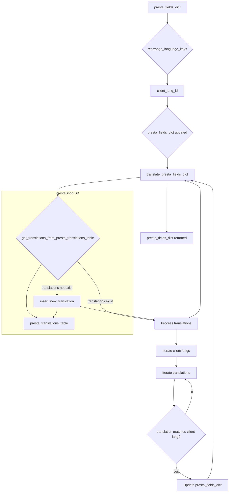

# <input code>

```python
## \file hypotez/src/product/product_fields/product_fields_translator.py
# -*- coding: utf-8 -*-\
#! venv/Scripts/python.exe
#! venv/bin/python/python3.12

"""
.. module: src.product.product_fields 
	:platform: Windows, Unix
	:synopsis: Модуль перевода полей товара на языки клиентской базы данных

"""
MODE = 'dev'

from pathlib import Path
from typing import List
...
from src import gs
from src.utils.printer import pprint
from src.logger import logger
#from src.db import ProductTranslationsManager
#from src.translator import get_translations_from_presta_translations_table
#from src.translator import insert_new_translation_to_presta_translations_table
from src.logger.exceptions import ProductFieldException
...

def rearrange_language_keys(presta_fields_dict: dict, client_langs_schema: dict | List[dict], page_lang: str) -> dict:
    """Функция обновляет идентификатор языка в словаре presta_fields_dict на соответствующий идентификатор
    из схемы клиентских языков при совпадении языка страницы.

    Args:
        presta_fields_dict (dict): Словарь полей товара.
        page_lang (str): Язык страницы.
        client_langs_schema (list | dict): Схема языков клиента.

    Returns:
        dict: Обновленный словарь presta_fields_dict.
    """
    client_lang_id = None
    for lang in client_langs_schema:
        if lang['locale'] == page_lang or \
        lang['iso_code'] == page_lang or  \
        lang['language_code'] == page_lang:   # <- оч плохо А если he или IL?
            client_lang_id = lang['id']
            break

    if client_lang_id is not None:
        for field in presta_fields_dict.values():
            if isinstance(field, dict) and 'language' in field:
                for lang_data in field['language']:
                    lang_data['attrs']['id'] = str(client_lang_id)   # <- Эти айдишники ОБЯЗАТЕЛЬНО строки. Связано с XML парсером

    return presta_fields_dict


def translate_presta_fields_dict (presta_fields_dict: dict, 
                                  client_langs_schema: list | dict, 
                                  page_lang: str = None) -> dict:
    """ @Перевод мультиязычных полей в соответствии со схемой значений `id` языка в базе данных клиента
    """
    presta_fields_dict = rearrange_language_keys (presta_fields_dict, client_langs_schema, page_lang)
    #product_translations = get_translations_from_presta_translations_table(presta_fields_dict['reference'])
    enabled_product_translations = get_translations_from_presta_translations_table(presta_fields_dict['reference'])
    if not enabled_product_translations or enabled_product_translations or len(enabled_product_translations) <1:
        """ В таблице переводов нет такого перевода товара. Добавляю текущий, как новый """
        global record
        rec = record(presta_fields_dict)
        insert_new_translation_to_presta_translations_table(rec)
        return presta_fields_dict

    for client_lang in client_langs_schema:
        for translated_record in enabled_product_translations:
            """ 
                        ПЕРЕВОД
            client codes from PrestaShop table
            'iso_code'    'en'    str
            'locale'    'en-US'    str
            'language_code'    'en-us'    str
            мне нужен iso_code
            """
            try:
                if client_lang['iso_code'] in translated_record.locale: 
                    "Записываю перевод из таблицы"
                    for key in presta_fields_dict.keys():
                        if hasattr(translated_record, key):
                            presta_fields_dict[key] = {'language': [{'attrs': {'id': str(client_lang['id'])}, 'value': getattr(translated_record, key)}]}
            except Exception as ex:
                logger.error(f"""Ошибка {ex}
                client_lang = {pprint(client_lang)}
                """)

    return presta_fields_dict
```

# <algorithm>

**Алгоритм работы функций:**

**rearrange_language_keys:**

1. Принимает словарь `presta_fields_dict`, схему языков `client_langs_schema` и язык страницы `page_lang`.
2. Ищет в `client_langs_schema` язык, соответствующий `page_lang` по `locale`, `iso_code` или `language_code`.
3. Если язык найден, сохраняет его ID в `client_lang_id`.
4. Если `client_lang_id` существует, обходит все поля в `presta_fields_dict`.
5. Для каждого поля, если оно словарь и содержит `language`, обходит все данные в `language`.
6. Для каждого элемента в `language` устанавливает `id` атрибута в `lang_data['attrs']` на строковое представление `client_lang_id`.
7. Возвращает обновленный `presta_fields_dict`.

**translate_presta_fields_dict:**

1. Принимает словарь `presta_fields_dict`, схему языков `client_langs_schema` и язык страницы `page_lang`.
2. Вызывает `rearrange_language_keys` для предварительной обработки данных.
3. Вызывает `get_translations_from_presta_translations_table` для получения переводов из базы данных по ключу `reference` из `presta_fields_dict`.
4. Если в базе нет переводов, добавляет новый перевод в базу с помощью `insert_new_translation_to_presta_translations_table`.
5. Проходит по всем языкам в `client_langs_schema`.
6. Проходит по всем записям перевода в `enabled_product_translations`.
7. Если `iso_code` текущего языка из `client_langs_schema` содержится в `locale` записи перевода, копирует соответствующие значения из перевода в `presta_fields_dict`, устанавливая `id` на строковое представление ID языка из `client_langs_schema`.
8. Возвращает обновленный `presta_fields_dict`.


# <mermaid>



# <explanation>

**Импорты:**

- `from pathlib import Path`: Импортирует класс `Path` для работы с путями к файлам.
- `from typing import List`: Импортирует тип данных `List` для работы со списками.
- `from src import gs`: Импортирует модуль `gs` из пакета `src`.  Необходимость и назначение `gs`  необходимо прояснить.
- `from src.utils.printer import pprint`: Импортирует функцию `pprint` из модуля `printer` в папке `utils` для красивого вывода данных.
- `from src.logger import logger`: Импортирует логгер `logger` из модуля `logger`.
- `from src.logger.exceptions import ProductFieldException`: Импортирует пользовательское исключение `ProductFieldException` для обработки ошибок в модуле логгирования.
- `#from src.db import ProductTranslationsManager`: Комментированный импорт, вероятно, для взаимодействия с базой данных.
- `#from src.translator import get_translations_from_presta_translations_table`, `#from src.translator import insert_new_translation_to_presta_translations_table`: Комментированные импорты для функций работы с таблицами переводов.


**Классы:**

Нет явных определений классов в данном коде.

**Функции:**

- `rearrange_language_keys`: Обновляет идентификатор языка в словаре `presta_fields_dict` на основе `client_langs_schema` и языка страницы.
    - Аргументы: `presta_fields_dict` (словарь), `client_langs_schema` (список или словарь), `page_lang` (строка).
    - Возвращает: Обновленный словарь `presta_fields_dict`.
- `translate_presta_fields_dict`: Переводит мультиязычные поля в соответствии со схемой значений `id` языка в базе данных клиента.
    - Аргументы: `presta_fields_dict` (словарь), `client_langs_schema` (список или словарь), `page_lang` (строка, необязательно).
    - Возвращает: Обновленный словарь `presta_fields_dict`.

**Переменные:**

- `MODE`: Строковая переменная, хранящая режим работы ('dev').
- `client_lang_id`: Переменная, хранящая идентификатор языка клиента.
- `enabled_product_translations`: Список/словарь переведенных данных.


**Возможные ошибки и улучшения:**

- **Недостаточная обработка ошибок:** Обработка исключений (`try...except`) присутствует, но неполная.  Следует более подробно обрабатывать все возможные типы исключений и выводить более информативные сообщения об ошибках.
- **Жесткая привязка к схеме:** Функции сильно зависят от структуры словарей (`presta_fields_dict`, `client_langs_schema`).  Необходимо учитывать возможные вариации в формате данных.
- **Непонятные комментарии:** Некоторые комментарии не очень информативны.  Следует добавить более подробные пояснения о логике и целях кода.
- **Недостающая валидация:** Необходимо добавлять проверки на валидность входных данных (например, типы, наличие необходимых ключей).
- **Переименование переменных:** Переменные типа `client_lang_id` можно переименовать на более говорящие, например, `language_id`.
- **Непонятные глобальные переменные:** Использование `global record` вызывает опасения. Возможно, это временное решение, которое следует пересмотреть.

**Взаимосвязи с другими частями проекта:**

Код взаимодействует с:
- Модулем `gs`.
- Модулем `printer`.
- Модулем `logger`.
- (`src.db`) и  (`src.translator`) (комментированные импорты) для взаимодействия с базой данных переводов.  Необходимо проанализировать и реализовать эти взаимодействия, если они нужны.


**Общие замечания:**

Код выполняет сложную задачу перевода полей товара.  Однако, его качество кода может быть улучшено с помощью более подробных комментариев, лучшей обработки ошибок и более понятных имён переменных. Также, необходимо добавить валидацию входных данных.