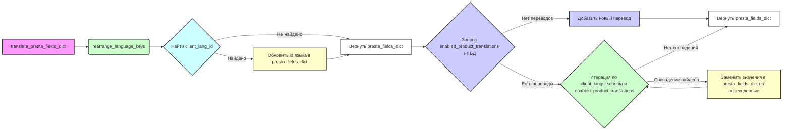

## Анализ кода `product_fields_translator.py`

### 1. <алгоритм>
**Блок-схема:**

1.  **`rearrange_language_keys(presta_fields_dict, client_langs_schema, page_lang)`**
    *   **Вход:**
        *   `presta_fields_dict`: Словарь полей товара (например, `{'name': {'language': [{'attrs': {'id': '1'}, 'value': 'Product Name'}]}}`).
        *   `client_langs_schema`: Список или словарь схем языков клиента (например, `[{'id': 2, 'locale': 'ru-RU'}, {'id': 1, 'locale': 'en-US'}]`).
        *   `page_lang`: Строка языка страницы (например, 'ru-RU').
    *   **Логика:**
        1.  Ищет `client_lang_id` в `client_langs_schema` по совпадению `locale`, `iso_code` или `language_code` с `page_lang`.
        2.  Если `client_lang_id` найден, то обходит `presta_fields_dict` и обновляет `id` в `language.attrs` на `client_lang_id` как строку.
    *   **Выход:** Модифицированный `presta_fields_dict` (например, `{'name': {'language': [{'attrs': {'id': '2'}, 'value': 'Product Name'}]}}`).

2.  **`translate_presta_fields_dict(presta_fields_dict, client_langs_schema, page_lang)`**
    *   **Вход:**
        *   `presta_fields_dict`: Словарь полей товара (например, `{'name': {'language': [{'attrs': {'id': '1'}, 'value': 'Product Name'}]}}`).
        *   `client_langs_schema`: Список или словарь схем языков клиента (например, `[{'id': 2, 'locale': 'ru-RU'}, {'id': 1, 'locale': 'en-US'}]`).
        *   `page_lang`: Строка языка страницы (например, 'ru-RU'). Может быть `None`.
    *   **Логика:**
        1.  Вызывает `rearrange_language_keys` для обновления `id` языка.
        2.  Получает `enabled_product_translations` из таблицы переводов.
        3.  Если переводов нет, то добавляет текущие значения как новый перевод и возвращает `presta_fields_dict`.
        4.  Итерируется по `client_langs_schema` и `enabled_product_translations`. Если находит совпадение по `iso_code` и `locale`, то заменяет значения в `presta_fields_dict` на соответствующие переводы.
    *   **Выход:** Модифицированный `presta_fields_dict` с переведенными значениями.

**Поток данных:**

*   `translate_presta_fields_dict` вызывает `rearrange_language_keys`, передавая `presta_fields_dict`, `client_langs_schema` и `page_lang`.
*   Результат из `rearrange_language_keys` возвращается в `translate_presta_fields_dict`.
*   `translate_presta_fields_dict` получает переводы из БД (если они есть) и модифицирует `presta_fields_dict`.
*   Модифицированный `presta_fields_dict` возвращается из `translate_presta_fields_dict`.

### 2. <mermaid>


**Зависимости `mermaid`:**

*   `translate_presta_fields_dict`: Главная функция, инициирующая процесс перевода.
*   `rearrange_language_keys`: Функция для перестановки ключей языка, вызывается из `translate_presta_fields_dict`.
*   `Найти client_lang_id`: Логический блок внутри `rearrange_language_keys` для поиска ID языка.
*    `Обновить id языка в presta_fields_dict`: Логический блок внутри `rearrange_language_keys` для обновления ID языка в словаре.
*   `Вернуть presta_fields_dict`: Логический блок для возврата словаря.
*    `Запрос enabled_product_translations из БД`: Логический блок для получения переводов из базы данных.
*    `Добавить новый перевод`: Логический блок для добавления нового перевода в БД.
*   `Итерация по client_langs_schema и enabled_product_translations`: Логический блок для прохода по языкам и переводам.
*    `Заменить значения в presta_fields_dict на переведенные`: Логический блок для замены значений в словаре.

### 3. <объяснение>
**Импорты:**

*   `pathlib.Path`: Для работы с путями к файлам и директориям.
*   `typing.List`: Для аннотации типов, указывает, что переменная является списком.
*   `src.gs`: Предположительно, глобальные настройки или константы проекта.
*   `src.utils.printer.pprint`: Функция для красивого вывода словарей и других структур данных.
*   `src.logger.logger.logger`: Объект логгера для записи ошибок и отладочной информации.
*   `src.logger.exceptions.ProductFieldException`: Пользовательское исключение для обработки ошибок при работе с полями продукта.
*   `src.db.ProductTranslationsManager` и функции `get_translations_from_presta_translations_table`, `insert_new_translation_to_presta_translations_table` закомментированы, но предположительно используются для взаимодействия с БД.
*   Импорты из `src` указывают на использование компонентов из других модулей проекта.

**Функции:**

*   **`rearrange_language_keys(presta_fields_dict, client_langs_schema, page_lang)`:**
    *   **Аргументы:**
        *   `presta_fields_dict` (dict): Словарь полей товара с идентификаторами языка, которые нужно обновить.
        *   `client_langs_schema` (dict | List[dict]): Список или словарь схем языков клиента, содержащий соответствия между `locale`, `iso_code`, `language_code` и `id`.
        *   `page_lang` (str): Язык текущей страницы (например, 'en-US').
    *   **Возвращает:** `dict`: Модифицированный `presta_fields_dict` с обновленными `id` языков.
    *   **Назначение:** Обновляет идентификаторы языков в словаре полей товара на соответствующие идентификаторы из схемы языков клиента.

    *   **Примеры:**

        ```python
        presta_fields_dict = {
           'name': {'language': [{'attrs': {'id': '1'}, 'value': 'Product Name'}]}
        }
        client_langs_schema = [{'id': 2, 'locale': 'ru-RU'}, {'id': 1, 'locale': 'en-US'}]
        page_lang = 'ru-RU'

        result = rearrange_language_keys(presta_fields_dict, client_langs_schema, page_lang)
        # result == {'name': {'language': [{'attrs': {'id': '2'}, 'value': 'Product Name'}]}}
        ```

        ```python
        presta_fields_dict = {
           'description': {'language': [{'attrs': {'id': '1'}, 'value': 'Description'}]}
        }
        client_langs_schema = [{'id': 2, 'iso_code': 'ru'}, {'id': 1, 'iso_code': 'en'}]
        page_lang = 'en'

        result = rearrange_language_keys(presta_fields_dict, client_langs_schema, page_lang)
        # result == {'description': {'language': [{'attrs': {'id': '1'}, 'value': 'Description'}]}}
        ```
*   **`translate_presta_fields_dict(presta_fields_dict, client_langs_schema, page_lang)`:**
    *   **Аргументы:**
        *   `presta_fields_dict` (dict): Словарь полей товара, требующий перевода.
        *   `client_langs_schema` (list | dict): Схема языков клиента.
        *   `page_lang` (str): Язык страницы поставщика. Может быть `None`, если нужно определить по тексту.
    *   **Возвращает:** `dict`: Словарь `presta_fields_dict` с переведенными значениями.
    *   **Назначение:** Переводит мультиязычные поля в соответствии со схемой `id` языков в базе данных клиента.
    *   **Примеры:**
    ```python
    presta_fields_dict = {
        'reference': 'product_123',
        'name': {'language': [{'attrs': {'id': '1'}, 'value': 'Product Name'}]},
        'description': {'language': [{'attrs': {'id': '1'}, 'value': 'Description'}]}
    }
    client_langs_schema = [{'id': 2, 'iso_code': 'ru', 'locale': 'ru-RU', 'language_code': 'ru'}, {'id': 1, 'iso_code': 'en', 'locale': 'en-US', 'language_code': 'en'}]
    page_lang = 'en-US'

    # Предположим, что `get_translations_from_presta_translations_table` возвращает
    # [ProductTranslation(reference='product_123', ru_name='Название продукта', ru_description='Описание', locale='ru')]
    # то после вызова этой функции результат будет:
    
    # {
    #     'reference': 'product_123',
    #     'name': {'language': [{'attrs': {'id': '1'}, 'value': 'Product Name'}]},
    #     'description': {'language': [{'attrs': {'id': '1'}, 'value': 'Description'}]}
    # }
    #
    # при условии что `get_translations_from_presta_translations_table` возвращает пустой список результат будет:
    # {
    #     'reference': 'product_123',
    #     'name': {'language': [{'attrs': {'id': '1'}, 'value': 'Product Name'}]},
    #     'description': {'language': [{'attrs': {'id': '1'}, 'value': 'Description'}]}
    # }
    
    # после вызова этой функции результат будет:
    # translate_presta_fields_dict(presta_fields_dict, client_langs_schema, page_lang)
    ```

**Переменные:**

*   `MODE`: Глобальная переменная, определяющая режим работы ('dev' в данном случае).
*   `record`: Глобальная переменная, предположительно используется для создания объектов записи в БД.
*   `presta_fields_dict`: Словарь полей товара.
*   `client_langs_schema`: Схема языков клиента.
*   `page_lang`: Язык страницы поставщика.
*   `client_lang_id`: Идентификатор языка клиента.
*   `enabled_product_translations`: Список переводов товара из БД.
*   `client_lang`: Словарь с данными о языке клиента.
*   `translated_record`: Объект с переводами для конкретного языка.
*   `key`: Ключ в словаре `presta_fields_dict`.
*   `ex`: Объект исключения.

**Потенциальные ошибки и области для улучшения:**

*   **Обработка ошибок:** В блоке `try...except` есть общий перехват `Exception`, лучше перехватывать конкретные исключения и предоставлять более информативные сообщения.
*   **Логика определения языка:** Проверка совпадения языка по `locale`, `iso_code`, `language_code` может быть ненадежной, особенно в случае, если языки определены с ошибками. Лучше добавить проверки и обработку исключительных ситуаций.
*    **Глобальная переменная record:** Использование глобальной переменной `record` делает код менее читаемым и усложняет его отладку. Лучше использовать замыкания или передавать эту переменную через аргументы функций.
*   **Закомментированный код:** Следует удалить или перенести закомментированный код в отдельный файл или модуль, если он не используется.
*   **Использование строк для `id`:** Как указано в комментариях, `id` языков всегда должны быть строками. Это стоит явно задокументировать в аннотациях типа.
*   **Производительность**: Запросы к базе данных в цикле могут быть неэффективными. Стоит оптимизировать, если это будет необходимо при большом количестве данных.
*   **Проверка на None для page_lang:** Проверка на None `page_lang` не выполняется. Функция предполагает, что язык будет задан всегда.

**Взаимосвязь с другими частями проекта:**

*   Модуль `product_fields_translator` зависит от `gs` (глобальные настройки), `printer` (для вывода), `logger` (для логирования) и `exceptions` (для обработки исключений).
*   Он также зависит от модулей `db` и `translator`, которые отвечают за получение и сохранение переводов в базе данных, хоть эти зависимости и закомментированы.
*   Предполагается, что модуль используется в контексте работы с данными о продуктах (скорее всего, для преобразования данных полученных с сайта поставщика, перед записью в БД клиента).

**Цепочка взаимосвязей:**

1.  Данные о продукте собираются (например, с сайта поставщика) и передаются в виде словаря в функцию `translate_presta_fields_dict`.
2.  `translate_presta_fields_dict` вызывает `rearrange_language_keys` для приведения `id` языков к соответствующему формату клиента.
3.  Далее `translate_presta_fields_dict` ищет переводы в базе данных. Если переводы найдены, то значения в `presta_fields_dict` обновляются. Если нет, то текущие значения могут быть записаны в БД.
4.  Результирующий словарь `presta_fields_dict` передается дальше для записи или использования.

В целом, код выполняет важную функцию перевода полей товара, но требует улучшения в плане обработки ошибок, читаемости и производительности.