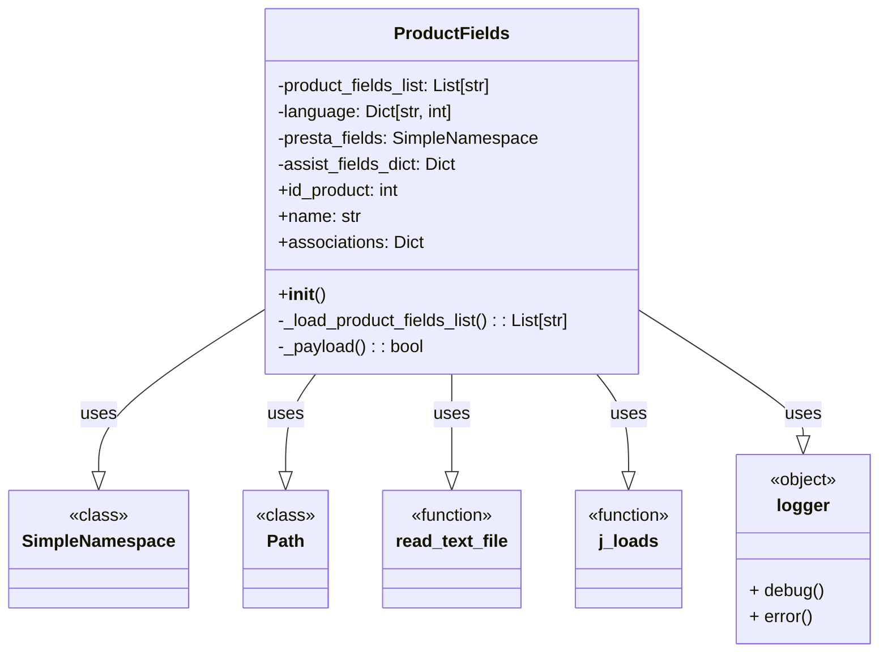

## Анализ кода класса `ProductFields`

### 1. <алгоритм>

**Общая схема работы класса `ProductFields`:**

1.  **Инициализация (`__init__`)**:
    *   Загрузка списка полей продукта из файла `fields_list.txt`.
    *   Инициализация словаря языков (например, `{'en': 1, 'he': 2, 'ru': 3}`).
    *   Создание `SimpleNamespace` объекта для хранения полей продукта, все значения инициализируются как `None`.
    *   Инициализация словаря `assist_fields_dict` для дополнительных полей (например, `'default_image_url'`, `'images_urls'`).
    *   Вызов метода `_payload` для загрузки значений по умолчанию из JSON-файла.

2.  **Загрузка списка полей (`_load_product_fields_list`)**:
    *   Чтение текстового файла `fields_list.txt` построчно.
    *   Возвращение списка строк, где каждая строка — имя поля.

3.  **Загрузка значений по умолчанию (`_payload`)**:
    *   Чтение JSON-файла `product_fields_default_values.json`.
    *   Если файл не найден или не может быть загружен, выводится сообщение об ошибке.
    *   Установка атрибутов объекта `ProductFields` из данных, загруженных из JSON-файла.

4.  **Работа с полями продукта:**
    *   **Одноязычные поля**:
        *   Использование `@property` для получения значения поля.
            *   Пример: `id_product` (возвращает значение поля `presta_fields.id_product`).
        *   Использование `@<имя_поля>.setter` для установки значения поля.
            *   Пример: `id_product` (устанавливает значение `presta_fields.id_product` и обрабатывает исключения).
    *   **Многоязычные поля**:
        *   Использование `@property` для получения значения поля.
            *   Пример: `name` (возвращает значение поля `presta_fields.name`).
        *   Использование `@<имя_поля>.setter` для установки значения поля.
            *   Пример: `name` (устанавливает значение в виде словаря с языковой структурой).

5.  **Работа с ассоциациями (`associations`)**:
    *   Использование `@property` для получения значения `presta_fields.associations`.
    *   Использование `@associations.setter` для установки значения `presta_fields.associations`.

**Примеры:**

*   **Инициализация:**
    ```python
    product = ProductFields()
    # Загружаются поля и устанавливаются значения по умолчанию
    ```

*   **Установка одноязычного поля:**
    ```python
    product.id_product = 123
    # Значение 123 устанавливается для поля id_product
    ```

*   **Установка многоязычного поля:**
    ```python
    product.name = "Product Name", lang='en'
    # Значение "Product Name" устанавливается для поля name для языка 'en'
    ```

*   **Установка ассоциаций:**
    ```python
    product.associations = {'categories': [{'id': 2}, {'id': 3}]}
    # Значения категорий устанавливаются в поле associations
    ```

### 2. <mermaid>



**Анализ зависимостей:**

*   `ProductFields`: Основной класс, который управляет полями продукта.
*   `SimpleNamespace`: Используется для динамического создания атрибутов, представляющих поля продукта.
*   `Path`: Из модуля `pathlib` используется для работы с путями к файлам.
*   `read_text_file`: Функция для чтения текстовых файлов. Зависимость от пакета `src.utils.file_utils`.
*   `j_loads`: Функция для загрузки данных из JSON-файлов. Зависимость от пакета `src.utils.json_utils`.
*   `logger`: Объект для логирования ошибок и отладочной информации. Зависимость от пакета `src.utils.logger`.

### 3. <объяснение>

**Импорты:**

*   `from types import SimpleNamespace`: `SimpleNamespace` используется для динамического создания атрибутов. Это позволяет обращаться к полям продукта как к атрибутам объекта (например, `product.presta_fields.name`).
*   `from pathlib import Path`: `Path` используется для представления путей к файлам и облегчения работы с ними.
*   `from typing import List, Dict, Optional`: Используется для статической типизации, что улучшает читаемость и помогает избежать ошибок.
*   `from src.utils.file_utils import read_text_file`: Импортируется функция `read_text_file` из модуля `src.utils.file_utils`, которая используется для чтения текстовых файлов.
*   `from src.utils.json_utils import j_loads`: Импортируется функция `j_loads` из модуля `src.utils.json_utils`, которая используется для загрузки данных из JSON-файлов.
*   `from src.utils.logger import logger`: Импортируется объект `logger` из модуля `src.utils.logger`, который используется для логирования ошибок и отладочной информации.
*   `from src.product.product_fields.product_field_exception import ProductFieldException`: Импортируется класс `ProductFieldException` для обработки специфических исключений, связанных с полями продукта.
*   `import src.global_settings as gs`: Импортируется модуль `global_settings` для доступа к общим настройкам проекта.

**Классы:**

*   `ProductFields`:
    *   **Роль**: Класс, инкапсулирующий структуру и поведение полей продуктов PrestaShop. Он отвечает за загрузку, валидацию и управление данными полей.
    *   **Атрибуты**:
        *   `product_fields_list`: Список имен полей продукта (загружается из файла).
        *   `language`: Словарь, сопоставляющий языковые коды с идентификаторами.
        *   `presta_fields`: `SimpleNamespace` объект, который содержит данные всех полей продукта.
        *   `assist_fields_dict`: Словарь для дополнительных полей (например, URL изображений).
    *   **Методы**:
        *   `__init__`: Инициализация объекта, загрузка полей и значений по умолчанию.
        *   `_load_product_fields_list`: Загружает список полей из файла.
        *   `_payload`: Загружает значения по умолчанию из JSON файла.
        *   Свойства (`@property` и `@<имя_поля>.setter`) для доступа и установки значений полей (например, `id_product`, `name`, `associations`).
    *   **Взаимодействие**:
        *   Использует функции из `src.utils.file_utils` (`read_text_file`) и `src.utils.json_utils` (`j_loads`) для чтения файлов.
        *   Использует объект `logger` из `src.utils.logger` для логирования.
        *   Использует `ProductFieldException` для обработки ошибок.

**Функции:**

*   `__init__(self)`: Инициализирует класс, вызывая методы для загрузки полей и настроек.
    *   **Аргументы**: `self` (экземпляр класса).
    *   **Возвращаемое значение**: `None`.
    *   **Назначение**: Инициализация состояния объекта.
*   `_load_product_fields_list(self) -> List[str]`: Загружает список полей продукта из файла.
    *   **Аргументы**: `self` (экземпляр класса).
    *   **Возвращаемое значение**: Список строк с именами полей.
    *   **Назначение**: Чтение текстового файла и возвращение списка полей.
    *   **Пример:** Возвращает `['id_product', 'name', 'description', ...]`.
*   `_payload(self) -> bool`: Загружает значения по умолчанию для полей продукта из JSON-файла.
    *   **Аргументы**: `self` (экземпляр класса).
    *   **Возвращаемое значение**: `True`, если загрузка прошла успешно, `False` если произошла ошибка.
    *   **Назначение**: Загрузка и установка значений по умолчанию для полей из JSON.
    *   **Пример:** Загружает значения по умолчанию из JSON файла и устанавливает их, например `self.active = 1`

**Переменные:**

*   `self.product_fields_list`: Список имен полей продукта (тип: `List[str]`).
*   `self.language`: Словарь, сопоставляющий языковые коды с идентификаторами (тип: `Dict[str, int]`).
*   `self.presta_fields`: Объект `SimpleNamespace`, содержащий данные полей продукта (тип: `SimpleNamespace`).
*   `self.assist_fields_dict`: Словарь для дополнительных полей (тип: `Dict`).
*   `data`: Словарь с данными из JSON файла (тип: `Dict`).

**Потенциальные ошибки и области для улучшения:**

*   **Отсутствие валидации**: Класс в основном полагается на исключения при установке полей, но нет явной валидации данных перед установкой. Например, можно добавить проверку типов данных перед присваиванием.
*   **Жесткая привязка к файлам**: Пути к файлам жестко закодированы. Было бы лучше вынести их в конфигурационный файл или переменные окружения, чтобы сделать класс более гибким.
*   **Обработка ошибок**: Хотя есть логирование ошибок, нет возможности как-то их обрабатывать или сообщать о них вызывающей стороне, кроме как через логи.
*   **Сложная структура многоязычных полей**: Структура словаря для многоязычных полей может быть сложной и трудночитаемой. Возможно, стоит использовать более удобную структуру.

**Цепочка взаимосвязей:**

1.  **`ProductFields`**: Управляет данными полей продукта.
2.  **`src.utils.file_utils`**: Предоставляет функцию `read_text_file` для чтения списка полей.
3.  **`src.utils.json_utils`**: Предоставляет функцию `j_loads` для загрузки значений по умолчанию из JSON.
4.  **`src.utils.logger`**: Предоставляет объект `logger` для логирования ошибок.
5.  **`src.global_settings`**: Предоставляет общие настройки проекта.
6.  **`src.product.product_fields.product_field_exception`**: Предоставляет исключение `ProductFieldException` для обработки ошибок.

Класс `ProductFields` является центральным элементом для работы с данными продуктов в контексте PrestaShop API. Он обеспечивает инкапсуляцию, управление данными и упрощает взаимодействие с API за счет предоставления структурированного интерфейса.