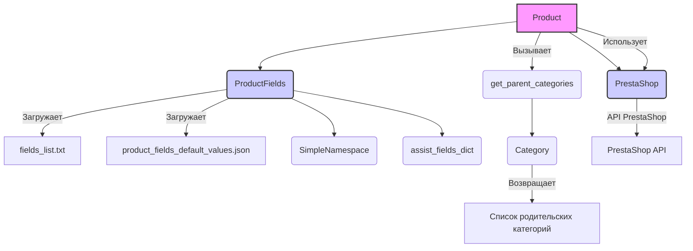

# Анализ кода `hypotez/src/product/readme.ru.md`

## <алгоритм>

1. **Инициализация `Product`:**
   - Создается экземпляр класса `Product`.
   - При инициализации, класс `Product` наследует атрибуты и методы от `ProductFields` и `PrestaShop`, это означает что при инициализации  `Product` инициализируется `ProductFields` и `PrestaShop`.
   - Принимает переменное количество аргументов `*args` и именованные аргументы `**kwargs`.

2.  **Загрузка полей продукта (`ProductFields`):**
    - При инициализации `ProductFields` происходит следующее:
      - Загружается список полей продукта из `fields_list.txt`.
        - **Пример:** `fields_list.txt` содержит `['id_product', 'name', 'price']`.
      - Загружаются соответствия между кодами языков и их идентификаторами из файла конфигурации.
      - Загружаются дефолтные значения полей продукта из файла `product_fields_default_values.json`.
        - **Пример:** `product_fields_default_values.json` содержит `{'id_product': None, 'name': '', 'price': 0.0}`.
    -  Поля продукта сохраняются в объекте `SimpleNamespace` (`presta_fields`).
    - Дополнительные служебные поля (например, `images_urls`) сохраняются в словаре `assist_fields_dict`.

3.  **Работа с API PrestaShop (`PrestaShop`):**
    -  Класс `PrestaShop` предоставляет методы для взаимодействия с API PrestaShop. (Детали методов не предоставлены).
    -  `Product` использует методы `PrestaShop` для получения и отправки данных в PrestaShop API.

4.  **Получение родительских категорий:**
    - Метод `get_parent_categories` класса `Product` принимает `id_category` и опционально `dept`.
    - Вызывает статический метод `get_parent_categories` который (дублирует метод `get_parents` класса `Category`).
    - Возвращает список родительских категорий.
      - **Пример:** Если `id_category` = 5, метод вернет `[1, 2]` (где 1 и 2 - ID родительских категорий).

5.  **Доступ к полям продукта:**
    -  Свойства класса `ProductFields` предоставляют доступ к полям продукта.
    -  При обращении к свойству, например `product_fields.id_product`, возвращается значение поля `id_product` из объекта `presta_fields`.
    -  При присваивании значения свойству, например `product_fields.id_product = 10`, значение поля `id_product` в объекте `presta_fields` обновляется.
        - **Пример:** `product.id_product = 15` - установит значение `id_product` экземпляра `Product`.

6.  **Работа с различными типами полей:**
    - Для полей связанных с языком, (например, `name`, `description`) значение устанавливается и получается для каждого языка отдельно.

## <mermaid>

**Объяснение зависимостей:**

-   `Product` зависит от `ProductFields` и `PrestaShop`, так как наследует их функциональность.
-   `ProductFields` загружает данные из `fields_list.txt` и `product_fields_default_values.json`, а также сохраняет данные в `SimpleNamespace` и `assist_fields_dict`.
-   `Product` использует `PrestaShop` для взаимодействия с API PrestaShop.
-   `Product` и `Category` используются для вызова `get_parent_categories`.

## <объяснение>

### Импорты

-   `src.endpoints.prestashop`, `src.category`, `src.product.product_fields`:
    -   Эти модули предоставляют классы `PrestaShop`, `Category` и `ProductFields`, соответственно. Они используются для организации доступа к API PrestaShop, для работы с категориями и с полями продукта. Модульность обеспечивает разделение ответственности.
    - Взаимосвязь:  `Product` использует классы из этих модулей для выполнения своей работы.

### Классы

#### `Product`

-   **Роль**: Основной класс, представляющий продукт в системе, обеспечивает взаимодействие между веб-сайтом, PrestaShop API и данными о продукте.
-   **Атрибуты**: Наследует атрибуты от `ProductFields` и `PrestaShop`.
-   **Методы**:
    -   `__init__`: Инициализирует объект, принимая переменное количество аргументов и передавая их родительским классам. Позволяет создавать объекты `Product` с произвольным набором параметров, что обеспечивает гибкость при работе с данными продукта.
    -   `get_parent_categories`: Получает список родительских категорий для заданного ID категории. Является обёрткой статической функции `get_parent_categories`.
-   **Взаимодействие**:
    -   Наследует методы и атрибуты от `ProductFields` для управления полями продукта.
    -   Наследует методы и атрибуты от `PrestaShop` для взаимодействия с API.

#### `ProductFields`

-   **Роль**: Базовый класс для работы с полями продукта, предоставляя доступ к данным и их модификацию.
-   **Атрибуты**:
    -   `product_fields_list`: Список полей продукта, загруженный из `fields_list.txt`.
    -   `language`: Словарь, содержащий соответствие кодов языков и их ID.
    -   `presta_fields`: Объект `SimpleNamespace` для хранения полей продукта.
    -   `assist_fields_dict`: Словарь для хранения дополнительных служебных полей.
-   **Методы**:
    -   `__init__`: Инициализирует объект, загружает список полей, языки и дефолтные значения.
    -    `_load_product_fields_list`: Загружает список полей из `fields_list.txt`.
    -   `_payload`: Загружает значения по умолчанию из `product_fields_default_values.json`.
-   **Взаимодействие**:
    -   Используется классом `Product` для работы с полями.
    -    `product_fields_list` и `language` используются для подготовки данных к работе с API.
    - `presta_fields` и `assist_fields_dict` обеспечивают структуру данных для работы с полями продукта.

#### `PrestaShop`

-   **Роль**: Класс для взаимодействия с API PrestaShop. Детали реализации не предоставлены в документации.
-   **Атрибуты**: (не указаны).
-   **Методы**: (не указаны).
-   **Взаимодействие**:
    - Используется классом `Product` для отправки и получения данных от API PrestaShop.

### Функции

#### `get_parent_categories` (статический метод класса `Product`)

-   **Аргументы**:
    -   `id_category` (int): ID категории.
    -   `dept` (int, optional): глубина категории, по умолчанию 0.
-   **Возвращаемое значение**: `list`: Список ID родительских категорий.
-   **Назначение**: Получает список родительских категорий для заданной категории.
-   **Примеры**:
    -   `get_parent_categories(5)` вернет список родительских категорий для категории с ID 5.
    -   `get_parent_categories(10, dept=2)` вернет список родительских категорий для категории с ID 10 на глубину 2.
-   **Исключения**:
    -   `TypeError`: Если `id_category` не является целым числом.

### Переменные

-   `product_fields_list`:  `List[str]`.  Список названий полей продукта, загруженных из файла.
-   `language`: `Dict[str, int]`.  Словарь, содержащий соответствие между кодами языков и их идентификаторами.
-   `presta_fields`: `SimpleNamespace`. Объект, содержащий поля продукта в виде атрибутов, что позволяет обращаться к полям как к атрибутам объекта.
-   `assist_fields_dict`: `Dict[str, Any]`. Словарь дополнительных полей (например, URL изображений).

### Потенциальные ошибки и области для улучшения

1.  **Отсутствие детальной документации для `PrestaShop`**:  Необходимо добавить описание методов и атрибутов класса `PrestaShop`.
2.  **Повторение кода**: Статический метод `get_parent_categories` в классе `Product` дублирует функциональность метода `get_parents` из класса `Category`.
3.  **Обработка ошибок**:  Следует добавить более подробную обработку ошибок (например, исключения при работе с API PrestaShop).
4. **Свойства**:  Свойства класса `ProductFields` описаны неполно, не приведено описание их  реализации в коде.
5. **Формат JSON**:  При использовании JSON-файлов, не указан формат данных (структура) ожидаемых JSON файлов `product_fields_default_values.json`, что затрудняет понимание кода.

### Цепочка взаимосвязей с другими частями проекта

1. **`src/endpoints/prestashop`**: Обеспечивает связь с API PrestaShop, что позволяет `Product` взаимодействовать с данными в базе данных PrestaShop.
2. **`src/category`**: Класс `Category` участвует в цепочке получения родительских категорий.
3.  **`src/product/product_fields`**: Предоставляет класс для работы с полями продукта, который используется классом `Product`.
4. **`src/product/product`**: Основной модуль, обеспечивающий логику работы с продуктом и использующий модули выше.

В целом, проект имеет модульную структуру, где каждый модуль выполняет свою функцию и взаимодействует с другими модулями для выполнения более сложных задач.