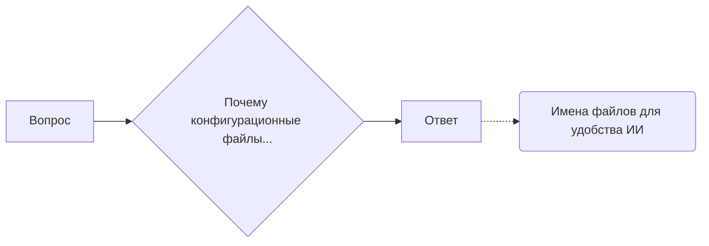

# Анализ кода

**1. <input code>**

```
**ВОПРОС** Почему конфигурационные файлы называются по имени модуля (например: `suppliers.json`)?  
Не лучше ли было их именовать `config.json`?  
**ОТВЕТ** Имена файлов сделаны для удобства понимания моделями ИИ.
```

**2. <algorithm>**

Данный код не содержит алгоритма в традиционном понимании. Он представляет собой текстовый диалог, задачу и ответ.  Пошаговая блок-схема не применима.

**3. <mermaid>**



**4. <explanation>**

Этот код не является кодом в том смысле, что он не содержит переменных, функций или классов, требующих анализа.  Это фрагмент диалога, обсуждающий вопрос о наименовании конфигурационных файлов.

* **Импорты:** Отсутствуют.
* **Классы:** Отсутствуют.
* **Функции:** Отсутствуют.
* **Переменные:** Отсутствуют.

**Цепочка взаимосвязей с другими частями проекта:**

Код предполагает, что есть проект, в котором используются конфигурационные файлы. Вероятно, есть модуль `suppliers`, который считывает данные из файла `suppliers.json`. Название файла может быть выбрано для более понятного контекста для анализа данных моделями ИИ, которые будут использовать этот конфигурационный файл.  Это означает, что сам код не предоставляет информацию о реализации.  Контекст находится за пределами предоставленного фрагмента.


**Возможные ошибки или области для улучшений:**

* Отсутствует конкретная информация о том, какие модели ИИ используются или как именно имена файлов повлияют на их работу.
* Необходимо больше контекста, чтобы понять полную цель и влияние названия файла на работу кода.


**Заключение:**

Представленный фрагмент - это текстовый диалог, а не код, требующий подробного анализа.  Анализ сосредоточен на контексте и предполагаемой связи с другим кодом или частью проекта.