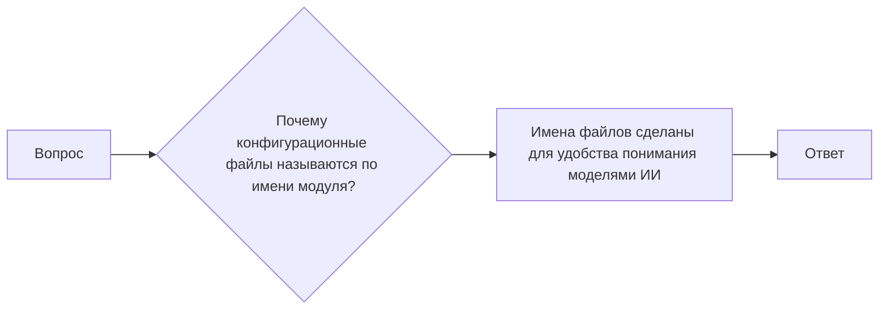

# Анализ кода

**1. <input code>**

```
**ВОПРОС** Почему конфигурационные файлы называются по имени модуля (например: `suppliers.json`)?  
Не лучше ли было их именовать `config.json`?  
**ОТВЕТ** Имена файлов сделаны для удобства понимания моделями ИИ.
```

**2. <algorithm>**

Этот код не содержит исполняемого кода. Он представляет собой фрагмент диалога, в котором обсуждается вопрос об именовании конфигурационных файлов.  Блок-схема в данном случае не применима.  Код не отражает алгоритма действий.

**3. <mermaid>**



**4. <explanation>**

Этот фрагмент кода – это не код в привычном понимании, а текстовый диалог. Он не имеет импортов, классов, функций и переменных в том виде, как их обычно описывают в коде.  Он представляет собой обсуждение, которое касается практического вопроса именования конфигурационных файлов.

* **Импорты:** Нет импортов, так как код не содержит программы или модулей, а представляет собой часть текста диалога.
* **Классы:** Нет классов.
* **Функции:** Нет функций.
* **Переменные:** Нет переменных.
* **Возможные ошибки или области для улучшений:**  Нет ошибок и областей для улучшений, поскольку код представляет собой текст диалога.

**Цепочка взаимосвязей с другими частями проекта:**

Данный фрагмент, скорее всего, относится к обсуждению проекта, который имеет конфигурационные файлы.  Этот диалог предполагает, что существует проект, где обсуждаются вопросы архитектуры и дизайна.  Связь с другими частями проекта заключается в контексте обсуждения: в проекте, где возникает этот вопрос, есть конфигурационные файлы, и они хранятся в файлах с именами, соответствующими модулям (например, `suppliers.json`). Это указывает на то, что проект, скорее всего, имеет модульную структуру, где каждый модуль имеет свою конфигурацию.


**Заключение:**

Представленный фрагмент – это не код, а часть обсуждения, и его анализ не предполагает построение схем или описаний компонентов. Он лишь указывает на принятое в проекте решение именовать конфигурационные файлы по имени модуля.