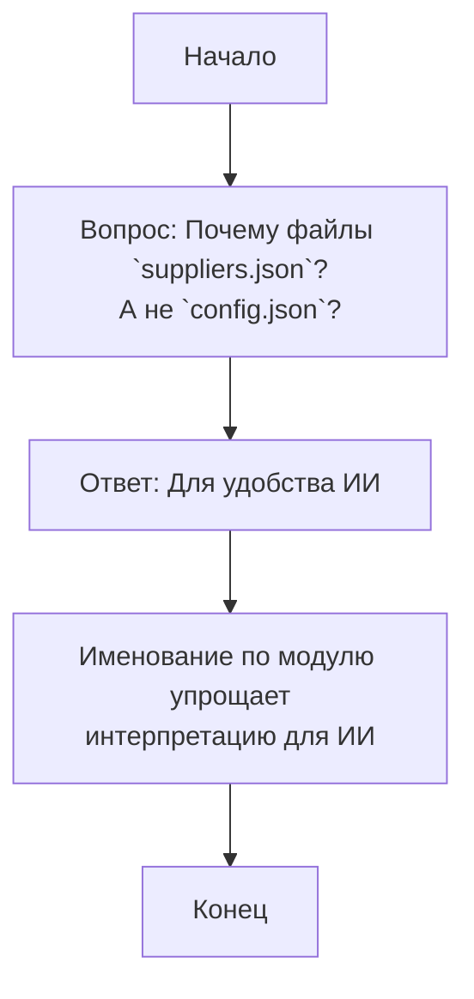

## <алгоритм>

1. **Ввод вопроса и ответа:**
   - Получается вопрос: "Почему конфигурационные файлы называются по имени модуля (например: `suppliers.json`)? Не лучше ли было их именовать `config.json`?".
   - Получается ответ: "Имена файлов сделаны для удобства понимания моделями ИИ."

2. **Анализ вопроса:**
   - Вопрос касается конвенции именования конфигурационных файлов в проекте.
   - Конкретно интересует, почему используется имя модуля (`suppliers.json`), а не общее имя (`config.json`).

3. **Анализ ответа:**
    - Ответ поясняет, что именование файлов по имени модуля (например, `suppliers.json`) сделано для удобства понимания моделями ИИ.

4. **Логический блок (Пример):**
   - Если модель ИИ обрабатывает конфигурационные файлы, то именование `suppliers.json` напрямую указывает, что это конфигурация для модуля `suppliers`. Это упрощает интерпретацию. Если бы все файлы были `config.json`, то требовалась бы дополнительная информация для определения модуля.

5. **Поток данных:**
   - Вопрос поступает от пользователя или разработчика.
   - Ответ поступает от проектировщика системы или из документации.
   - Модели ИИ обрабатывают конфигурационные файлы, используя имена для определения назначения.

## <mermaid>

**Объяснение диаграммы `mermaid`:**

- `Start`: Начальная точка процесса.
- `Question`: Представляет вопрос о наименовании конфигурационных файлов.
- `Answer`: Отображает ответ на вопрос.
- `Explanation`: Описывает, почему такое именование упрощает работу ИИ.
- `End`: Конечная точка процесса.

В этой диаграмме нет импорта, поэтому нет необходимости создавать дополнительную диаграмму для `header.py`.

## <объяснение>

**Импорты:**
- В этом коде нет импортов. Это текстовый вопрос и ответ, не содержащий программного кода.

**Классы:**
- В этом коде нет классов.

**Функции:**
- В этом коде нет функций.

**Переменные:**
- Отсутствуют переменные в традиционном смысле, поскольку это не код, а текст вопроса и ответа.

**Объяснение:**

- **Вопрос:** Основной вопрос заключается в мотивации именования конфигурационных файлов по имени модуля (например, `suppliers.json`). Это подразумевает, что в проекте есть модули, у каждого из которых есть свой конфигурационный файл. Вопрос ставит под сомнение это решение, предлагая альтернативу с общим именем (`config.json`).
- **Ответ:** Ответ заключается в том, что такое именование сделано для удобства моделей ИИ. Это значит, что, когда модели ИИ обрабатывают эти файлы, имя `suppliers.json` сразу сообщает модели, что это конфигурационный файл именно для модуля `suppliers`. Это помогает в контекстном анализе и сокращает объем необходимой обработки для понимания назначения файла.
- **Контекст:** Проект, вероятно, имеет модульную структуру, где каждый модуль имеет свои настройки. Вместо общего `config.json`, для каждого модуля создается свой файл конфигурации, что обеспечивает контекст и упрощает интерпретацию.

**Потенциальные улучшения:**
-   **Документирование:** Важно документировать это решение в README проекта или в руководстве по стилю кодирования, чтобы все разработчики знали о нём.
-   **Согласованность:** Проверить, что это правило именования последовательно применяется ко всем модулям и конфигурационным файлам.
-   **Альтернативы:** Возможны и другие подходы. Например, использовать в именах файлов префикс `config-` или добавлять имя модуля в путь (например, `config/suppliers.json`), что также может упростить понимание для ИИ.

**Цепочка взаимосвязей:**

- Именование файлов напрямую связано с модульной структурой проекта.
- Эта структура может влиять на то, как данные хранятся и загружаются, а также на работу моделей ИИ при анализе этих данных.
- Взаимосвязь между именованием файлов и модулями влияет на организацию проекта в целом.
- **Проект:** Применяется в проектах с модульной архитектурой, где каждый модуль имеет свой набор настроек.