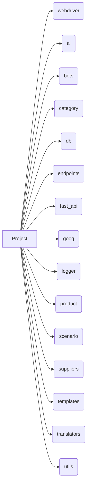

```MD
# <input code>

```markdown
# Table of Contents

1. [webdriver](#webdriver)  
2. [ai](#ai)  
3. [bots](#bots)  
4. [category](#category)  
5. [db](#db)  
6. [endpoints](#endpoints)  
7. [fast_api](#fast_api)  
8. [goog](#goog)  
9. [logger](#logger)  
10. [product](#product)  
11. [scenario](#scenario)  
12. [suppliers](#suppliers)  
13. [templates](#templates)  
14. [translators](#translators)  
15. [utils](#utils)  


# Modules

## webdriver  
Module for working with web drivers and automating browser actions.

## ai  
Module for integrating artificial intelligence, including interaction with various AI models.

## bots  
Module for creating and managing bots that interact with users.

## category  
Module for working with product or data categories.

## db  
Module for interacting with databases, including creating, reading, and updating data.

## endpoints  
Module for creating and handling API endpoints that interact with clients.

## fast_api  
Module for using FastAPI within the project, including request routing and configuration.

## goog  
Module for working with Google services, such as Google Cloud or APIs.

## logger  
Module for logging, providing functionality for recording logs and errors.

## product  
Module for working with products, including processing product and service data.

## scenario  
Module for modeling and executing interaction scenarios.

## suppliers  
Module for interacting with suppliers, including integration with external systems.

## templates  
Module for working with data templates and generating them.

## translators  
Module for text translation using various tools and APIs.

## utils  
Utility module that includes various helper functions for the project.
```

# <algorithm>

The provided code is a table of contents and module descriptions, not executable code.  Therefore, there's no algorithm to describe.  It's a documentation file, outlining the various modules within a project.


# <mermaid>



**Explanation of the Mermaid Diagram:**

The diagram represents a simple project structure.  Each module (webdriver, ai, etc.) is a separate component of the project connected to the main project entity. There is no dependency or flow of data depicted; it's a simple, one-to-many relationship of modules to the project.


# <explanation>

The provided code is a Markdown file, not source code. It serves as documentation for a project.  It lists the different modules/components of the software.  Each section describes the purpose of a module.

**Modules and Structure:**

The code details various modules in the project (e.g., `webdriver`, `ai`, `db`, `fast_api`).  These likely represent separate Python modules or packages within the project's directory structure.

**No code analysis is possible:**


* Since this is documentation, there are no variables, functions, or classes to analyze.
* No dependencies between modules are described in detail.

**Possible Errors/Improvements (for a *program* not the documentation):**

This code (documentation) does not contain any *code* to analyze for errors.  Errors would be within the implementation of the modules, not the documentation itself.  For example, the `ai` module might have errors in the AI model integration, and so on.

**Relationship to other parts of the project:**

The relationship is simply structural.  Each listed module contributes to the overall project functionality. Further details about relationships, dependencies, and data flow would come from the actual module implementations, not this documentation.