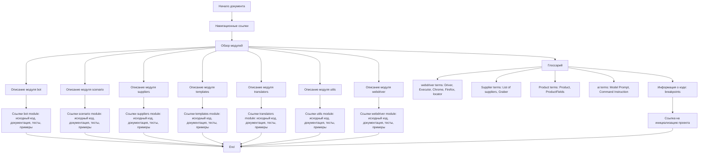

# Анализ `readme.ru.md`

## <алгоритм>

1. **Начало**: Документ начинается с заголовка, указывающего на его функцию - обзор модулей проекта. 
2. **Навигация**: Предоставляются ссылки для навигации к корневому каталогу (`[Root ↑]`) и английской версии документа (`English`).
3. **Обзор модулей**: 
   - Документ описывает структуру проекта, перечисляя ключевые модули (bot, scenario, suppliers, templates, translators, utils, webdriver).
   - Для каждого модуля предоставляются ссылки на:
     - **Исходный код**: Ссылка на файл `readme.ru.md` в каталоге соответствующего модуля.
     - **Документацию**: Ссылка на сгенерированную документацию `readme.ru.md` в каталоге `docs/gemini/ru/doc/`.
     - **Тесты**: Ссылка на каталог с тестами в `pytest/gemini/src`.
     - **Примеры**: Ссылка на каталог с примерами использования модуля в `docs/examples`.
4. **Глоссарий**:
    - Определяются основные термины, используемые в проекте:
       - `webdriver`: Описываются `Driver`, `Executor`, конкретные браузеры (например, `Chrome`, `Firefox`), и `locator`.
       - `Supplier`: Описываются поставщики (`Amazon`, `Aliexpress`, `Morlevi`, и т.д.), и `Graber`.
       - `Product`: Описываются `Product` и `ProductFields`.
       - `ai`: Описываются `Model Prompt` и `Command Instruction`.
5. **Информация о коде**:
   - Указывается, что символ `...` обозначает места для установки точек останова при отладке.
6. **Ссылка на инициализацию**:
    - Предоставляется ссылка на документ по инициализации проекта `[Project Initialization and Setup]`.

## <mermaid>

###  Анализ `mermaid` диаграммы:

Диаграмма описывает структуру и поток информации в документе `readme.ru.md`. Она показывает, что документ начинается с навигационных ссылок, затем переходит к обзору модулей, где каждый модуль представлен ссылками на исходный код, документацию, тесты и примеры. После обзора модулей следует глоссарий, где даются определения ключевых терминов проекта. В заключении есть раздел с информацией о коде и ссылка на документ инициализации проекта. Все элементы диаграммы имеют понятные имена, например, `ModuleDescription1` обозначает описание первого модуля, `Link1` - ссылки на соответствующие ресурсы.
Диаграмма четко показывает последовательность и взаимосвязи между разделами документа.

## <объяснение>

### Общее описание

Файл `readme.ru.md` - это обзорный документ, предназначенный для русскоязычных пользователей проекта. Он предоставляет краткое описание структуры проекта, разбивая его на отдельные модули и предоставляя ссылки на более подробную информацию о каждом из них. Он также содержит глоссарий основных терминов проекта, что помогает новым пользователям быстро освоиться.

### Идеология и структура

Документ ориентирован на то, чтобы предоставить пользователям легкий способ навигации по модулям проекта и доступу к соответствующей документации, исходному коду, тестам и примерам использования. Он служит точкой входа для изучения конкретных частей проекта.

### Модули

- **`bot`**: Модуль для интерфейсов ботов `telegram` и `discord`. Позволяет взаимодействовать с этими платформами через ботов.
- **`scenario`**: Модуль для работы со сценариями, используется для управления процессами, вероятно автоматизации и работы по заранее определенным планам.
- **`suppliers`**: Модуль, отвечающий за поставщиков.  Управляет данными и отношениями с поставщиками, предоставляющими товары или услуги.
- **`templates`**: Модуль для работы с шаблонами, вероятно используется для создания и управления различными шаблонами документов или сообщений.
- **`translators`**: Модуль для работы с переводами, используется для перевода текста между языками.
- **`utils`**: Модуль, содержащий набор утилит для упрощения выполнения общих задач, полезных во всем проекте.
- **`webdriver`**: Модуль, управляющий браузерами через драйверы и веб-элементами, обычно для автоматизации работы в браузере.

### Глоссарий

- **`webdriver`**:
    - `Driver`: Объект, управляющий браузером, например, `Chrome` или `Firefox`.
    - `Executor`: Интерфейс для выполнения команд в браузере.
    - `locator`: Механизм для поиска элементов на веб-странице.
- **`Supplier`**:
    - `List of suppliers`: Список поставщиков, таких как `Amazon`, `Aliexpress`.
    - `Graber`: Инструмент для автоматического сбора данных с сайтов поставщиков.
- **`Product`**:
    - `Product`: Объект, представляющий продукт.
    - `ProductFields`: Атрибуты продукта (название, цена, описание и т.д.).
- **`ai`**:
    - `Model Prompt`: Инструкции для модели обработки информации.
    - `Command Instruction`: Команда, передаваемая с каждым запросом.

### Переменные
В самом документе переменных как таковых нет. Но если рассмотреть их с контекста всего проекта, то к ним можно отнести пути к модулям и файлам в репозитории.

### Потенциальные ошибки и области для улучшения:
- **Отсутствие подробных описаний модулей**: Краткие описания могут быть расширены для лучшего понимания их функциональности.
- **Отсутствие примеров использования в основном файле**:  Было бы полезно добавить краткие примеры использования или фрагменты кода в основном `readme.ru.md` для более быстрого понимания.
- **Возможные неактуальные ссылки**: Необходима регулярная проверка актуальности всех ссылок, особенно на документацию и исходный код.

### Взаимосвязь с другими частями проекта

Этот `readme.ru.md` является частью документации проекта и предоставляет обзор основных модулей. Он связан с:
- **Файлами `readme.ru.md`** в каждом из подкаталогов модулей, где содержится более подробная информация о каждом модуле.
- **Каталогами `docs`**, где хранится сгенерированная документация по проекту.
- **Каталогами `pytest`**, где расположены тесты для каждого модуля.
- **Каталогами `docs/examples`**, где можно найти примеры использования модулей.
- **`src/credentials.md`**, где объясняется инициализация и настройка проекта.

Этот файл является важным элементом документации, который обеспечивает обзор и навигацию по различным частям проекта.