## Анализ `readme.ru.md`

### 1. <алгоритм>
Файл `readme.ru.md` представляет собой обзорную страницу для модулей проекта. Его основная цель - предоставить структурированную информацию о каждом модуле, включая ссылки на исходный код, документацию, тесты и примеры.

**Пошаговая блок-схема:**

1.  **Начало**:
    *   Отображение заголовка "Модули проекта".
    *   Отображение краткого описания "Данный документ предоставляет обзор различных модулей проекта..."

2.  **Итерация по модулям**:
    *   Для каждого модуля (например, `bot`, `scenario`, `suppliers`, `templates`, `translators`, `utils`, `webdriver`) выполняется следующий набор действий:
        *   **Отображение названия модуля**: например, "## Модуль `bot`".
        *   **Описание модуля**: например, "Модуль интерфейсов для `telegram`, `doscord` ботов".
        *   **Ссылки на ресурсы**:
            *   Ссылка на исходный код: "[Исходный код модуля](URL)".
            *   Ссылка на документацию: "[Документация](URL)".
            *   Ссылка на тесты: "[Тесты](URL)".
            *   Ссылка на примеры: "[Примеры](URL)".

3. **Глоссарий**:
    *   Отображение заголовка "Глоссарий".
    *   Определение ключевых терминов:
        *   **webdriver**:
            *   `Driver`: Описание объекта управления браузером.
            *   `Executor`: Описание интерфейса для выполнения команд.
            *   `Chrome`, `Firefox` : Описание конкретных браузеров.
            *   `locator`: Описание механизма поиска элементов на веб-странице.
        *   **`Supplier`**:
            *   `list of suppliers`: Описание списка поставщиков.
            *   `Graber`: Описание инструмента для сбора данных.
        *   **`Product`**:
            *    `Product`: Описание продукта.
            *   `ProductFields`: Описание полей продукта.
        *   **`ai`**:
            *    `Model Prompt`: Описание инструкций для модели.
            *   `Command Instruction`: Описание команд для модели.

4. **Прочее**:
     *   Раздел "Court Information" и "Next".
     
5. **Конец**: Завершение обработки документа.

**Примеры для логических блоков:**

*   **Модуль `bot`**: Заголовок "## Модуль `bot`", описание "Модуль интерфейсов для `telegram`, `doscord` ботов", ссылки на ресурсы.
*   **Ссылка на исходный код**: `[Исходный код модуля](https://github.com/hypo69/hypo/blob/master/src/bot/readme.ru.md)`.

```mermaid
graph LR
    Start(Начало) --> ModulesOverview[Обзор модулей проекта]
    ModulesOverview --> ModuleBot[Модуль `bot`]
    ModulesOverview --> ModuleScenario[Модуль `scenario`]
    ModulesOverview --> ModuleSuppliers[Модуль `suppliers`]
    ModulesOverview --> ModuleTemplates[Модуль `templates`]
    ModulesOverview --> ModuleTranslators[Модуль `translators`]
    ModulesOverview --> ModuleUtils[Модуль `utils`]
    ModulesOverview --> ModuleWebdriver[Модуль `webdriver`]

    ModuleBot --> BotSourceCode(Исходный код модуля `bot`)
    ModuleBot --> BotDocumentation(Документация модуля `bot`)
    ModuleBot --> BotTests(Тесты модуля `bot`)
    ModuleBot --> BotExamples(Примеры модуля `bot`)

    ModuleScenario --> ScenarioSourceCode(Исходный код модуля `scenario`)
    ModuleScenario --> ScenarioDocumentation(Документация модуля `scenario`)
    ModuleScenario --> ScenarioTests(Тесты модуля `scenario`)
    ModuleScenario --> ScenarioExamples(Примеры модуля `scenario`)

    ModuleSuppliers --> SuppliersSourceCode(Исходный код модуля `suppliers`)
    ModuleSuppliers --> SuppliersDocumentation(Документация модуля `suppliers`)
    ModuleSuppliers --> SuppliersTests(Тесты модуля `suppliers`)
    ModuleSuppliers --> SuppliersExamples(Примеры модуля `suppliers`)

    ModuleTemplates --> TemplatesSourceCode(Исходный код модуля `templates`)
    ModuleTemplates --> TemplatesDocumentation(Документация модуля `templates`)
    ModuleTemplates --> TemplatesTests(Тесты модуля `templates`)
    ModuleTemplates --> TemplatesExamples(Примеры модуля `templates`)

    ModuleTranslators --> TranslatorsSourceCode(Исходный код модуля `translators`)
    ModuleTranslators --> TranslatorsDocumentation(Документация модуля `translators`)
    ModuleTranslators --> TranslatorsTests(Тесты модуля `translators`)
    ModuleTranslators --> TranslatorsExamples(Примеры модуля `translators`)

    ModuleUtils --> UtilsSourceCode(Исходный код модуля `utils`)
    ModuleUtils --> UtilsDocumentation(Документация модуля `utils`)
    ModuleUtils --> UtilsTests(Тесты модуля `utils`)
    ModuleUtils --> UtilsExamples(Примеры модуля `utils`)

    ModuleWebdriver --> WebdriverSourceCode(Исходный код модуля `webdriver`)
    ModuleWebdriver --> WebdriverDocumentation(Документация модуля `webdriver`)
    ModuleWebdriver --> WebdriverTests(Тесты модуля `webdriver`)
    ModuleWebdriver --> WebdriverExamples(Примеры модуля `webdriver`)

     ModulesOverview --> Glossary[Глоссарий]
    
    Glossary --> webdriverDef[Определение `webdriver`]
    webdriverDef --> webdriverDriver[Определение `Driver`]
    webdriverDef --> webdriverExecutor[Определение `Executor`]
    webdriverDef --> webdriverChromeFirefox[Определение `Chrome, Firefox`]
    webdriverDef --> webdriverLocator[Определение `locator`]
    
    Glossary --> supplierDef[Определение `Supplier`]
    supplierDef --> supplierList[Определение `list of suppliers`]
    supplierDef --> supplierGraber[Определение `Graber`]
    
    Glossary --> productDef[Определение `Product`]
    productDef --> productProduct[Определение `Product`]
    productDef --> productFields[Определение `ProductFields`]

    Glossary --> aiDef[Определение `ai`]
    aiDef --> aiModelPrompt[Определение `Model Prompt`]
    aiDef --> aiCommandInstruction[Определение `Command Instruction`]
    
    ModulesOverview --> CourtInfo[Court Information]
    ModulesOverview --> NextStep[Next]
    
    ModulesOverview --> End(Конец)

    
```

### 2. <mermaid>

**Объяснение диаграммы:**

1.  `Start(Начало)`: Начало процесса.
2.  `ModulesOverview[Обзор модулей проекта]`: Центральный узел, представляющий общую структуру документа.
3.  **Модули**: Узлы `ModuleBot`, `ModuleScenario`, `ModuleSuppliers`, `ModuleTemplates`, `ModuleTranslators`, `ModuleUtils`, `ModuleWebdriver` представляют отдельные модули проекта. Каждый из них содержит ссылки на исходный код, документацию, тесты и примеры.
    *   `BotSourceCode`, `BotDocumentation`, `BotTests`, `BotExamples`: Ресурсы для модуля `bot`.
    *   `ScenarioSourceCode`, `ScenarioDocumentation`, `ScenarioTests`, `ScenarioExamples`: Ресурсы для модуля `scenario`.
    *   И так далее для остальных модулей.
4.  `Glossary[Глоссарий]`: Раздел, содержащий определения ключевых терминов.
5.  `webdriverDef`, `supplierDef`, `productDef`, `aiDef`: Разделы глоссария для `webdriver`, `supplier`, `product` и `ai`, соответственно.
    *   `webdriverDriver`, `webdriverExecutor`, `webdriverChromeFirefox`, `webdriverLocator`: Определение терминов `webdriver`
    *    `supplierList`, `supplierGraber`: Определение терминов `supplier`
    *   `productProduct`, `productFields`: Определение терминов `product`
    *   `aiModelPrompt`, `aiCommandInstruction`: Определение терминов `ai`

6. `CourtInfo[Court Information]`: Раздел с информацией о отладке
7. `NextStep[Next]`: Раздел с информацией о следующих шагах.

8.  `End(Конец)`: Конец процесса.

Эта диаграмма наглядно показывает, как структурирован документ и как каждый модуль связан с различными ресурсами.

### 3. <объяснение>

**Импорты:**

В данном файле нет импортов, так как это Markdown-файл с текстом и ссылками, а не код Python.

**Классы:**

В данном файле нет классов, так как это Markdown-файл.

**Функции:**

В данном файле нет функций, так как это Markdown-файл.

**Переменные:**

В данном файле нет переменных в смысле кода Python. Тем не менее, URL-адреса являются переменными для ссылок на ресурсы.

**Описание модулей:**

-   **`bot`**: Предназначен для создания интерфейсов для ботов в Telegram и Discord. Это позволяет пользователям взаимодействовать с функциональностью проекта через ботов.
-   **`scenario`**: Отвечает за управление сценариями, включая генерацию и выполнение. Это может быть полезно для автоматизации процессов.
-   **`suppliers`**: Предназначен для работы с поставщиками. Он управляет данными и взаимоотношениями с поставщиками.
-   **`templates`**: Используется для создания и управления шаблонами для различных целей. Шаблоны могут быть полезны для генерации повторяющегося контента.
-   **`translators`**: Отвечает за перевод текста, что позволяет поддерживать многоязычность в проекте.
-   **`utils`**: Содержит вспомогательные утилиты, упрощающие выполнение общих задач.
-   **`webdriver`**: Предназначен для управления веб-браузерами. Это позволяет автоматизировать тестирование и взаимодействие с веб-страницами.

**Глоссарий:**
- **webdriver**: Общее описание инструментов и терминологии связанных с автоматизированным управлением браузером.
- **Supplier**: Общее описание компаний, предоставляющих продукты или услуги.
- **Product**: Общее описание продукта или услуги, доступной на различных платформах.
- **ai**: Общее описание использования и инструкций для AI моделей.

**Цепочка взаимосвязей:**

Данный файл является точкой входа для понимания структуры проекта. Он предоставляет ссылки на более подробную документацию, исходный код, тесты и примеры для каждого модуля.

**Потенциальные ошибки и области для улучшения:**

*   Файл является статичным обзором. При обновлении структуры проекта, его нужно будет обновлять вручную. Можно автоматизировать процесс создания документа из структуры проекта.
*   Ссылки могут стать недействительными, если структура репозитория изменится. Можно использовать относительные ссылки для избежания этой проблемы.
*   Глоссарий можно расширить и сделать более подробным, добавив определения всех терминов, используемых в проекте.

**Заключение:**

Файл `readme.ru.md` является важным компонентом проекта, предоставляющим обзорную информацию о его модульной структуре. Он позволяет пользователям быстро ознакомиться с назначением каждого модуля и получить доступ к соответствующим ресурсам.