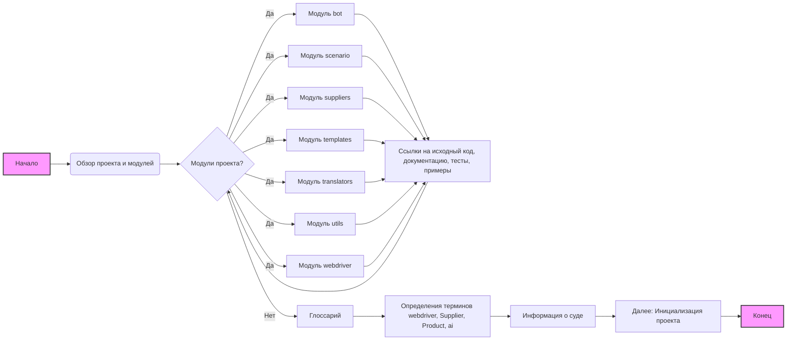

# Анализ структуры проекта `hypo`

## <алгоритм>

1.  **Начало**: Пользователь открывает файл `readme.ru.md`.
2.  **Обзор**: Пользователь читает вводный обзор проекта и его модулей.
3.  **Модули**: Пользователь изучает описание каждого модуля, включая:
    *   `bot`: Модуль для управления ботами (Telegram, Discord).
    *   `scenario`: Модуль для работы со сценариями.
    *   `suppliers`: Модуль для управления поставщиками.
    *   `templates`: Модуль для работы с шаблонами.
    *   `translators`: Модуль для перевода текстов.
    *   `utils`: Модуль с вспомогательными утилитами.
    *   `webdriver`: Модуль для управления веб-браузером.
    *   Для каждого модуля предоставляются ссылки на:
        *   **Исходный код**: Ссылка на `readme.ru.md` модуля.
        *   **Документация**: Ссылка на документацию модуля.
        *   **Тесты**: Ссылка на тесты модуля.
        *   **Примеры**: Ссылка на примеры использования модуля.
4.  **Глоссарий**: Пользователь изучает глоссарий, содержащий определения ключевых терминов:
    *   **webdriver**:
        *   `Driver`: Объект управления браузером.
        *   `Executor`: Интерфейс для выполнения команд.
        *   `Chrome`, `Firefox`, ...: Конкретные браузеры.
        *   `locator`: Механизм поиска элементов.
    *   `Supplier`:
        *   `list of suppliers` (`Amazon`, `Aliexpress`, ...): Список поставщиков.
        *   `Graber`: Инструмент сбора данных с сайтов поставщиков.
    *   `Product`:
        *   `Product`: Объект, представляющий продукт.
        *   `ProductFields`: Поля, описывающие продукт.
    *   `ai`:
        * `Model Prompt`: Указание, как модель должна обрабатывать входящую информацию и возвращать ответ.
        * `Command Instruction`: Короткая команда или инструкция, отправляемая с каждым запросом.
5. **Информация о суде**:
   * `...`: Символ для установки точек останова при отладке.
6. **Далее**:
   * Ссылка на `credentials.md` для инициализации и настройки проекта.
7.  **Конец**: Пользователь завершает изучение файла.

## <mermaid>

**Описание диаграммы:**

*   **Начало (A)**: Начальная точка процесса.
*   **Обзор проекта и модулей (B)**: Описание основной цели файла и модулей проекта.
*   **Модули проекта? (C)**: Условный блок, проверяющий наличие модулей для просмотра.
*   **Модуль bot, scenario, suppliers, templates, translators, utils, webdriver (D, F, G, H, I, J, K)**: Перечисление модулей проекта.
*    **Ссылки на исходный код, документацию, тесты, примеры (E)**: Информация о каждом модуле.
*   **Глоссарий (L)**: Раздел с определениями терминов.
*   **Определения терминов webdriver, Supplier, Product, ai (M)**: Описание ключевых терминов проекта.
*   **Информация о суде (N)**: Дополнительная информация.
*  **Далее: Инициализация проекта (O)**: Ссылка на следующий этап.
*   **Конец (P)**: Конечная точка процесса.

**Зависимости `mermaid`:**

Данная диаграмма не имеет импортов, так как она является частью документа `readme.ru.md` и использует синтаксис `mermaid`, встроенный в markdown. Зависимости, представленные в диаграмме, являются логическими связями между разделами документа, а не импортом кода.

## <объяснение>

**Общее**

Файл `readme.ru.md` представляет собой обзор проекта `hypo` на русском языке. Он служит отправной точкой для понимания структуры и организации проекта. Включает в себя разделы с описанием модулей, глоссарий терминов, и дополнительную информацию.

**Разделы и их назначение:**

*   **Обзор:** Вводный раздел, дающий общее представление о проекте.
*   **Модули проекта:** Этот раздел предоставляет описание каждого модуля, включая:
    *   `bot`: Модуль для интеграции ботов (Telegram, Discord).
    *   `scenario`: Модуль для работы со сценариями.
    *   `suppliers`: Модуль для управления данными поставщиков.
    *   `templates`: Модуль для управления шаблонами.
    *   `translators`: Модуль для перевода текстов.
    *   `utils`: Модуль с различными вспомогательными функциями.
    *   `webdriver`: Модуль для управления веб-браузерами.

    Для каждого модуля предоставляются ссылки на:
    *   Исходный код (`readme.ru.md` каждого модуля).
    *   Документацию.
    *   Тесты.
    *   Примеры использования.

    Это позволяет пользователю легко переходить к интересующим его частям проекта и изучать их более подробно.

*   **Глоссарий:** Этот раздел объясняет ключевые термины, используемые в проекте:
    *   **`webdriver`**: Включает описание объектов для управления браузером (`Driver`), выполнения команд (`Executor`), конкретных браузеров (`Chrome`, `Firefox`), и методов поиска элементов (`locator`).
    *   **`Supplier`**: Определяет поставщиков и инструменты для работы с ними (`Graber`).
    *   **`Product`**: Описывает структуру продуктов и их характеристики (`ProductFields`).
    *  **`ai`**: Определяет понятия модели (`Model Prompt`) и инструкций (`Command Instruction`).
*  **Информация о суде**: Раздел с дополнительной информацией.
*  **Далее**: Предоставляет ссылку на файл `credentials.md` для настройки проекта.

**Взаимосвязь с другими частями проекта:**

*   Файл `readme.ru.md` является корневым файлом документации проекта и связан с другими `readme.ru.md` файлами, описывающими каждый модуль.
*   Он также связан с папками `docs`, `pytest` и `examples`, предоставляя ссылки на документацию, тесты и примеры для каждого модуля.
*   Глоссарий помогает пользователям понять основные понятия, используемые в проекте.
*   Ссылка на `credentials.md` указывает на следующий шаг настройки проекта.

**Потенциальные улучшения:**

*   Для улучшения навигации можно добавить ссылки в начале документа на основные разделы.
*   Можно добавить краткое описание для каждого модуля прямо в этом файле, чтобы не приходилось переходить по ссылкам.
*  Можно добавить диаграмму зависимостей модулей, используя `mermaid`.
*   Можно добавить описание структуры проекта в виде дерева каталогов, чтобы было проще ориентироваться.

**Заключение:**

Файл `readme.ru.md` предоставляет структурированный обзор проекта `hypo`, включая описание модулей, глоссарий и ссылки на дополнительную документацию. Это помогает новым пользователям быстро понять структуру проекта и начать работу с ним.