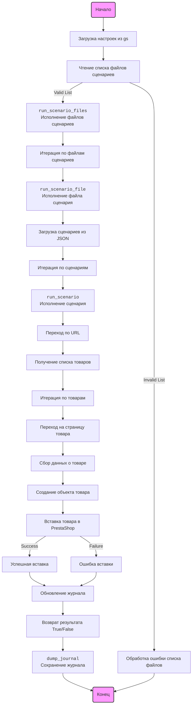

## Анализ модуля `src.scenario`

### 1. <алгоритм>

**Общая блок-схема работы модуля `src.scenario`:**

1.  **Начало:** Инициализация модуля.
    *   Пример: `python -m src.scenario`
2.  **Чтение списка файлов сценариев:** Функция `main()` получает список файлов сценариев (JSON).
    *   Пример: `scenario_files_list = ['scenario1.json', 'scenario2.json']`
3.  **Цикл по файлам сценариев:** Для каждого файла в списке вызывается функция `run_scenario_files()`.
    *   Пример: Проход по `scenario1.json`, затем `scenario2.json`.
4.  **Обработка файла сценариев:** Функция `run_scenario_files()` вызывает функцию `run_scenario_file()`.
    *   Вход: `s` (объект настроек) и путь к файлу сценария.
5.  **Загрузка сценариев из файла:** Функция `run_scenario_file()` загружает JSON из файла, представляющего собой набор сценариев.
    *   Пример: `scenario_file = 'scenario1.json'` загружается JSON с несколькими сценариями.
6.  **Цикл по сценариям:** Для каждого сценария в файле вызывается функция `run_scenario()`.
    *   Пример: Проход по сценарию "mineral+creams" в JSON.
7.  **Обработка сценария:** Функция `run_scenario()`:
    *   a. **Переходит по URL:** Используя переданный URL, происходит навигация на страницу веб-сайта.
        *   Пример:  `https://example.com/category/mineral-creams/`
    *   b. **Получение списка товаров:** Извлекается список товаров с данной страницы.
        *   Пример: Список ссылок на товары.
    *   c. **Цикл по товарам:** Для каждого товара происходит:
        *   i. **Переход на страницу товара:** Переход на страницу с подробностями о товаре.
        *   ii. **Извлечение полей товара:** Извлекаются данные о товаре (название, цена, описание и т.д.)
        *   iii. **Создание объекта товара:** Создается объект товара, который содержит извлеченные поля.
        *   iv. **Вставка товара в PrestaShop:** Товар добавляется в базу данных PrestaShop (или обновляется, если он уже существует).
        *   v. **Обновление журнала:** Запись в журнале о результате обработки товара.
8.  **Сохранение журнала:** Функция `dump_journal()` сохраняет журнал выполнения в файл.
    *   Пример: `journal.json` файл с записями о каждом сценарии.
9.  **Завершение:** Завершение работы модуля.

**Поток данных:**

*   `main()` -> `run_scenario_files()`: Список файлов сценариев.
*   `run_scenario_files()` -> `run_scenario_file()`: Путь к файлу сценария.
*   `run_scenario_file()` -> `run_scenario()`: Отдельный сценарий (словарь).
*   `run_scenario()`: URL, данные о товарах -> PrestaShop.
*   `run_scenario()`: Результаты -> журнал (список).
*   `main()` -> `dump_journal()`: Журнал.

### 2. <mermaid>



**Разбор `mermaid` диаграммы:**

*   **`Start`:** Начало процесса, представляет входную точку модуля.
*   **`LoadSettings`**: Загрузка глобальных настроек проекта из `src.gs`.
*   **`ReadScenarioList`:** Функция, ответственная за чтение списка файлов сценариев.
*   **`RunScenarioFiles`:** Функция `run_scenario_files`, которая обрабатывает список файлов сценариев.
*   **`IterateScenarioFile`:**  Цикл, который проходит по каждому файлу сценария.
*   **`RunScenarioFile`:**  Функция `run_scenario_file`, которая загружает и обрабатывает сценарии из одного файла.
*   **`LoadScenarios`:** Загрузка данных сценариев из файла JSON.
*   **`IterateScenarios`:**  Цикл, который проходит по каждому сценарию.
*   **`RunScenario`:** Функция `run_scenario`, выполняющая один сценарий.
*   **`NavigateURL`:** Переход по URL, указанному в сценарии.
*   **`GetProductList`:** Получение списка товаров с текущей страницы.
*   **`IterateProducts`:**  Цикл, который проходит по каждому товару.
*   **`NavigateProductPage`:** Переход на страницу с деталями товара.
*   **`GrabProductFields`:** Извлечение полей данных о товаре.
*   **`CreateProductObject`:** Создание объекта товара на основе извлеченных данных.
*   **`InsertPrestashop`:** Вставка/обновление товара в базе данных PrestaShop.
*   **`SuccessLog`:** Логирование успешной вставки.
*   **`FailureLog`:** Логирование ошибки вставки.
*   **`UpdateJournal`:** Обновление журнала выполнения.
*   **`ReturnResult`:** Возврат результата выполнения функции.
*   **`DumpJournal`:** Сохранение журнала в файл.
*   **`End`:** Завершение процесса, представляет выходную точку модуля.
*    **`ErrorHandling1`**: Обработка ошибок при чтении списка файлов.

**Импортированные зависимости (не указаны в тексте, но подразумеваются):**

*   `src.gs`: Для загрузки настроек проекта (предположение, основанное на тексте).
*   `json`: Для чтения JSON файлов.
*   `requests`: Для HTTP-запросов к веб-сайтам.

### 3. <объяснение>

**Импорты:**

*   По тексту нет явного указания импортов, но предполагаются:
    *   `json`: Используется для работы с JSON-файлами, в которых хранятся сценарии.
    *   `requests`: Используется для выполнения HTTP-запросов к веб-сайтам, чтобы получать данные о товарах.
    *   `src.gs`: Глобальные настройки проекта, используемые для доступа к базам данных PrestaShop, а также общим настройкам.
    *   Дополнительно: `logging` для логирования

    *   Цепочка взаимосвязей:  `src.scenario` -> `requests`/`json` -> `src.gs` -> PrestaShop DB

**Классы:**

*   Конкретные классы в тексте не описаны, подразумевается, что в `src.gs` может содержаться класс или набор классов для работы с настройками, а также возможно есть классы для представления товара.

**Функции:**

*   **`run_scenario_files(s, scenario_files_list)`**:
    *   **Аргументы**:
        *   `s`: Объект настроек (предположительно из `src.gs`).
        *   `scenario_files_list`: Список путей к файлам сценариев.
    *   **Возвращаемое значение**: `None`.
    *   **Назначение**: Запускает выполнение сценариев из каждого файла в списке.
    *   **Пример**:
        ```python
        run_scenario_files(settings_obj, ['scenario1.json', 'scenario2.json'])
        ```
*   **`run_scenario_file(s, scenario_file)`**:
    *   **Аргументы**:
        *   `s`: Объект настроек.
        *   `scenario_file`: Путь к файлу сценария.
    *   **Возвращаемое значение**: `None`.
    *   **Назначение**: Загружает и запускает сценарии из одного файла.
    *   **Пример**:
        ```python
        run_scenario_file(settings_obj, 'scenario1.json')
        ```
*   **`run_scenario(s, scenario)`**:
    *   **Аргументы**:
        *   `s`: Объект настроек.
        *   `scenario`: Словарь с данными сценария (например, URL, категории).
    *   **Возвращаемое значение**: `None`.
    *   **Назначение**: Выполняет сценарий, переходит по URL, извлекает данные и добавляет их в PrestaShop.
    *   **Пример**:
        ```python
        run_scenario(settings_obj, {
            "url": "https://example.com/category/mineral-creams/",
            "name": "mineral+creams",
            "presta_categories": {"default_category": 12345, "additional_categories": [12346, 12347]}
        })
        ```
*    **`dump_journal(s, journal)`**:
    *    **Аргументы**:
        *    `s`: Объект настроек.
        *    `journal`: Список записей журнала.
    *    **Возвращаемое значение**: `None`.
    *    **Назначение**: Сохраняет журнал выполнения в файл.
    *    **Пример**:
        ```python
         dump_journal(settings_obj, journal_list)
        ```
*    **`main()`**:
    *   **Аргументы**: `None`.
    *    **Возвращаемое значение**: `None`.
    *   **Назначение**: Основная точка входа в модуль, инициализирует настройки, читает файлы и запускает обработку.
    *   **Пример**:
        ```python
        main() # Запуск модуля
        ```

**Переменные:**

*   `s`: Объект настроек (возможно, экземпляр класса).
*   `scenario_files_list`: Список строк, содержащих пути к файлам сценариев.
*   `scenario_file`: Строка, представляющая путь к файлу сценария.
*   `scenario`: Словарь с информацией о сценарии (URL, категории и т.д.).
*   `journal`: Список, содержащий логи выполнения сценариев.

**Потенциальные ошибки и улучшения:**

*   **Обработка ошибок:** Код упоминает об ошибках `FileNotFoundError`, `JSONDecodeError` и `requests.exceptions.RequestException`, но нет деталей обработки. Необходимо предусмотреть более детальную обработку, логирование и возможность восстановления после ошибок.
*   **Логирование:**  Добавить подробное логирование каждого этапа обработки, особенно для отладки и мониторинга.
*   **Модульность:** Разбить `run_scenario` на более мелкие функции, чтобы повысить читаемость и переиспользуемость кода.
*   **Настройка параметров запроса:** Добавить возможность настройки параметров запроса (`User-Agent`, тайм-ауты и т.д.).
*   **Параллелизм:** Рассмотреть возможность параллельной обработки нескольких сценариев для ускорения работы.
*   **Тестирование:** Необходимо добавить тесты для проверки корректности работы каждого компонента.
*   **Обработка различных структур данных:** Учесть возможность изменения структуры данных на веб-сайтах поставщиков.
*   **Повторный запуск**: Возможно стоит добавить возможность повторного запуска обработки сценариев.

**Взаимосвязь с другими частями проекта:**

*   Зависимость от `src.gs` для доступа к настройкам, базе данных PrestaShop и другим глобальным параметрам.
*   Интеграция с PrestaShop для добавления новых товаров.
*   Возможное взаимодействие с модулями логирования для более полного отслеживания ошибок и процесса выполнения.

Этот подробный анализ дает полное понимание функциональности модуля `src.scenario`, а также его потенциальных улучшений.