# Анализ модуля `src.scenario`

## 1. <алгоритм>

**Блок-схема работы модуля:**

```mermaid
graph LR
    A[Начало] --> B(Загрузка списка файлов сценариев);
    B --> C{Список файлов пуст?};
    C -- Да --> Z[Конец];
    C -- Нет --> D(Итерация по файлам сценариев);
    D --> E(Загрузка сценариев из файла);
    E --> F{Сценарии в файле есть?};
    F -- Нет --> D;
    F -- Да --> G(Итерация по сценариям);
    G --> H(Получение URL из сценария);
    H --> I(Переход по URL);
    I --> J(Получение списка продуктов со страницы);
    J --> K{Список продуктов пуст?};
    K -- Да --> G;
    K -- Нет --> L(Итерация по продуктам);
    L --> M(Переход на страницу продукта);
    M --> N(Извлечение полей продукта);
    N --> O(Создание объекта продукта);
    O --> P(Вставка продукта в PrestaShop);
    P -- Успех --> Q(Обновление журнала);
    P -- Ошибка --> R(Обработка ошибки);
    R --> Q;
    Q --> L;
    L -- Все продукты обработаны --> G;
     G -- Все сценарии обработаны --> D;
     D -- Все файлы обработаны --> T(Сохранение журнала);
    T --> Z;
    Z --> S[Конец];
```



**Примеры для каждого блока:**

*   **A: Начало** - Модуль запускается.
*   **B: Загрузка списка файлов сценариев** - `scenario_files_list` может быть `['scenario1.json', 'scenario2.json']`.
*   **C: Список файлов пуст?** - Проверка `len(scenario_files_list) > 0`.
*   **D: Итерация по файлам сценариев** -  Перебор элементов списка `scenario_files_list`.
*   **E: Загрузка сценариев из файла** -  Чтение JSON файла `scenario1.json`.
*   **F: Сценарии в файле есть?** -  Проверка, есть ли в загруженном JSON ключе `scenarios`.
*   **G: Итерация по сценариям** -  Перебор сценариев в словаре `scenarios`.
*   **H: Получение URL из сценария** - Получение значения ключа `url` из сценария. Например, `"url": "https://example.com/category/mineral-creams/"`
*   **I: Переход по URL** - Запрос страницы по URL, используя библиотеку `requests`.
*  **J: Получение списка продуктов со страницы** - Выбор всех ссылок на продукты со страницы, используя `BeautifulSoup`.
*   **K: Список продуктов пуст?** - Проверка, что список ссылок на продукты не пуст.
*   **L: Итерация по продуктам** - Перебор ссылок на продукты.
*   **M: Переход на страницу продукта** - Запрос страницы продукта по его URL.
*   **N: Извлечение полей продукта** - Парсинг данных о продукте со страницы, используя `BeautifulSoup`.
*   **O: Создание объекта продукта** - Создание экземпляра класса продукта с извлеченными данными.
*   **P: Вставка продукта в PrestaShop** - Использование API PrestaShop для добавления товара в базу данных.
*   **Q: Обновление журнала** - Запись в лог информации об успехе или неудаче.
*   **R: Обработка ошибки** - Запись в лог информации об ошибке и ее анализ.
*   **T: Сохранение журнала** - Запись данных журнала в файл.
*   **Z: Конец** - Завершение работы модуля.

**Поток данных:**

1.  Список файлов сценариев (`scenario_files_list`) передается в `run_scenario_files`.
2.  Каждый файл сценария (`scenario_file`) передается в `run_scenario_file`.
3.  Из каждого файла загружаются сценарии, каждый из которых (`scenario`) передается в `run_scenario`.
4.  В `run_scenario` извлекаются URL, выполняется HTTP-запрос, парсится HTML, извлекаются данные продукта.
5.  Данные продукта используются для создания объекта и вставки в базу данных PrestaShop.
6.  Информация об успешном/неудачном выполнении операции добавляется в `journal`.
7.  `journal` сохраняется в файл с помощью `dump_journal`.

## 2. <mermaid>

```mermaid
graph TD
    subgraph "Модуль src.scenario"
        supplierInstance(Supplier Instance) --> scenarioFilesList{Список файлов сценариев};
        scenarioFilesList -- "Валидный список" --> runScenarioFiles(run_scenario_files);
        scenarioFilesList -- "Невалидный список" --> errorHandling1[Обработка ошибок];
        runScenarioFiles --> iterateScenarioFiles{Итерация по файлам};
        iterateScenarioFiles --> runScenarioFile(run_scenario_file);
        runScenarioFile --> loadScenarios{Загрузка сценариев};
        loadScenarios --> iterateScenarios{Итерация по сценариям};
        iterateScenarios --> runScenario(run_scenario);
        runScenario --> navigateToURL(Переход по URL);
        navigateToURL --> getProductList{Получение списка продуктов};
        getProductList --> iterateProducts{Итерация по продуктам};
        iterateProducts --> navigateToProductPage(Переход на страницу продукта);
        navigateToProductPage --> grabProductFields(Извлечение полей продукта);
        grabProductFields --> createProductObject(Создание объекта продукта);
        createProductObject --> insertProductToPrestaShop(Вставка продукта в PrestaShop);
        insertProductToPrestaShop -- "Успех" --> updateJournalSuccess(Обновление журнала);
        insertProductToPrestaShop -- "Неудача" --> errorHandling2[Обработка ошибок];
        errorHandling2 --> updateJournalError(Обновление журнала);
        updateJournalSuccess --> journalUpdate;
         journalUpdate --> iterateProducts;
        updateJournalError --> journalUpdate;
        
        iterateProducts -- "Все продукты обработаны" --> iterateScenarios;
        iterateScenarios -- "Все сценарии обработаны" --> iterateScenarioFiles;
    iterateScenarioFiles -- "Все файлы обработаны" --> dumpJournal(dump_journal);
    dumpJournal --> end[Конец]
        
    end
    
    errorHandling1 --> end
    
```

**Анализ зависимостей `mermaid`:**

Диаграмма `mermaid` описывает основной поток управления в модуле `src.scenario`.
Она показывает, как данные передаются между функциями, начиная от списка файлов сценариев и заканчивая записью журнала.

*   `supplierInstance` представляет внешний контекст (например, настройки), которые могут использоваться для соединения с базой данных или другими ресурсами.
*   `scenarioFilesList` - список файлов со сценариями, загружается из внешней системы или конфигурации.
*   `runScenarioFiles`, `runScenarioFile`, `runScenario`, `dumpJournal` - основные функции модуля, которые обрабатывают сценарии, данные продуктов и логирование.
*   `loadScenarios`, `iterateScenarios`, `iterateProducts` - логические блоки для управления итерациями.
*   `navigateToURL`, `getProductList`, `navigateToProductPage`, `grabProductFields`, `createProductObject`, `insertProductToPrestaShop` - последовательные шаги для получения данных о продукте и их сохранения.
*   `errorHandling1` и `errorHandling2` - точки для обработки ошибок.
*   `updateJournalSuccess` и `updateJournalError` - блоки для обновления журнала в зависимости от результата.
*   `journalUpdate` - блок,  объединяющий операции обновления журнала.
* `end` - окончание работы модуля.

## 3. <объяснение>

### Импорты:

В представленном тексте нет явных импортов. Тем не менее, по описанию функций и логике работы, модуль подразумевает использование следующих библиотек:

*   `json`: для загрузки данных сценариев из JSON файлов.
*   `requests`: для выполнения HTTP-запросов к веб-сайтам поставщиков.
*   `BeautifulSoup` (или `lxml`): для парсинга HTML-кода страниц и извлечения данных.
*   Возможны импорты для работы с базой данных PrestaShop (например, если используется API).
*   Импорт модуля `logging` для ведения журнала работы программы.

### Классы:

В представленном тексте нет явного определения классов. Однако, логически подразумевается наличие как минимум класса продукта (возможно, `Product`), который будет представлять извлеченные данные продукта.

*   **`Product`**:
    *   **Атрибуты**: Набор атрибутов, соответствующих полям товара (название, описание, цена, изображения и т.д.).
    *   **Методы**: Возможно, метод для добавления товара в базу данных PrestaShop.

### Функции:

*   **`run_scenario_files(s, scenario_files_list)`**:
    *   **Аргументы**:
        *   `s`: Объект настроек (может содержать информацию для подключения к БД PrestaShop).
        *   `scenario_files_list`: Список путей к файлам сценариев (например, `['scenario1.json', 'scenario2.json']`).
    *   **Возвращает**: `None`.
    *   **Назначение**: Перебирает список файлов сценариев и вызывает функцию `run_scenario_file` для каждого из них.
    *   **Пример**:
        ```python
        settings = {"db_host": "localhost", "db_user": "admin", ...}
        scenario_files = ["scenario1.json", "scenario2.json"]
        run_scenario_files(settings, scenario_files)
        ```

*   **`run_scenario_file(s, scenario_file)`**:
    *   **Аргументы**:
        *   `s`: Объект настроек.
        *   `scenario_file`: Путь к файлу сценария (например, `'scenario1.json'`).
    *   **Возвращает**: `None`.
    *   **Назначение**: Загружает JSON из файла сценария и вызывает `run_scenario` для каждого сценария.
    *   **Пример**:
        ```python
        settings = {"db_host": "localhost", "db_user": "admin", ...}
        run_scenario_file(settings, 'scenario1.json')
        ```

*   **`run_scenario(s, scenario)`**:
    *   **Аргументы**:
        *   `s`: Объект настроек.
        *   `scenario`: Словарь, содержащий описание сценария, например:
            ```python
            {
                "url": "https://example.com/category/mineral-creams/",
                "name": "mineral+creams",
                "presta_categories": {
                    "default_category": 12345,
                    "additional_categories": [12346, 12347]
                }
            }
            ```
    *   **Возвращает**: `None`.
    *   **Назначение**: Выполняет основной цикл работы, включая загрузку страницы, парсинг данных и добавление товара в PrestaShop.
    *   **Пример**:
        ```python
        settings = {"db_host": "localhost", "db_user": "admin", ...}
        scenario = {
                "url": "https://example.com/category/mineral-creams/",
                "name": "mineral+creams",
                "presta_categories": {
                    "default_category": 12345,
                    "additional_categories": [12346, 12347]
                }
            }
        run_scenario(settings, scenario)
        ```

*   **`dump_journal(s, journal)`**:
    *   **Аргументы**:
        *   `s`: Объект настроек.
        *   `journal`: Список записей журнала.
    *   **Возвращает**: `None`.
    *   **Назначение**: Сохраняет журнал выполнения в файл.
    *   **Пример**:
        ```python
        settings = {"log_file": "execution.log", ...}
        journal = [{"time": "...", "status": "...", ...}, ...]
        dump_journal(settings, journal)
        ```

*   **`main()`**:
    *   **Аргументы**: `None`.
    *   **Возвращает**: `None`.
    *   **Назначение**: Запускает выполнение модуля, обрабатывает общие ошибки и завершает работу.

### Переменные:

*   `s` (settings): Объект, содержащий настройки подключения к БД, пути к файлам и т.д.
*   `scenario_files_list`: Список путей к файлам сценариев.
*   `scenario_file`: Путь к файлу сценария.
*   `scenario`: Словарь, представляющий один сценарий.
*   `journal`: Список записей журнала.

### Потенциальные ошибки и области для улучшения:

1.  **Обработка ошибок**: Нужна более детальная обработка ошибок, таких как сетевые ошибки, проблемы с парсингом HTML, ошибки при работе с БД.
2.  **Логирование**: Более детальное логирование, с указанием типа ошибки и места её возникновения.
3.  **Конфигурация**:  Управление настройками (пути к файлам, настройки БД) через файл конфигурации, а не хардкодить.
4.  **Модульность**: Разбиение `run_scenario` на более мелкие функции для лучшей читаемости и переиспользуемости кода.
5.  **Асинхронность**: Использование асинхронных запросов для параллельной обработки сценариев и продуктов, для увеличения скорости работы.
6.  **Тестирование**: Отсутствует описание тестов. Необходимо предусмотреть возможность автоматического тестирования.

### Взаимосвязи с другими частями проекта:

*   Модуль `src.scenario` связан с модулями, которые обеспечивают взаимодействие с PrestaShop (возможно, через API) и с модулями, отвечающими за парсинг веб-страниц (`BeautifulSoup`, `lxml` или аналог).
*   Модуль зависит от структуры JSON файлов сценариев.
*   Модуль может зависеть от конфигурационных файлов, определяющих пути к файлам, параметры подключения к БД.
*   Возможно взаимодействие с модулем `src.settings`, для получения конфигурации, и с модулем `src.loggin`, для ведения журнала.