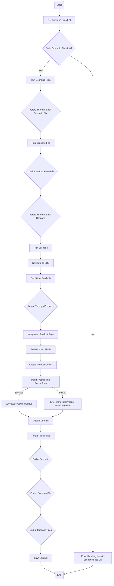

## Анализ кода модуля `src.scenario`

### 1. <алгоритм>

**Общий рабочий процесс модуля `src.scenario` можно описать следующей блок-схемой:**

1.  **Начало:** Запускается функция `main()`, которая инициирует работу модуля.
2.  **Получение списка файлов сценариев:** Функция `main()` получает список файлов сценариев из конфигурации (не показано в коде, но подразумевается).
    *   **Пример:** `scenario_files_list = ["scenario1.json", "scenario2.json"]`.
3.  **Запуск обработки файлов сценариев:** Вызывается функция `run_scenario_files(s, scenario_files_list)`:
    *   **s:** Объект настроек, например, с информацией о подключении к БД.
    *   **scenario_files_list:** Список путей к файлам сценариев.
4.  **Итерация по файлам сценариев:** Функция `run_scenario_files` итерируется по списку `scenario_files_list` и для каждого файла вызывает функцию `run_scenario_file(s, scenario_file)`.
    *   **Пример:** Первая итерация: `run_scenario_file(s, "scenario1.json")`.
5.  **Загрузка сценариев из файла:** Функция `run_scenario_file` загружает JSON-данные из файла сценария, которые содержат в себе список сценариев.
    *   **Пример:** Из файла `scenario1.json` загружается JSON, содержащий сценарии.
6.  **Итерация по сценариям:** Функция `run_scenario_file` итерируется по сценариям, загруженным из файла, и для каждого сценария вызывает функцию `run_scenario(s, scenario)`.
    *   **Пример:** Для сценария из `scenario1.json` вызывается `run_scenario(s, {"url": "https://example.com/category/mineral-creams/", "name": "mineral+creams", "presta_categories": {"default_category": 12345, "additional_categories": [12346, 12347]}})`.
7.  **Обработка сценария:** Функция `run_scenario` выполняет следующие шаги:
    *   **Переход по URL:** Выполняется запрос к веб-сайту, указанному в `scenario['url']`.
    *   **Получение списка продуктов:** Извлекается список продуктов на странице.
    *   **Итерация по продуктам:** Итерируется по списку продуктов.
    *   **Переход на страницу продукта:** Переход на страницу каждого продукта.
    *   **Извлечение полей продукта:** Извлекаются нужные данные о продукте (название, цена, описание и т.д.).
    *   **Создание объекта продукта:** Создается объект, представляющий продукт в формате, подходящем для сохранения в БД.
    *   **Вставка продукта в PrestaShop:** Продукт сохраняется в PrestaShop.
        *   **Успех:** Возвращается успех, обновляется журнал.
        *   **Ошибка:** Возвращается ошибка, обновляется журнал.
8.  **Обновление журнала:** Функция `run_scenario` добавляет информацию о результате обработки сценария в журнал.
9.  **Возврат результата:** Функция `run_scenario` возвращает `True` при успешной обработке или `False` в случае ошибки.
10. **Сохранение журнала:** После обработки всех файлов сценариев вызывается функция `dump_journal(s, journal)` для сохранения журнала в файл.
11. **Завершение:** Модуль завершает работу.

### 2. <mermaid>

**Анализ зависимостей в диаграмме `mermaid`:**

*   **Start:** Начало процесса.
*   **Get Scenario Files List:** Получение списка файлов сценариев из внешнего источника (не показан в коде, но подразумевается).
*   **Valid Scenario Files List?:** Проверка, является ли список файлов сценариев валидным.
*   **Run Scenario Files:** Вызов функции `run_scenario_files()`, которая обрабатывает каждый файл сценария.
*   **Error Handling: Invalid Scenario Files List:** Обработка ошибки, если список файлов сценариев не является валидным.
*   **Iterate Through Each Scenario File:** Итерация по списку файлов сценариев.
*   **Run Scenario File:** Вызов функции `run_scenario_file()`, которая обрабатывает сценарии из файла.
*   **Load Scenarios From File:** Загрузка сценариев из JSON-файла.
*   **Iterate Through Each Scenario:** Итерация по списку сценариев.
*   **Run Scenario:** Вызов функции `run_scenario()`, которая обрабатывает отдельный сценарий.
*   **Navigate to URL:** Переход по URL, указанному в сценарии.
*   **Get List of Products:** Получение списка продуктов со страницы.
*   **Iterate Through Products:** Итерация по списку продуктов.
*   **Navigate to Product Page:** Переход на страницу конкретного продукта.
*   **Grab Product Fields:** Извлечение данных о продукте.
*   **Create Product Object:** Создание объекта продукта в нужном формате.
*   **Insert Product into PrestaShop:** Сохранение данных о продукте в базе данных PrestaShop.
*   **Success: Product Inserted:** Успешное добавление продукта в PrestaShop.
*   **Error Handling: Product Insertion Failed:** Обработка ошибки добавления продукта в PrestaShop.
*   **Update Journal:** Обновление журнала выполнения с информацией о текущем сценарии и продукте.
*   **Return True/False:** Возвращение результата обработки сценария (успех/неудача).
    **End of Scenario:** Конец обработки одного сценария.
    **End of Scenario File:** Конец обработки одного файла сценариев.
      **End of Scenario Files:** Конец обработки всех файлов сценариев.
*   **Save Journal:** Сохранение журнала выполнения в файл.
*   **End:** Конец процесса.

### 3. <объяснение>

**Импорты:**

В предоставленном коде нет явных импортов. Однако, основываясь на описании, можно предположить, что модуль использует следующие библиотеки:

*   `json`: Для работы с JSON файлами.
*   `requests`: Для выполнения HTTP-запросов к веб-сайтам.
*   Модули из `src`: такие как `src.gs` (Global Settings - глобальные настройки), `src.db` (работа с базой данных),  `src.product` (модуль с классами и функциями для работы с продуктами), и другие.

**Классы:**

В предоставленном коде нет описаний классов, но исходя из контекста и описания функциональности, в проекте могут использоваться классы, например:

*   `Settings`: Для хранения настроек приложения (пути к файлам, настройки БД и т.д.).
*   `PrestaShopConnector`: Для взаимодействия с API PrestaShop.
*   `Product`: Для представления продукта.
*   `Journal`: Для ведения журнала операций.
*   `Supplier`: Представляет поставщика и содержит методы для получения данных с его сайта.

**Функции:**

*   `run_scenario_files(s, scenario_files_list)`:
    *   **Аргументы:**
        *   `s`: Объект настроек (например, `Settings`).
        *   `scenario_files_list`: Список путей к файлам сценариев (список строк).
    *   **Возвращает:** Ничего (None).
    *   **Назначение:** Последовательно запускает обработку файлов сценариев.
    *   **Пример:** `run_scenario_files(settings, ["scenario1.json", "scenario2.json"])`
*   `run_scenario_file(s, scenario_file)`:
    *   **Аргументы:**
        *   `s`: Объект настроек (например, `Settings`).
        *   `scenario_file`: Путь к файлу сценария (строка).
    *   **Возвращает:** Ничего (None).
    *   **Назначение:** Загружает сценарии из файла и запускает их обработку.
    *   **Пример:** `run_scenario_file(settings, "scenario1.json")`
*   `run_scenario(s, scenario)`:
    *   **Аргументы:**
        *   `s`: Объект настроек (например, `Settings`).
        *   `scenario`: Словарь, содержащий информацию о сценарии (например, URL, категории).
    *   **Возвращает:** Ничего (None).
    *   **Назначение:** Обрабатывает отдельный сценарий: получает данные с веб-сайта, сохраняет их в БД.
    *   **Пример:** `run_scenario(settings, {"url": "https://example.com/...", "name": "...", ...})`
*   `dump_journal(s, journal)`:
    *   **Аргументы:**
        *   `s`: Объект настроек (например, `Settings`).
        *   `journal`: Список записей журнала (список словарей).
    *   **Возвращает:** Ничего (None).
    *   **Назначение:** Сохраняет журнал выполнения в файл.
    *   **Пример:** `dump_journal(settings, log_entries)`
*   `main()`:
    *   **Аргументы:** Ничего.
    *   **Возвращает:** Ничего (None).
    *   **Назначение:** Основная функция запуска модуля.
    *   **Пример:** `main()`

**Переменные:**

*   `s`: Объект настроек, передается между функциями.
*   `scenario_files_list`: Список путей к файлам сценариев.
*   `scenario_file`: Путь к файлу сценария.
*   `scenario`: Словарь, содержащий информацию о сценарии.
*   `journal`: Список записей журнала.

**Потенциальные ошибки и области для улучшения:**

*   **Обработка ошибок:** В коде присутствуют общие блоки `except Exception` , но для полноценной обработки ошибок необходимо более детальное их логирование и возможная повторная попытка выполнения действия, в том числе для `requests.exceptions.RequestException`.
*   **Конфигурация:** В коде не показано, как загружаются настройки. Необходимо предусмотреть механизм загрузки настроек из файла или окружения.
*   **Итерация по продуктам:** В коде не указано, как именно извлекаются итерируются продукты на странице.
*   **Общая обработка:** В коде явно не указано, как обрабатывать случаи, если не было найдено продуктов на странице.
*   **Масштабируемость:** Код может быть масштабирован, если будет использоваться несколько потоков для одновременной обработки нескольких сценариев.

**Цепочка взаимосвязей с другими частями проекта:**

1.  **`src.gs` (Global Settings):** Модуль `src.scenario` зависит от глобальных настроек, таких как пути к файлам, настройки БД и т.д.
2.  **`src.db` (Database):** Для работы с базой данных PrestaShop необходимы модули `src.db`.
3.  **`src.product` (Product):** Модуль `src.scenario` зависит от классов и функций, связанных с продуктами, например, для создания объектов продуктов, сохранения данных в БД и т.д.
4.  **`src.supplier`:** Модуль может зависеть от модуля поставщика `src.supplier`, для  получения данных с сайта.

**Дополнительно:**
Необходимо добавить подробную обработку ошибок. Не понятно, как обрабатывается ошибка в случае, если продукт не вставляется в базу данных PrestaShop (необходимо повторно запросить или обновить данные).