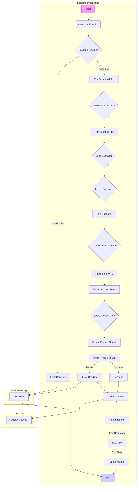

## Анализ кода модуля `src.scenario`

### 1. <алгоритм>

**Общий рабочий процесс:**

1.  **`main()`**:
    *   Инициализирует настройки (`s`).
    *   Определяет список файлов сценариев `scenario_files_list`.
    *   Вызывает `run_scenario_files(s, scenario_files_list)` для запуска обработки сценариев.
    *   Обрабатывает любые исключения, возникающие в процессе.

2.  **`run_scenario_files(s, scenario_files_list)`**:
    *   Получает список файлов сценариев.
    *   Для каждого `scenario_file` в списке вызывает функцию `run_scenario_file(s, scenario_file)`.
    *   Пример: Если `scenario_files_list = ["scenario1.json", "scenario2.json"]`, то `run_scenario_file` будет вызвана дважды для каждого файла.

3.  **`run_scenario_file(s, scenario_file)`**:
    *   Загружает содержимое JSON-файла сценария `scenario_file`.
    *   Извлекает список сценариев из загруженного JSON.
    *   Для каждого `scenario` в списке вызывает функцию `run_scenario(s, scenario)`.
    *   Пример: Если `scenario_file` содержит JSON с двумя сценариями, `run_scenario` будет вызвана дважды.

4.  **`run_scenario(s, scenario)`**:
    *   Получает данные для обработки из `scenario` (например, `url` для запроса).
    *   Отправляет HTTP-запрос к `url` и получает HTML-контент.
    *   Извлекает данные о продуктах из HTML-контента (например, имя, цену, описание).
    *   Создаёт объекты продуктов.
    *   Вставляет объекты продуктов в базу данных (например, PrestaShop).
    *   Обновляет журнал выполнения, добавляя информацию о каждом продукте.
    *   Пример: Если сценарий содержит URL для страницы с несколькими товарами, то для каждого товара будут извлечены данные и они будут вставлены в базу данных.

5.  **`dump_journal(s, journal)`**:
    *   Получает `journal` - список записей о ходе выполнения сценариев.
    *   Записывает `journal` в файл журнала для дальнейшего анализа.
    *   Пример: Журнал может содержать информацию о том, какие продукты были добавлены в базу данных и какие ошибки возникли.

### 2. <mermaid>

**Объяснение диаграммы `mermaid`:**

*   **`Start` (A)**: Начальная точка процесса.
*   **`Load Configuration` (B)**: Загрузка настроек приложения.
*   **`Scenario Files List` (C)**: Список файлов сценариев для обработки.
*    **`Run Scenario Files` (D)**:  Функция, отвечающая за выполнение сценариев из списка файлов.
*    **`Error Handling` (E,R,Y):** Блок обработки ошибок, который регистрирует возникающие исключения и завершает работу.
*   **`Iterate Scenario File` (F)**: Цикл, проходящий по всем файлам сценариев.
*   **`Run Scenario File` (G)**: Выполнение сценария для одного файла.
*   **`Load Scenarios` (H)**: Загрузка сценариев из файла.
*   **`Iterate Scenarios` (I)**: Цикл, проходящий по всем сценариям.
*   **`Run Scenario` (J)**: Выполнение отдельного сценария.
*   **`Get URL from Scenario` (K)**: Извлечение URL из данных сценария.
*    **`Navigate to URL` (L)**: Переход по URL, указанному в сценарии.
*    **`Extract Product Data` (M)**: Извлечение данных о товарах со страницы.
*    **`Iterate Product Data` (N)**: Цикл по данным каждого извлечённого товара.
*    **`Create Product Object` (O)**: Создание объекта товара на основе извлеченных данных.
*   **`Insert Product to DB` (P)**: Вставка объекта продукта в базу данных (например, PrestaShop).
*   **`Success` (Q)**: Успешное выполнение операции.
*   **`Update Journal` (S,X)**: Запись информации в журнал выполнения.
*   **`Next Scenario` (T)**: Переход к следующему сценарию.
*    **`Next File` (U)**: Переход к следующему файлу со сценариями.
*   **`Dump Journal` (V)**: Запись журнала выполнения в файл.
*   **`End` (W)**: Конечная точка процесса.

### 3. <объяснение>

#### Импорты:

В предоставленном коде не указаны импорты, но исходя из описания, можно предположить следующие:

*   **`json`**: Для работы с JSON-файлами (чтение сценариев).
*   **`requests`**: Для выполнения HTTP-запросов к веб-сайтам.
*   Возможно, другие модули (например, для работы с базой данных PrestaShop,  логгирования), которые не описаны в README.
*   В проекте есть модули `src.classes` и `src.settings`, с которыми происходит взаимодействие, но в описании в README об этом ничего не сказано.

**Взаимосвязи с другими пакетами `src`:**

*   Исходя из кода и описания, данный модуль тесно связан с другими частями проекта, которые отвечают за настройку соединения с БД, классами продуктов и  работу с логами.

#### Классы:

*   В предоставленном коде нет явного описания классов, но, как минимум, можно предположить, что используется класс для хранения настроек, экземпляры которого передаются как `s` в функции.
*   Может присутствовать класс для продуктов (например, `Product`), представляющий структуру данных продукта (имя, цена, описание, ID).
*   Для журнала используется класс, который хранит информацию о каждом запуске сценария.

**Взаимодействие с другими компонентами:**

*   Классы для работы с базой данных PrestaShop (если таковые имеются)
    *   Для вставки продуктов, и других связанных данных (например категорий).
*   Класс для настроек:
    *   Предоставляет параметры соединения с базой данных и другими внешними ресурсами.

#### Функции:

*   **`run_scenario_files(s, scenario_files_list)`**:
    *   **Аргументы**:
        *   `s`: Объект настроек (например, для соединения с базой данных).
        *   `scenario_files_list` (list): Список путей к файлам сценариев.
    *   **Возвращает**: `None`
    *   **Назначение**: Запускает обработку сценариев для каждого файла в списке.
    *   **Пример**: `run_scenario_files(settings, ["scenario1.json", "scenario2.json"])`.
*   **`run_scenario_file(s, scenario_file)`**:
    *   **Аргументы**:
        *   `s`: Объект настроек.
        *   `scenario_file` (str): Путь к файлу сценария.
    *   **Возвращает**: `None`
    *   **Назначение**: Загружает и обрабатывает все сценарии из одного файла.
    *   **Пример**: `run_scenario_file(settings, "scenario1.json")`.
*   **`run_scenario(s, scenario)`**:
    *   **Аргументы**:
        *   `s`: Объект настроек.
        *   `scenario` (dict): Словарь, содержащий сценарий (например, с URL, категориями).
    *   **Возвращает**: `None`
    *   **Назначение**: Обрабатывает один сценарий: извлекает данные о продуктах со страницы и сохраняет их в базе данных.
    *   **Пример**: `run_scenario(settings, {"url": "https://example.com/products", "presta_categories": {"default_category": 12345}})`.
*   **`dump_journal(s, journal)`**:
    *   **Аргументы**:
        *   `s`: Объект настроек.
        *   `journal` (list): Список записей журнала выполнения.
    *   **Возвращает**: `None`
    *   **Назначение**: Сохраняет журнал выполнения в файл.
    *   **Пример**: `dump_journal(settings, journal_data)`.
*   **`main()`**:
    *   **Аргументы**: `None`
    *   **Возвращает**: `None`
    *   **Назначение**: Главная функция для запуска модуля.
    *   **Пример**: Вызывается при запуске модуля.

#### Переменные:

*   `s`: Объект настроек, содержащий параметры для соединения с базой данных и другими ресурсами.
*   `scenario_files_list`: Список путей к JSON-файлам со сценариями.
*   `scenario_file`: Путь к JSON-файлу со сценариями.
*   `scenario`: Словарь, представляющий один сценарий.
*   `journal`: Список, в котором хранятся записи журнала о ходе выполнения сценариев.
*   `url`: URL веб-сайта, который нужно посетить, чтобы извлечь данные.

#### Потенциальные ошибки и области для улучшения:

*   **Обработка ошибок**: Текущий код указывает только общие `Exception`, без конкретной обработки ошибок для разных типов исключений (например, `requests.exceptions.RequestException`). Необходимо добавить более конкретную обработку ошибок.
*   **Валидация данных**: Не хватает валидации данных, получаемых из веб-сайтов, например, проверка типа данных перед вставкой в базу данных.
*   **Управление соединениями с БД**: Отсутствуют явные механизмы для управления соединениями с базой данных (например, пулом соединений).
*   **Параллелизм**: Процесс обработки сценариев выполняется последовательно. Можно улучшить производительность за счет параллелизации обработки сценариев.
*   **Логирование**: Текущее логирование ограничивается записью в журнал. Было бы полезно добавить логирование в реальном времени с различными уровнями (например, DEBUG, INFO, ERROR).
*   **Гибкость**: Сценарии имеют фиксированную структуру. Было бы полезно сделать структуру сценариев более гибкой (например, через использование пользовательских функций извлечения).
*   **Конфигурация:** Настройки приложения заданы константами, стоит вынести в отдельный файл конфигурации.
*   **Тестирование**:  Не указано наличие тестов. Необходимо добавить тесты для обеспечения надежности.
*   **Зависимости**: Не указаны зависимости между модулями проекта.